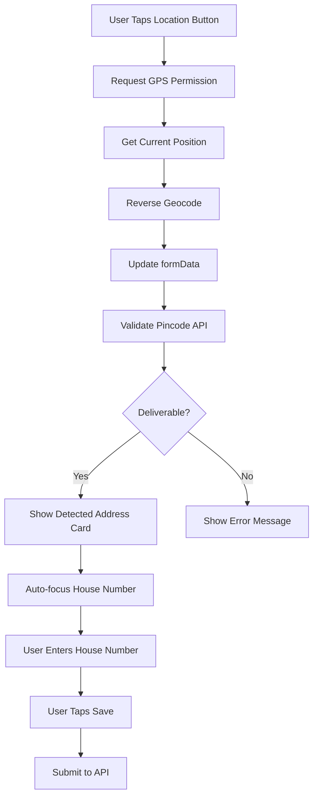

# Design Document: Address Screen UX Redesign

## Overview

This design transforms the Add Address screen from a traditional form-heavy interface into a mobile-first, thumb-optimized experience. The redesign reduces user friction by prioritizing GPS-detected address display, minimizing manual input to essential fields only (house number), and positioning interactive elements within the thumb-reachable zone.

The core design principle is "detect first, edit minimally" - GPS handles 80% of address data, users provide only what GPS cannot detect. This approach reduces average completion time from 30 seconds to under 5 seconds.

Key design decisions:
- Sticky bottom save button for constant thumb accessibility
- Detected address displayed as a card (not scattered form fields)
- House number field auto-focused and visually prominent
- Auto-filled fields (district, state) styled as read-only with muted colors
- Maximum 3 suggestion chips in horizontal scroll
- Map picker hidden by default (available via "Adjust on Map" option)

## Architecture

### Component Structure

The screen follows a vertical layout optimized for one-handed mobile use:

```
AddAddressScreen (ScrollView)
├── LocationDetectionButton (Thumb Zone - Top)
├── DetectedAddressCard (Conditional)
│   ├── AddressText
│   └── EditButton
├── HouseNumberInput (Primary Field)
├── LandmarkInput (Optional Field)
├── PincodeSection (Auto-filled, Read-only)
│   ├── PincodeDisplay
│   ├── CityDisplay
│   └── DeliverabilityIndicator
├── SuggestionChips (Horizontal ScrollView, max 3)
├── NameInput (Pre-filled from profile)
├── PhoneInput (Pre-filled from profile)
├── LabelSelector (Home/Office/Other)
└── SaveButton (Sticky, Absolute Position)
```

### State Management

The component uses React `useState` hooks for local state management:

- `formData`: Stores all address fields (name, pincode, city, state, address, phone, label)
- `pincodeStatus`: Tracks pincode validation state (isChecking, isResolved, isDeliverable, message)
- `availableCities`: Array of city suggestions from pincode API
- `showMap`: Boolean to toggle map picker visibility
- `mapRegion`: GPS coordinates for map display
- `isDetecting`: Loading state for GPS location detection

No global state management required - all state is local to the screen.

### Data Flow



## Components and Interfaces

### LocationDetectionButton

**Purpose:** Trigger GPS-based address detection

**Props:**
```typescript
interface LocationDetectionButtonProps {
  onPress: () => Promise<void>;
  isDetecting: boolean;
}
```

**Styling:**
- Position: Top of screen (within thumb zone)
- Height: 48dp minimum touch target
- Background: White with primary color border
- Text: Primary color, 14px, bold
- Icon: Ionicons "location-outline", 20px

**Behavior:**
- Disabled state while `isDetecting` is true
- Shows "Detecting..." text during loading
- Triggers `handleUseCurrentLocation` function

### DetectedAddressCard

**Purpose:** Display GPS-detected address in readable card format

**Props:**
```typescript
interface DetectedAddressCardProps {
  address: string;
  onEdit: () => void;
}
```

**Styling:**
- Padding: 16px
- Background: White card with subtle elevation (shadow)
- Border radius: 12px
- Text: 16px, regular weight, primary text color
- Edit icon: Positioned top-right, 20px

**Behavior:**
- Only rendered when GPS detection succeeds
- Tapping edit icon allows inline editing of address text
- Displays full address as single readable string

### HouseNumberInput

**Purpose:** Primary user input for house/flat number

**Props:**
```typescript
interface HouseNumberInputProps {
  value: string;
  onChange: (text: string) => void;
  autoFocus: boolean;
}
```

**Styling:**
- Font size: 18px (larger than secondary fields)
- Border: 2px (prominent)
- Height: 56dp
- Label: "House/Flat Number *" (bold, 14px)
- Required indicator: Red asterisk

**Behavior:**
- Auto-focuses when DetectedAddressCard is displayed
- Accepts alphanumeric input
- Required field validation

### PincodeSection

**Purpose:** Display auto-filled pincode and city data

**Props:**
```typescript
interface PincodeSectionProps {
  pincode: string;
  city: string;
  isDeliverable: boolean;
  message: string;
}
```

**Styling:**
- Layout: Horizontal (pincode | city)
- Background: Muted surface color (#F3F4F6)
- Text: 14px, secondary text color
- Border: 1px subtle
- Deliverability indicator: Green checkmark or red X icon

**Behavior:**
- Read-only display
- Shows validation status from pincode API
- If not deliverable, displays error message and disables save button

### SuggestionChips

**Purpose:** Display city suggestions in compact pill format

**Props:**
```typescript
interface SuggestionChipsProps {
  suggestions: string[];
  onSelect: (city: string) => void;
  maxVisible: number; // Always 3
}
```

**Styling:**
- Layout: Horizontal ScrollView
- Chip padding: 8px horizontal, 6px vertical
- Chip background: White with border
- Chip border radius: 16px (pill shape)
- Text: 14px, primary text color

**Behavior:**
- Only shows first 3 suggestions
- Horizontal scroll if suggestions overflow
- Tapping chip populates city field

### SaveButton

**Purpose:** Submit address data

**Props:**
```typescript
interface SaveButtonProps {
  onPress: () => Promise<void>;
  isLoading: boolean;
  disabled: boolean;
  text: string; // "Add Address" or "Update Address"
}
```

**Styling:**
- Position: Absolute, bottom: 0
- Width: 100% minus 16px padding each side
- Height: 48dp minimum
- Background: Primary color (#FF6A00)
- Text: White, 16px, bold
- Disabled state: Muted background (#9CA3AF)

**Behavior:**
- Sticky positioning (remains visible during scroll)
- Disabled when form validation fails or pincode not deliverable
- Shows loading spinner during API submission
- Triggers form validation before submission

## Data Models

### FormData Interface

```typescript
interface FormData {
  name: string;           // User's full name
  pincode: string;        // 6-digit pincode
  city: string;           // City or village name
  admin_district: string; // Auto-filled from pincode API
  state: string;          // Auto-filled from pincode API
  address: string;        // House/flat, street, area
  phone: string;          // 10-digit mobile number
  label: LabelType;       // HOME | OFFICE | OTHER
}
```

### PincodeStatus Interface

```typescript
interface PincodeStatus {
  isChecking: boolean;    // API call in progress
  isResolved: boolean;    // API call completed
  isDeliverable: boolean; // Pincode is serviceable
  message: string;        // Status message for user
}
```

### Address API Payload

```typescript
interface AddressPayload {
  name: string;
  label: 'HOME' | 'OFFICE' | 'OTHER';
  pincode: string;
  city: string;
  state: string;
  addressLine: string;    // Maps to formData.address
  phone: string;
  isDefault: boolean;     // True if first address
}
```

### PincodeCheckResponse (from API)

```typescript
interface PincodeCheckResponse {
  deliverable: boolean;
  state?: string;
  postal_district?: string;
  admin_district?: string;
  cities?: string[];      // Suggestion list
  message?: string;
}
```

### GPS Coordinate Sanitization

```typescript
interface Coordinate {
  latitude: number;       // -90 to 90
  longitude: number;      // -180 to 180
  latitudeDelta?: number; // Zoom level
  longitudeDelta?: number;// Zoom level
}

// Validation ensures coordinates are finite numbers within valid ranges
// Falls back to India center (20.5937, 78.9629) if invalid
```


## Correctness Properties

*A property is a characteristic or behavior that should hold true across all valid executions of a system-essentially, a formal statement about what the system should do. Properties serve as the bridge between human-readable specifications and machine-verifiable correctness guarantees.*

### Property 1: Location Button Triggers Detection

*For any* user interaction with the Location_Button, when the button is tapped, the system should initiate GPS location detection and update the button state to show "Detecting..." text while `isDetecting` is true.

**Validates: Requirements 1.3, 1.4**

### Property 2: Detected Address Card Rendering

*For any* successful GPS location detection result, when location data is available, the system should render the Detected_Address_Card component containing the complete address text in a single readable format.

**Validates: Requirements 2.1, 2.2**

### Property 3: House Field Auto-Focus

*For any* state where the Detected_Address_Card is displayed, the House_Field input should have the autoFocus property set to true, ensuring immediate keyboard focus for user input.

**Validates: Requirements 3.4**

### Property 4: Form Validation Without Landmark

*For any* form submission attempt, when all required fields (name, pincode, city, state, address, phone) are valid and the landmark field is empty, the form validation should pass and allow submission.

**Validates: Requirements 4.4**

### Property 5: Pincode Auto-Population

*For any* GPS location detection that returns a postal code, when the reverse geocoding completes successfully, the system should automatically populate the pincode, city, state, and admin_district fields in formData.

**Validates: Requirements 5.1**

### Property 6: Error Display on Non-Deliverable Pincode

*For any* pincode validation result where `deliverable` is false, the system should display an error message in the Pincode_Section and set `pincodeStatus.isDeliverable` to false.

**Validates: Requirements 5.5**

### Property 7: Button Disabled During Validation

*For any* form state where `isLoading` is true or `pincodeStatus.isChecking` is true or `pincodeStatus.isDeliverable` is false, the Save_Button should be disabled and styled with muted background color.

**Validates: Requirements 6.5**

### Property 8: Suggestion Count Capping

*For any* array of city suggestions returned from the pincode API, when rendering suggestion chips, the system should display a maximum of 3 suggestions regardless of the input array length.

**Validates: Requirements 7.1**

### Property 9: Chip Selection Updates City

*For any* Suggestion_Chip that is tapped, the system should update `formData.city` with the selected city value.

**Validates: Requirements 7.4**

### Property 10: Auto-Fill Read-Only Fields

*For any* pincode validation response containing state and admin_district data, the system should populate these fields in formData and render them with read-only styling (editable=false, muted background color).

**Validates: Requirements 9.2**

### Property 11: Minimal Required Fields After GPS

*For any* form state where GPS location has successfully populated pincode, city, state, and address fields, the form validation should require only the house number field (formData.address) to be non-empty for submission to be enabled.

**Validates: Requirements 10.1**

### Property 12: Background Pincode Validation

*For any* pincode input change, when the pincode reaches 6 digits, the system should trigger validation via the checkPincode API without disabling other form inputs or blocking user interaction.

**Validates: Requirements 10.2**

### Property 13: Pre-Fill From Profile

*For any* screen initialization where user profile data contains name and phone values, the system should pre-populate `formData.name` and `formData.phone` with these values.

**Validates: Requirements 10.3**

### Property 14: Enable Button When Valid

*For any* form state where all required fields are valid and `pincodeStatus.isDeliverable` is true, the Save_Button should be enabled (not disabled).

**Validates: Requirements 10.4**

### Property 15: Required Indicators on Editable Fields Only

*For any* form field that is read-only (editable=false), the field label should not display a required indicator (asterisk), even if the field is required for submission.

**Validates: Requirements 11.4**

### Property 16: Error Message Display on Validation Failure

*For any* field validation failure, the system should render an error message text element directly below the invalid field with error color styling.

**Validates: Requirements 12.1**

### Property 17: Error Border Color on Invalid Field

*For any* field that fails validation, the input border should change to error color (#EF4444) with 2px width.

**Validates: Requirements 12.2**

### Property 18: Disable Button on Non-Deliverable Pincode

*For any* pincode validation result where `isDeliverable` is false, the Save_Button should be disabled and the Pincode_Section should display an inline error message.

**Validates: Requirements 12.4**

### Property 19: Clear Errors on Field Edit

*For any* field that has an error state, when the user begins editing the field (onChange event fires), the error message should be cleared and the field border should return to normal styling.

**Validates: Requirements 12.5**


## Error Handling

### GPS Permission Denied

**Scenario:** User denies location permission or permission is unavailable

**Handling:**
- Display Alert: "Permission Denied - Please enable location permissions in settings"
- Set `isDetecting` to false
- Allow user to manually enter address fields
- Do not block form submission

**Implementation:**
```typescript
if (status !== 'granted') {
  Alert.alert('Permission Denied', 'Please enable location permissions in settings');
  setIsDetecting(false);
  return;
}
```

### GPS Location Timeout

**Scenario:** GPS location detection takes longer than 10 seconds

**Handling:**
- Timeout reverse geocoding after 10 seconds
- Display Alert: "Location Detected - Could not get address details automatically. Please enter your address manually."
- Continue with manual address entry
- Do not block user from proceeding

**Implementation:**
```typescript
const reverseGeocodeWithTimeout = async (coords: any, timeoutMs: number = 10000) => {
  return Promise.race([
    Location.reverseGeocodeAsync(coords),
    new Promise((_, reject) => 
      setTimeout(() => reject(new Error('Reverse geocoding timeout')), timeoutMs)
    )
  ]);
};
```

### Invalid GPS Coordinates

**Scenario:** GPS returns coordinates outside valid ranges (lat: -90 to 90, lng: -180 to 180)

**Handling:**
- Sanitize coordinates using `sanitizeCoordinate` function
- Fall back to India center coordinates (20.5937, 78.9629)
- Log warning to console
- Allow user to manually enter address

**Implementation:**
```typescript
const sanitizeCoordinate = (coord: Coordinate) => {
  const lat = Number(coord.latitude);
  const lng = Number(coord.longitude);
  
  if (isNaN(lat) || isNaN(lng) || !isFinite(lat) || !isFinite(lng) ||
      lat < -90 || lat > 90 || lng < -180 || lng > 180) {
    console.warn('[AddAddress] Invalid coordinate:', coord);
    return { latitude: 20.5937, longitude: 78.9629, latitudeDelta: 0.01, longitudeDelta: 0.01 };
  }
  
  return coord;
};
```

### Pincode API Failure

**Scenario:** Pincode validation API call fails or times out

**Handling:**
- Set `pincodeStatus.message` to "Failed to validate pincode"
- Set `pincodeStatus.isDeliverable` to false
- Disable Save_Button
- Display error message below pincode field
- Allow user to retry by editing pincode

**Implementation:**
```typescript
catch (error) {
  setPincodeStatus({
    isChecking: false,
    isResolved: true,
    isDeliverable: false,
    message: 'Failed to validate pincode',
  });
}
```

### Non-Deliverable Pincode

**Scenario:** Pincode validation returns `deliverable: false`

**Handling:**
- Display inline error: "✗ Not deliverable to this pincode"
- Disable Save_Button
- Clear city suggestions
- Allow user to edit pincode and retry

**Implementation:**
```typescript
if (!data.deliverable) {
  setPincodeStatus({
    isChecking: false,
    isResolved: true,
    isDeliverable: false,
    message: '✗ Not deliverable to this pincode',
  });
  setAvailableCities([]);
}
```

### Form Validation Errors

**Scenario:** User attempts to submit with invalid or missing required fields

**Handling:**
- Display Alert with specific error message:
  - "Please enter a valid 6-digit pincode"
  - "Please enter city/village"
  - "Please enter address"
  - "State is required"
  - "This pincode is not deliverable"
  - "Please enter a valid 10-digit phone number starting with 6-9"
  - "Please enter name"
- Do not submit form
- Keep user on screen to fix errors

**Implementation:**
```typescript
const validateForm = (): boolean => {
  if (!formData.pincode || !/^\d{6}$/.test(formData.pincode)) {
    Alert.alert('Error', 'Please enter a valid 6-digit pincode');
    return false;
  }
  // ... additional validations
  return true;
};
```

### Address Submission Failure

**Scenario:** API call to add/update address fails

**Handling:**
- Display Alert with error message from API or generic fallback
- Keep user on screen with form data intact
- Allow user to retry submission
- Log error details to console

**Implementation:**
```typescript
catch (error: any) {
  Alert.alert('Error', error?.data?.message || 'Failed to save address');
}
```

## Testing Strategy

### Unit Testing

Unit tests will focus on specific examples, edge cases, and error conditions using React Native Testing Library and Jest.

**Test Categories:**

1. **Component Rendering Tests**
   - Verify LocationDetectionButton renders with correct text and icon
   - Verify DetectedAddressCard renders when address data exists
   - Verify HouseNumberInput has correct label and required indicator
   - Verify PincodeSection displays pincode and city in horizontal layout
   - Verify SaveButton has correct text ("Add Address" vs "Update Address")

2. **State Management Tests**
   - Verify initial formData state matches initialFormData
   - Verify pincodeStatus updates correctly during validation
   - Verify isDetecting toggles during GPS detection
   - Verify showMap toggles when map picker is opened/closed

3. **Form Validation Tests**
   - Verify validation fails with empty pincode
   - Verify validation fails with non-6-digit pincode
   - Verify validation fails with empty city
   - Verify validation fails with empty address
   - Verify validation fails with invalid phone number (not 10 digits or not starting with 6-9)
   - Verify validation passes with all required fields filled
   - Verify validation passes when landmark is empty

4. **Error Handling Tests**
   - Verify GPS permission denied shows alert
   - Verify invalid coordinates fall back to India center
   - Verify pincode API failure sets error state
   - Verify non-deliverable pincode disables save button
   - Verify form validation errors show alerts

5. **User Interaction Tests**
   - Verify tapping LocationDetectionButton calls handleUseCurrentLocation
   - Verify tapping SuggestionChip updates formData.city
   - Verify tapping SaveButton calls handleSubmit
   - Verify editing pincode triggers debounced validation
   - Verify editing field clears error state

### Property-Based Testing

Property-based tests will verify universal properties across all inputs using fast-check library (JavaScript/TypeScript property-based testing framework). Each test will run a minimum of 100 iterations.

**Property Test Configuration:**
```typescript
import fc from 'fast-check';

// Example property test structure
describe('Address Screen Properties', () => {
  it('Property 1: Location Button Triggers Detection', () => {
    fc.assert(
      fc.property(fc.boolean(), (isDetecting) => {
        // Test implementation
      }),
      { numRuns: 100 }
    );
  });
});
```

**Property Test Categories:**

1. **Location Detection Properties**
   - **Property 1**: Location button triggers detection (Tag: Feature: address-screen-ux-redesign, Property 1: Location button triggers GPS detection and shows loading state)
   - **Property 2**: Detected address card renders with address data (Tag: Feature: address-screen-ux-redesign, Property 2: Detected address card displays complete address text)

2. **Form Field Properties**
   - **Property 3**: House field auto-focuses when address card is shown (Tag: Feature: address-screen-ux-redesign, Property 3: House field auto-focuses after GPS detection)
   - **Property 4**: Form validates without landmark field (Tag: Feature: address-screen-ux-redesign, Property 4: Form submission succeeds without landmark data)
   - **Property 5**: Pincode auto-populates from GPS (Tag: Feature: address-screen-ux-redesign, Property 5: GPS detection auto-fills pincode and city)

3. **Validation Properties**
   - **Property 6**: Non-deliverable pincode shows error (Tag: Feature: address-screen-ux-redesign, Property 6: Non-deliverable pincode displays error message)
   - **Property 7**: Button disabled during validation (Tag: Feature: address-screen-ux-redesign, Property 7: Save button disabled when validation in progress)
   - **Property 12**: Background pincode validation doesn't block input (Tag: Feature: address-screen-ux-redesign, Property 12: Pincode validation runs without blocking other fields)
   - **Property 14**: Button enabled when form is valid (Tag: Feature: address-screen-ux-redesign, Property 14: Save button enabled when all required fields valid)

4. **Suggestion Properties**
   - **Property 8**: Suggestion count capped at 3 (Tag: Feature: address-screen-ux-redesign, Property 8: Maximum 3 city suggestions displayed)
   - **Property 9**: Chip selection updates city field (Tag: Feature: address-screen-ux-redesign, Property 9: Tapping suggestion chip populates city)

5. **Auto-Fill Properties**
   - **Property 10**: District and state auto-filled as read-only (Tag: Feature: address-screen-ux-redesign, Property 10: Auto-filled fields styled as read-only)
   - **Property 11**: Minimal required fields after GPS (Tag: Feature: address-screen-ux-redesign, Property 11: Only house number required after GPS detection)
   - **Property 13**: Pre-fill from user profile (Tag: Feature: address-screen-ux-redesign, Property 13: Name and phone pre-filled from profile)

6. **Error Display Properties**
   - **Property 15**: Required indicators only on editable fields (Tag: Feature: address-screen-ux-redesign, Property 15: Read-only fields have no required indicators)
   - **Property 16**: Error message below invalid field (Tag: Feature: address-screen-ux-redesign, Property 16: Validation errors display below field)
   - **Property 17**: Error border color on invalid field (Tag: Feature: address-screen-ux-redesign, Property 17: Invalid fields show red border)
   - **Property 18**: Disable button on non-deliverable pincode (Tag: Feature: address-screen-ux-redesign, Property 18: Save button disabled for non-deliverable pincode)
   - **Property 19**: Clear errors on field edit (Tag: Feature: address-screen-ux-redesign, Property 19: Error state clears when user edits field)

**Test Data Generators:**

Property tests will use fast-check arbitraries to generate test data:

```typescript
// Address data generator
const addressArbitrary = fc.record({
  name: fc.string({ minLength: 1, maxLength: 100 }),
  pincode: fc.stringOf(fc.integer({ min: 0, max: 9 }), { minLength: 6, maxLength: 6 }),
  city: fc.string({ minLength: 1, maxLength: 50 }),
  state: fc.string({ minLength: 1, maxLength: 50 }),
  address: fc.string({ minLength: 1, maxLength: 200 }),
  phone: fc.stringOf(fc.integer({ min: 6, max: 9 }), { minLength: 10, maxLength: 10 }),
  label: fc.constantFrom('HOME', 'OFFICE', 'OTHER'),
});

// GPS coordinate generator
const coordinateArbitrary = fc.record({
  latitude: fc.double({ min: -90, max: 90 }),
  longitude: fc.double({ min: -180, max: 180 }),
});

// Pincode status generator
const pincodeStatusArbitrary = fc.record({
  isChecking: fc.boolean(),
  isResolved: fc.boolean(),
  isDeliverable: fc.boolean(),
  message: fc.string(),
});
```

### Integration Testing

Integration tests will verify the complete flow from GPS detection through form submission:

1. **GPS Detection Flow**
   - Request permission → Get location → Reverse geocode → Validate pincode → Display address card
   
2. **Manual Entry Flow**
   - Enter pincode → Validate → Select city suggestion → Enter house number → Submit

3. **Edit Address Flow**
   - Load existing address → Modify fields → Validate → Update

### Test Coverage Goals

- Unit test coverage: 80% minimum for component logic
- Property test coverage: All 19 correctness properties implemented
- Integration test coverage: 3 critical user flows
- Error handling coverage: All 7 error scenarios tested

### Testing Tools

- **Unit Tests**: Jest + React Native Testing Library
- **Property Tests**: fast-check (JavaScript property-based testing library)
- **Integration Tests**: Detox (React Native E2E testing framework)
- **Mocking**: jest.mock for API calls and GPS location services

