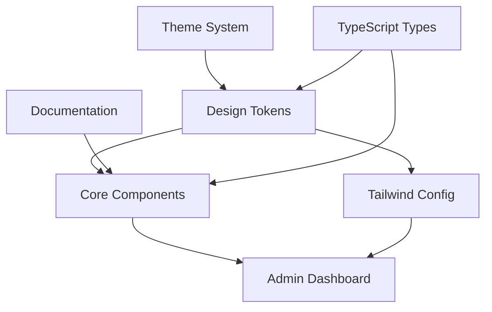

# Design Document: Admin Design System

## Overview

The Admin Design System is a comprehensive UI component library and design token system that transforms basic CRUD interfaces into professional business dashboards. This system provides a unified visual language, consistent user experience, and scalable architecture for admin interfaces.

### Key Design Principles

1. **Consistency**: All components follow unified design patterns and behaviors
2. **Accessibility**: WCAG AA compliance ensures usability for all users
3. **Scalability**: Token-based system allows easy theming and maintenance
4. **Developer Experience**: Clear APIs and comprehensive documentation
5. **Performance**: Optimized components with minimal bundle impact

### System Scope

The design system encompasses:
- Design token system (colors, typography, spacing)
- Core UI components (buttons, inputs, cards, tables, modals)
- Layout utilities and responsive behavior
- Accessibility features and ARIA compliance
- Theme switching capabilities (light/dark modes)
- Integration with Tailwind CSS

## Architecture

### High-Level Architecture



### Component Architecture

The system follows a layered architecture:

1. **Token Layer**: Centralized design values (colors, spacing, typography)
2. **Component Layer**: Reusable UI components built on tokens
3. **Utility Layer**: Helper functions and Tailwind utilities
4. **Application Layer**: Admin dashboard consuming the design system

### Technology Stack

- **React**: Component framework with TypeScript
- **Tailwind CSS**: Utility-first CSS framework
- **Headless UI**: Accessible component primitives
- **Framer Motion**: Animation library for interactions
- **Storybook**: Component documentation and testing
- **Jest/Testing Library**: Unit and integration testing

## Components and Interfaces

### Design Token System

```typescript
interface DesignTokens {
  colors: {
    primary: ColorScale;
    secondary: ColorScale;
    semantic: SemanticColors;
    neutral: NeutralColors;
  };
  typography: {
    fontFamily: FontFamily;
    fontSize: FontSizeScale;
    fontWeight: FontWeightScale;
    lineHeight: LineHeightScale;
  };
  spacing: SpacingScale;
  borderRadius: BorderRadiusScale;
  shadows: ShadowScale;
}

interface ColorScale {
  50: string;
  100: string;
  200: string;
  300: string;
  400: string;
  500: string; // Base color
  600: string;
  700: string;
  800: string;
  900: string;
}
```

### Core Component Interfaces

```typescript
// Button Component
interface ButtonProps {
  variant: 'primary' | 'secondary' | 'danger';
  size: 'small' | 'medium' | 'large';
  disabled?: boolean;
  loading?: boolean;
  icon?: ReactNode;
  iconPosition?: 'left' | 'right';
  onClick?: () => void;
  children: ReactNode;
}

// Input Component
interface InputProps {
  type: 'text' | 'email' | 'password' | 'number';
  label?: string;
  placeholder?: string;
  helpText?: string;
  error?: string;
  success?: boolean;
  disabled?: boolean;
  required?: boolean;
  value: string;
  onChange: (value: string) => void;
}

// Card Component
interface CardProps {
  elevation?: 'flat' | 'raised' | 'elevated';
  loading?: boolean;
  empty?: boolean;
  header?: ReactNode;
  footer?: ReactNode;
  children: ReactNode;
}

// Table Component
interface TableProps<T> {
  data: T[];
  columns: TableColumn<T>[];
  sortable?: boolean;
  selectable?: boolean;
  pagination?: PaginationConfig;
  loading?: boolean;
  onRowSelect?: (rows: T[]) => void;
  onSort?: (column: string, direction: 'asc' | 'desc') => void;
}
```

### Theme System Interface

```typescript
interface ThemeConfig {
  mode: 'light' | 'dark';
  tokens: DesignTokens;
  components: ComponentThemeOverrides;
}

interface ThemeProvider {
  theme: ThemeConfig;
  setTheme: (theme: Partial<ThemeConfig>) => void;
  toggleMode: () => void;
}
```

## Data Models

### Design Token Models

```typescript
// Color System
interface SemanticColors {
  success: ColorScale;
  warning: ColorScale;
  error: ColorScale;
  info: ColorScale;
}

interface NeutralColors {
  white: string;
  black: string;
  gray: ColorScale;
}

// Typography System
interface FontSizeScale {
  xs: string;    // 12px
  sm: string;    // 14px
  base: string;  // 16px
  lg: string;    // 18px
  xl: string;    // 20px
  '2xl': string; // 24px
  '3xl': string; // 30px
  '4xl': string; // 36px
  '5xl': string; // 48px
  '6xl': string; // 60px
}

// Spacing System
interface SpacingScale {
  1: string;  // 4px
  2: string;  // 8px
  3: string;  // 12px
  4: string;  // 16px
  5: string;  // 20px
  6: string;  // 24px
  8: string;  // 32px
  10: string; // 40px
  12: string; // 48px
  16: string; // 64px
}
```

### Component State Models

```typescript
// Component States
type ComponentState = 'default' | 'hover' | 'active' | 'disabled' | 'loading';

interface ValidationState {
  isValid: boolean;
  error?: string;
  touched: boolean;
}

interface LoadingState {
  isLoading: boolean;
  progress?: number;
  message?: string;
}

// Table Data Models
interface TableColumn<T> {
  key: keyof T;
  title: string;
  sortable?: boolean;
  filterable?: boolean;
  render?: (value: T[keyof T], row: T) => ReactNode;
  width?: string;
}

interface PaginationConfig {
  pageSize: number;
  currentPage: number;
  totalItems: number;
  showSizeChanger?: boolean;
}
```

## Correctness Properties

*A property is a characteristic or behavior that should hold true across all valid executions of a system-essentially, a formal statement about what the system should do. Properties serve as the bridge between human-readable specifications and machine-verifiable correctness guarantees.*

### Property 1: Typography System Completeness

*For any* typography system configuration, it should contain all required heading sizes (H1-H6), body text sizes (large, medium, small), and font weights (light, regular, medium, semibold, bold) with proper pixel values and line heights.

**Validates: Requirements 1.1, 1.2, 1.3**

### Property 2: Color System Structure

*For any* color system configuration, it should contain primary colors with variants, secondary colors with variants, semantic colors (success, warning, error, info), and neutral colors with proper color scale structure.

**Validates: Requirements 2.1, 2.2, 2.3, 2.4**

### Property 3: WCAG AA Contrast Compliance

*For any* color combination used in the design system, the contrast ratio should meet or exceed WCAG AA requirements (4.5:1 for normal text, 3:1 for large text).

**Validates: Requirements 2.5, 9.5**

### Property 4: Spacing System Base Unit Consistency

*For any* spacing value in the spacing system, it should be a multiple of the base unit (4px) and include all required scale values.

**Validates: Requirements 3.1, 3.2**

### Property 5: Token-to-Utility Class Mapping

*For any* design token (typography, spacing, color), there should be a corresponding utility class generated in the CSS output.

**Validates: Requirements 1.5, 3.5**

### Property 6: Component Variant Support

*For any* component that defines variants (buttons, badges, modals, loaders), it should accept all specified variant props and render with appropriate styling.

**Validates: Requirements 4.1, 4.2, 8.1, 9.1, 9.2, 10.1**

### Property 7: Component State Handling

*For any* component that supports states (disabled, loading, error, success), it should update its appearance and behavior correctly when state props change.

**Validates: Requirements 4.3, 5.2, 6.3, 7.4, 9.4**

### Property 8: Input Type Support

*For any* input component, it should accept all specified input types (text, email, password, number) and render with appropriate HTML input attributes.

**Validates: Requirements 5.1**

### Property 9: Component Content Rendering

*For any* component that supports structured content (cards with header/body/footer, modals with sections, inputs with labels/help text), it should render all provided content in the correct locations.

**Validates: Requirements 5.3, 6.1, 8.5**

### Property 10: Interactive Component Behavior

*For any* interactive component (buttons, modals, tables), it should respond correctly to user interactions (clicks, keyboard events, backdrop clicks).

**Validates: Requirements 4.4, 8.2, 7.1, 7.2**

### Property 11: Accessibility Compliance

*For any* component in the design system, it should include proper ARIA attributes, keyboard navigation support, and focus management.

**Validates: Requirements 4.6, 5.5, 8.3, 8.6**

### Property 12: Table Functionality

*For any* table component configuration, it should support sorting, selection, pagination, and filtering operations correctly with proper state management.

**Validates: Requirements 7.1, 7.2, 7.3, 7.6**

### Property 13: Responsive Behavior

*For any* component that supports responsive design, it should apply appropriate styling and behavior changes across different viewport sizes.

**Validates: Requirements 7.5**

### Property 14: Modal Focus Management

*For any* modal component, when opened it should trap focus within the modal boundaries and prevent body scrolling.

**Validates: Requirements 8.3, 8.4**

### Property 15: Theme System Integration

*For any* design token system configuration, it should support theme switching between light and dark modes with proper token value updates.

**Validates: Requirements 11.2, 11.4**

### Property 16: Tailwind CSS Integration

*For any* design token, it should be properly integrated into the Tailwind CSS configuration and generate corresponding utility classes.

**Validates: Requirements 11.3**

### Property 17: TypeScript Type Definitions

*For any* design token or component prop, there should be corresponding TypeScript type definitions that accurately reflect the available options.

**Validates: Requirements 11.5**

### Property 18: Documentation Completeness

*For any* component in the design system, there should be comprehensive documentation including usage examples, prop documentation, accessibility guidelines, and interactive examples.

**Validates: Requirements 12.1, 12.2, 12.3, 12.4, 12.5**

### Property 19: Component Spacing Rules

*For any* component, it should follow the defined spacing system rules and apply consistent spacing values from the spacing scale.

**Validates: Requirements 3.3**

### Property 20: Design Token Export Completeness

*For any* design token category (colors, typography, spacing), all values should be properly exported and accessible to consuming applications.

**Validates: Requirements 11.1**

## Error Handling

### Design Token Errors

The design system should handle missing or invalid design tokens gracefully:

1. **Missing Token Values**: Fallback to default values when tokens are undefined
2. **Invalid Color Values**: Validate hex/rgb values and provide error messages
3. **Invalid Spacing Values**: Ensure all spacing values are valid CSS units
4. **Theme Loading Errors**: Graceful degradation when theme switching fails

### Component Error Boundaries

Each component should implement proper error handling:

1. **Prop Validation**: TypeScript interfaces with runtime validation for critical props
2. **Render Errors**: Error boundaries to prevent component crashes from affecting the entire application
3. **Accessibility Errors**: Console warnings for missing accessibility attributes
4. **Performance Errors**: Warnings for excessive re-renders or large data sets

### Integration Error Handling

The design system should handle integration issues:

1. **Tailwind CSS Conflicts**: Namespace conflicts with existing CSS frameworks
2. **Bundle Size Warnings**: Alerts when bundle size exceeds recommended thresholds
3. **Browser Compatibility**: Graceful degradation for unsupported CSS features
4. **Theme Persistence**: Error recovery when theme preferences cannot be saved

## Testing Strategy

### Dual Testing Approach

The design system requires both unit testing and property-based testing for comprehensive coverage:

**Unit Tests**: Focus on specific examples, edge cases, and integration points
- Component rendering with specific props
- User interaction scenarios (clicks, keyboard navigation)
- Error conditions and edge cases
- Integration with external libraries (Tailwind, Headless UI)

**Property Tests**: Verify universal properties across all inputs using fast-check library
- Design token validation across all possible values
- Component behavior with randomized props
- Accessibility compliance across component variations
- Theme switching with random token combinations

### Property-Based Testing Configuration

- **Library**: fast-check for JavaScript/TypeScript property-based testing
- **Iterations**: Minimum 100 iterations per property test
- **Test Tagging**: Each property test references its design document property
- **Tag Format**: `// Feature: admin-design-system, Property {number}: {property_text}`

### Testing Categories

1. **Design Token Tests**
   - Unit: Specific token value validation
   - Property: Token structure and type compliance across all tokens

2. **Component Tests**
   - Unit: Specific component states and interactions
   - Property: Component behavior with randomized valid props

3. **Integration Tests**
   - Unit: Tailwind CSS integration with specific configurations
   - Property: Theme switching across all possible token combinations

4. **Accessibility Tests**
   - Unit: Specific ARIA attribute presence
   - Property: Keyboard navigation and focus management across all components

5. **Performance Tests**
   - Unit: Bundle size analysis for specific component imports
   - Property: Render performance with varying data sizes

### Test Environment Setup

```typescript
// Example property test configuration
import fc from 'fast-check';
import { render } from '@testing-library/react';
import { Button } from '../components/Button';

// Feature: admin-design-system, Property 6: Component Variant Support
test('Button component supports all variants', () => {
  fc.assert(fc.property(
    fc.constantFrom('primary', 'secondary', 'danger'),
    fc.constantFrom('small', 'medium', 'large'),
    fc.boolean(),
    (variant, size, disabled) => {
      const { container } = render(
        <Button variant={variant} size={size} disabled={disabled}>
          Test Button
        </Button>
      );
      
      // Verify component renders without errors
      expect(container.firstChild).toBeInTheDocument();
      
      // Verify correct CSS classes are applied
      const button = container.querySelector('button');
      expect(button).toHaveClass(`btn-${variant}`);
      expect(button).toHaveClass(`btn-${size}`);
      if (disabled) {
        expect(button).toBeDisabled();
      }
    }
  ), { numRuns: 100 });
});
```

This comprehensive testing strategy ensures that the design system maintains consistency, accessibility, and performance across all use cases while providing confidence in its reliability and correctness.