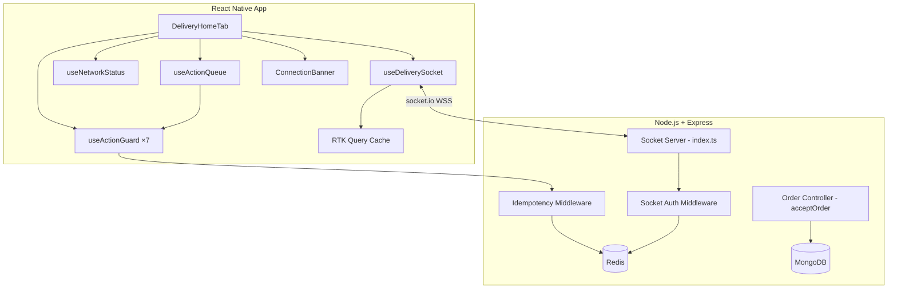

# Design Document — Delivery Production Hardening Phase 1

## Overview

This document describes the technical design for hardening the delivery partner app for production. The UI transformation is already complete; this phase adds four orthogonal production-readiness layers:

1. **Real-Time Socket Layer** — zone-scoped push events replace polling
2. **Anti-Double-Action Guard** — per-action `isProcessing` flags + `useActionGuard` hook
3. **Backend Idempotency** — Redis-backed deduplication middleware
4. **Order Lock** — atomic MongoDB `findOneAndUpdate` prevents race conditions
5. **Network Failure UX** — offline detection, banner, action queue with retry

The backend already has `socket.io` v4.8.1, `ioredis`, and the `redis` client from `backend/src/config/redis.ts`. The frontend already has `@react-native-community/netinfo` available via Expo. The existing `delivery:{userId}` room join flow in `backend/src/index.ts` is extended, not replaced.

---

## Architecture



**Key design decisions:**

- The socket auth middleware runs at the `io.use()` level — connections with missing/invalid tokens or non-delivery roles are rejected before any `connection` event fires. This is a hard security boundary.
- Zone rooms (`delivery_zone:{zone}`) are joined/left on status toggle, not on socket connect. This keeps the socket lifecycle independent of rider availability state.
- The idempotency middleware is applied as Express middleware on the delivery mutation routes, not inside individual controllers. This keeps controllers clean and makes deduplication auditable in one place.
- The `useActionGuard` hook is a thin wrapper — it does not know about the network or the queue. The `useActionQueue` hook sits above it and decides whether to call the guarded function or enqueue.
- The `ConnectionBanner` is rendered as the first child of the root `View` in `DeliveryHomeTab`, above the `ControlBar` and `ScrollView`, so it is never obscured.

---

## Components and Interfaces

### Backend: Socket Auth Middleware

**File:** `backend/src/index.ts` (modify existing `io.use()` block)

The existing middleware already extracts a token and attaches `socket.data.userId` and `socket.data.role`. The change is to make it **reject** connections where the role is not `delivery` (or `admin` for admin sockets). Currently it calls `next()` even on failure.

```typescript
io.use(async (socket, next) => {
  try {
    const token =
      socket.handshake.auth?.token ||
      socket.handshake.headers?.authorization?.replace(/^Bearer\s+/i, '') ||
      '';

    if (!token) return next(new Error('Unauthorized'));

    const decoded = jwt.verify(token, process.env.JWT_SECRET!) as any;
    const userId = String(decoded?.userId || '');
    if (!userId) return next(new Error('Unauthorized'));

    const user = await User.findById(userId).select('_id role').lean();
    if (!user) return next(new Error('Unauthorized'));

    const role = String((user as any).role || '');
    // Only delivery and admin roles may connect
    if (role !== 'delivery' && role !== 'admin') return next(new Error('Unauthorized'));

    socket.data.userId = userId;
    socket.data.role = role;
    return next();
  } catch {
    return next(new Error('Unauthorized'));
  }
});
```

### Backend: Zone Room Join on `join_room`

**File:** `backend/src/index.ts` (modify `join_room` handler)

When a delivery socket emits `join_room`, the server joins two rooms:
- `delivery:{userId}` — for targeted `order_updated` events
- `delivery_zone:{zone}` — for broadcast `new_order` events

The zone is derived from the rider's `assignedAreas[0]` field in the database, defaulting to `'default'` if absent.

```typescript
socket.on('join_room', async (data) => {
  // ... existing admin_room handling unchanged ...

  if (roomStr.startsWith('delivery:')) {
    // ... existing token verification ...
    const deliveryUser = await User.findById(deliveryBoyId)
      .select('role assignedAreas')
      .lean();

    if (!deliveryUser || String((deliveryUser as any).role) !== 'delivery') return;

    const zone = (deliveryUser as any).assignedAreas?.[0] ?? 'default';
    socket.join(`delivery:${deliveryBoyId}`);
    socket.join(`delivery_zone:${zone}`);
    socket.data.zone = zone;
  }
});
```

A `leave_room` event mirrors this: the socket leaves `delivery_zone:{zone}` when the rider goes offline.

### Backend: `new_order` Emission

**File:** `backend/src/domains/operations/controllers/deliveryOrderController.ts` (or wherever order creation triggers socket emission)

```typescript
const zone = order.zone ?? 'default';
const room = `delivery_zone:${zone}`;
io.to(room).timeout(5000).emit('new_order', order, (err: any, acks: any[]) => {
  if (err) {
    // No acks received within 5s — re-emit once
    io.to(room).emit('new_order', order);
  }
});
```

### Backend: `order_updated` Emission

Emitted from `OrderEventBroadcaster` or the order controller after any status change:

```typescript
const riderId = order.deliveryBoy?.toString();
if (riderId) {
  io.to(`delivery:${riderId}`).emit('order_updated', order);
}
```

### Backend: Idempotency Middleware

**File:** `backend/src/middleware/idempotency.ts` (new file)

```typescript
import { createHash } from 'crypto';
import { redis } from '../config/redis';
import { logger } from '../utils/logger';

export const idempotencyMiddleware = async (req: any, res: any, next: any) => {
  const key = req.headers['idempotency-key'];
  if (!key) return next();

  const hash = createHash('sha256').update(JSON.stringify(req.body)).digest('hex');

  try {
    const stored = await redis.get(`idempotency:${key}`);
    if (stored) {
      const record = JSON.parse(stored);
      if (record.hash !== hash) {
        return res.status(400).json({ error: 'Idempotency key reuse with different payload' });
      }
      return res.status(200).json(record.response);
    }
  } catch (err) {
    logger.warn('[Idempotency] Redis unavailable, proceeding without deduplication', err);
    return next(); // fail-open
  }

  // Intercept the response to cache it
  const originalJson = res.json.bind(res);
  res.json = (body: any) => {
    redis
      .setEx(`idempotency:${key}`, 60, JSON.stringify({ hash, response: body }))
      .catch((err) => logger.warn('[Idempotency] Failed to cache response', err));
    return originalJson(body);
  };

  next();
};
```

Applied in `backend/src/routes/deliveryAuth.ts` on all 7 mutation routes:

```typescript
import { idempotencyMiddleware } from '../middleware/idempotency';

router.post('/orders/:orderId/accept',       authenticateToken, requireDeliveryRole, idempotencyMiddleware, acceptOrder);
router.post('/orders/:orderId/reject',       authenticateToken, requireDeliveryRole, idempotencyMiddleware, rejectOrder);
router.post('/orders/:orderId/pickup',       authenticateToken, requireDeliveryRole, idempotencyMiddleware, pickupOrder);
router.post('/orders/:orderId/start-delivery', authenticateToken, requireDeliveryRole, idempotencyMiddleware, startDelivery);
router.post('/orders/:orderId/arrived',      authenticateToken, requireDeliveryRole, idempotencyMiddleware, markArrived);
router.post('/orders/:orderId/verify-otp',   authenticateToken, requireDeliveryRole, idempotencyMiddleware, verifyDeliveryOtp);
router.post('/orders/:orderId/fail',         authenticateToken, requireDeliveryRole, idempotencyMiddleware, failDelivery);
```

### Backend: Order Lock (Atomic Accept)

**File:** `backend/src/domains/operations/controllers/deliveryOrderController.ts` — `acceptOrder` handler

```typescript
export const acceptOrder = async (req: Request, res: Response) => {
  const { orderId } = req.params;
  const riderId = (req as any).user?.userId;

  const order = await Order.findOneAndUpdate(
    { _id: orderId, status: 'pending' },
    { $set: { status: 'assigned', deliveryBoy: riderId } },
    { new: true }
  );

  if (!order) {
    return res.status(409).json({ error: 'Order already taken by another rider' });
  }

  // Emit order_updated to the assigned rider's room
  const io = req.app.get('io');
  io?.to(`delivery:${riderId}`).emit('order_updated', order);

  return res.status(200).json({ success: true, order });
};
```

### Frontend: `useDeliverySocket` Hook

**File:** `apps/customer-app/src/hooks/delivery/useDeliverySocket.ts` (new file)

```typescript
import { useEffect, useState } from 'react';
import { io, Socket } from 'socket.io-client';
import { useAppDispatch } from '../../store';
import { useSelector } from 'react-redux';
import { RootState } from '../../store';
import { deliveryApi } from '../../api/deliveryApi';

const SOCKET_URL = process.env.EXPO_PUBLIC_API_URL ?? 'http://localhost:5001';

export type SocketStatus = 'connected' | 'reconnecting' | 'disconnected';

export const useDeliverySocket = () => {
  const dispatch = useAppDispatch();
  const token = useSelector((state: RootState) => state.auth.token);
  const [socketStatus, setSocketStatus] = useState<SocketStatus>('disconnected');

  useEffect(() => {
    if (!token) return;

    const socket: Socket = io(SOCKET_URL, {
      auth: { token },
      reconnection: true,
      reconnectionDelay: 1000,
      reconnectionDelayMax: 30000,
      reconnectionAttempts: Infinity,
    });

    socket.on('connect', () => {
      setSocketStatus('connected');
      socket.emit('join_room', { room: `delivery:${socket.id}`, token });
    });

    socket.on('reconnecting', () => setSocketStatus('reconnecting'));
    socket.on('disconnect', () => setSocketStatus('disconnected'));

    socket.on('new_order', (order: any, ack?: () => void) => {
      dispatch(
        deliveryApi.util.updateQueryData('getDeliveryOrders', undefined, (draft) => {
          if (!draft?.orders?.find((o: any) => o._id === order._id)) {
            draft.orders.push(order);
          }
        })
      );
      ack?.();
    });

    socket.on('order_updated', (order: any) => {
      dispatch(
        deliveryApi.util.updateQueryData('getDeliveryOrders', undefined, (draft) => {
          const idx = draft?.orders?.findIndex((o: any) => o._id === order._id);
          if (idx !== undefined && idx !== -1) draft.orders[idx] = order;
        })
      );
    });

    return () => {
      socket.disconnect();
    };
  }, [token]);

  return { socketStatus };
};
```

### Frontend: `useActionGuard` Hook

**File:** `apps/customer-app/src/hooks/delivery/useActionGuard.ts` (new file)

```typescript
import { useState, useCallback } from 'react';

export const useActionGuard = <T extends unknown[]>(
  fn: (...args: T) => Promise<void>
) => {
  const [isProcessing, setIsProcessing] = useState(false);

  const guarded = useCallback(
    async (...args: T) => {
      if (isProcessing) return;
      setIsProcessing(true);
      try {
        await fn(...args);
      } finally {
        setIsProcessing(false);
      }
    },
    [fn, isProcessing]
  );

  return { guarded, isProcessing };
};
```

### Frontend: `useNetworkStatus` Hook

**File:** `apps/customer-app/src/hooks/delivery/useNetworkStatus.ts` (new file)

```typescript
import { useState, useEffect } from 'react';
import NetInfo from '@react-native-community/netinfo';

export const useNetworkStatus = () => {
  const [isOnline, setIsOnline] = useState(true);
  const [connectionType, setConnectionType] = useState<string>('unknown');

  useEffect(() => {
    // Check initial state
    NetInfo.fetch().then((state) => {
      setIsOnline(!!state.isConnected);
      setConnectionType(state.type);
    });

    const unsubscribe = NetInfo.addEventListener((state) => {
      setIsOnline(!!state.isConnected);
      setConnectionType(state.type);
    });

    return unsubscribe;
  }, []);

  return { isOnline, connectionType };
};
```

### Frontend: `useActionQueue` Hook

**File:** `apps/customer-app/src/hooks/delivery/useActionQueue.ts` (new file)

The queue holds at most 10 items. On reconnect, each item is validated against the current order state before replay.

```typescript
export interface QueuedAction {
  id: string;
  action: string;       // e.g. 'accept', 'pickup'
  orderId: string;
  args: unknown[];
  fn: (...args: any[]) => Promise<void>;
  idempotencyKey: string;
}

// Valid transitions map
export const VALID_TRANSITIONS: Record<string, string[]> = {
  pending:          ['assigned'],
  assigned:         ['picked_up'],
  picked_up:        ['in_transit'],
  in_transit:       ['arrived'],
  arrived:          ['delivered', 'failed'],
};

const MAX_QUEUE_SIZE = 10;
```

The hook exposes:
- `enqueue(action: QueuedAction)` — adds to queue, drops oldest if > 10
- `replayQueue(fetchOrderStatus: (id: string) => Promise<string>)` — called when `isOnline` transitions to `true`
- `isSyncing` — boolean, true while replay is in progress
- `queueLength` — current queue size

### Frontend: `ConnectionBanner` Component

**File:** `apps/customer-app/src/components/delivery/ConnectionBanner/ConnectionBanner.tsx` (new file)

```typescript
interface ConnectionBannerProps {
  isOnline: boolean;
  socketStatus: SocketStatus;
  connectionType: string;
  isSyncing: boolean;
}
```

Rendering logic:
- `!isOnline` → red banner, "No Internet Connection"
- `isOnline && socketStatus === 'reconnecting'` → yellow banner, "Reconnecting..."
- `isSyncing` → yellow banner, "Syncing..."
- `isOnline && socketStatus === 'connected' && !isSyncing` → renders `null`

The banner is positioned with `zIndex: 100` and rendered as the first child of the root `View` in `DeliveryHomeTab`.

### Frontend: `DeliveryHomeTab` Integration

**File:** `apps/customer-app/src/screens/delivery/DeliveryHomeTab.tsx` (modify)

Changes:
1. Add `useDeliverySocket`, `useNetworkStatus`, `useActionQueue` hooks
2. Wrap all 7 action handlers with `useActionGuard`
3. Generate idempotency keys: `{action}:{orderId}:{Date.now()}`
4. Render `<ConnectionBanner>` as first child of root `View`
5. On `handleAcceptOrder` 409 response: remove order from RTK cache via `updateQueryData`
6. On network error in any handler: call `enqueue` instead of showing an alert

---

## Data Models

### IdempotencyRecord (Redis)

```
Key:   idempotency:{idempotency-key-header-value}
TTL:   60 seconds
Value: JSON string
{
  hash: string,      // SHA-256 of JSON.stringify(req.body)
  response: object   // The response body that was returned
}
```

### QueuedAction (in-memory)

```typescript
{
  id: string,              // uuid
  action: string,          // 'accept' | 'reject' | 'pickup' | 'startDelivery' | 'markArrived' | 'verifyOtp' | 'failDelivery'
  orderId: string,
  args: unknown[],         // original call arguments
  fn: Function,            // the guarded async function to call
  idempotencyKey: string,  // pre-generated key to reuse on retry
  enqueuedAt: number,      // Date.now() at enqueue time
}
```

### Socket Room Naming

| Room name | Purpose |
|---|---|
| `delivery:{userId}` | Targeted events for a specific rider (order_updated) |
| `delivery_zone:{zone}` | Broadcast new orders to all riders in a zone |
| `admin_room` | Admin dashboard events (unchanged) |
| `order:{orderId}` | Customer live tracking (unchanged) |

### Idempotency Key Format (Frontend)

```
{action}:{orderId}:{timestamp}
```

Example: `accept:64f3a1b2c3d4e5f6a7b8c9d0:1718000000000`

---

## Correctness Properties

*A property is a characteristic or behavior that should hold true across all valid executions of a system — essentially, a formal statement about what the system should do. Properties serve as the bridge between human-readable specifications and machine-verifiable correctness guarantees.*

### Property 1: Zone Isolation

*For any* order with a zone field, the `new_order` socket event SHALL be emitted only to sockets in the `delivery_zone:{order.zone}` room. Sockets in any other zone room SHALL NOT receive the event.

**Validates: Requirements 1.1, 1.6**

### Property 2: Auth Exclusivity

*For any* socket connection attempt where the JWT token is missing, expired, invalid, or carries a role other than `"delivery"`, the connection SHALL be rejected with an `"Unauthorized"` error and no delivery events SHALL be received.

**Validates: Requirements 3.3, 3.4, 3.5**

### Property 3: Idempotency Safety — Same Key, Same Body

*For any* `(idempotency-key, request-body)` pair that has been processed within the last 60 seconds, a subsequent request with the same key and the same body SHALL return the cached response with HTTP 200 and SHALL NOT re-execute the handler.

**Validates: Requirements 6.2, 6.3**

### Property 4: Idempotency Safety — Same Key, Different Body

*For any* `idempotency-key` that has been seen within the last 60 seconds, a request with the same key but a different request body SHALL return HTTP 400 with `{ "error": "Idempotency key reuse with different payload" }` and SHALL NOT execute the handler.

**Validates: Requirements 6.4**

### Property 5: Order Lock Atomicity

*For any* order in `pending` status, at most one concurrent `accept` request SHALL succeed (returning HTTP 200). All other concurrent `accept` requests for the same order SHALL receive HTTP 409 with `{ "error": "Order already taken by another rider" }`.

**Validates: Requirements 7.1, 7.2, 7.3**

### Property 6: Action Guard — No Concurrent Dispatch

*For any* action handler wrapped with `useActionGuard`, if the handler is invoked while `isProcessing` is `true`, the invocation SHALL be silently ignored and no new API call SHALL be dispatched. After the in-flight call completes (success or error), `isProcessing` SHALL be reset to `false`.

**Validates: Requirements 5.2, 5.3, 5.4**

### Property 7: Queue Validity — Invalid Transitions Discarded

*For any* queued action where the current order status makes the intended transition invalid (i.e., the target status is not in `VALID_TRANSITIONS[currentStatus]`), the action SHALL be silently discarded from the queue without alerting the rider.

**Validates: Requirements 10.4**

### Property 8: Queue Bounded Size

*For any* sequence of network-failed actions, the ActionQueue SHALL never hold more than 10 items. When a new action would exceed the limit, the oldest queued action SHALL be discarded.

**Validates: Requirements 10.7**

### Property 9: RTK Cache Update — No Refetch

*For any* `new_order` or `order_updated` socket event, the RTK Query cache for `getDeliveryOrders` SHALL be updated via `updateQueryData` without triggering a network request to the `GET /delivery/orders` endpoint.

**Validates: Requirements 1.4, 2.2**

### Property 10: Network Status Accuracy

*For any* sequence of network state changes reported by `NetInfo`, the `isOnline` boolean returned by `useNetworkStatus` SHALL accurately reflect the most recent `isConnected` value at all times.

**Validates: Requirements 8.2, 8.3**

---

## Error Handling

| Scenario | Handling |
|---|---|
| Socket auth failure (bad/missing token) | `next(new Error('Unauthorized'))` — connection rejected, client receives `connect_error` |
| Socket auth failure (wrong role) | Same as above |
| Redis unavailable during idempotency check | Log warning, call `next()` — fail-open, handler executes normally |
| Redis unavailable during idempotency write | Log warning, response still returned to client |
| `findOneAndUpdate` returns null (order taken) | HTTP 409 `{ error: 'Order already taken by another rider' }` |
| Frontend receives 409 on accept | Remove order from RTK cache, show alert |
| Frontend action fails with network error | Enqueue action, show no alert (banner indicates offline state) |
| Frontend action fails with server error (4xx/5xx) | Do not enqueue, show error alert |
| Queued action replay fails with server error | Remove from queue, show error alert |
| Queued action replay — invalid transition | Silently discard, no alert |
| `new_order` ACK timeout (5s) | Re-emit once to the same zone room |
| JWT token expires while socket connected | Frontend disconnects, refreshes token, reconnects |

---

## Testing Strategy

### Unit Tests

- `useActionGuard`: verify `isProcessing` flag lifecycle, verify guarded function is not called when already processing
- `useNetworkStatus`: mock `NetInfo`, verify `isOnline` and `connectionType` update correctly
- `useActionQueue`: verify enqueue/dequeue, max-size eviction, FIFO replay order, invalid-transition discard
- `useDeliverySocket`: mock `socket.io-client`, verify RTK cache updates on `new_order` and `order_updated`
- `ConnectionBanner`: snapshot tests for each of the 4 states (offline, reconnecting, syncing, connected/hidden)
- `idempotencyMiddleware`: unit test with mocked Redis — same key+body returns cache, same key+different body returns 400, missing key passes through, Redis failure passes through
- `acceptOrder` controller: mock `Order.findOneAndUpdate` — success returns 200, null return gives 409

### Property-Based Tests

Property-based testing is applied using **fast-check** (TypeScript/JavaScript). Each property test runs a minimum of **100 iterations**.

- **Property 1 (Zone Isolation)**: Generate random zone strings and order objects; verify socket room targeting
  - Tag: `Feature: delivery-production-hardening-phase1, Property 1: Zone Isolation`

- **Property 2 (Auth Exclusivity)**: Generate random JWT payloads with arbitrary roles; verify only `role === 'delivery'` passes
  - Tag: `Feature: delivery-production-hardening-phase1, Property 2: Auth Exclusivity`

- **Property 3 (Idempotency Safety — Same Key, Same Body)**: Generate random `(key, body, response)` triples; verify cached response is returned
  - Tag: `Feature: delivery-production-hardening-phase1, Property 3: Idempotency Safety Same Key Same Body`

- **Property 4 (Idempotency Safety — Same Key, Different Body)**: Generate random `(key, body1, body2)` where `body1 !== body2`; verify 400 response
  - Tag: `Feature: delivery-production-hardening-phase1, Property 4: Idempotency Safety Same Key Different Body`

- **Property 5 (Order Lock Atomicity)**: Simulate concurrent accept requests with mocked MongoDB; verify exactly one succeeds
  - Tag: `Feature: delivery-production-hardening-phase1, Property 5: Order Lock Atomicity`

- **Property 6 (Action Guard)**: Generate random async functions and call sequences; verify no double-dispatch
  - Tag: `Feature: delivery-production-hardening-phase1, Property 6: Action Guard No Concurrent Dispatch`

- **Property 7 (Queue Validity)**: Generate random `(action, currentStatus)` pairs; verify invalid transitions are discarded
  - Tag: `Feature: delivery-production-hardening-phase1, Property 7: Queue Validity Invalid Transitions Discarded`

- **Property 8 (Queue Bounded Size)**: Generate sequences of > 10 network failures; verify queue length ≤ 10
  - Tag: `Feature: delivery-production-hardening-phase1, Property 8: Queue Bounded Size`

- **Property 9 (RTK Cache Update — No Refetch)**: Generate random order payloads; verify cache update without network call
  - Tag: `Feature: delivery-production-hardening-phase1, Property 9: RTK Cache Update No Refetch`

- **Property 10 (Network Status Accuracy)**: Generate random sequences of NetInfo state changes; verify `isOnline` always matches latest `isConnected`
  - Tag: `Feature: delivery-production-hardening-phase1, Property 10: Network Status Accuracy`

### Integration Tests

- End-to-end socket flow: rider connects → joins zone room → new order emitted → rider receives it
- Idempotency middleware applied to all 7 mutation routes (verify middleware is registered)
- Order lock: two concurrent accept requests in a test MongoDB instance — verify exactly one 200 and one 409
