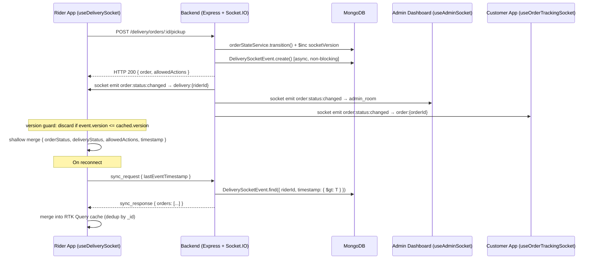
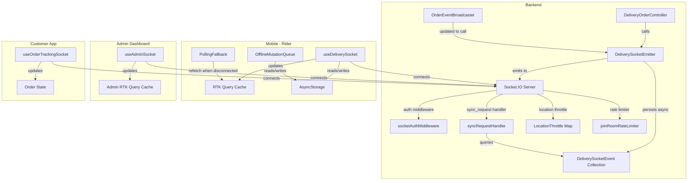

# Design Document: delivery-realtime-updates

## Overview

This feature replaces the current polling-based delivery update model with a systematic Socket.IO push architecture. The backend already has Socket.IO partially wired — `io` is available via `req.app.get("io")`, rooms `delivery:{riderId}`, `admin_room`, `order:{orderId}`, and `delivery_zone:{zone}` exist, and the `useDeliverySocket` hook handles `new_order` and `order_updated`. This design extends and hardens that foundation rather than replacing it.

The core changes are:

1. **Backend emission layer** — a `DeliverySocketEmitter` service that every delivery controller calls after a state transition, emitting `order:status:changed` to all three relevant rooms simultaneously with a standardized payload including `socketVersion`, `allowedActions`, and `eventId`.
2. **DeliverySocketEvent collection** — a MongoDB collection that persists every emitted event for sync recovery, with a 24-hour TTL.
3. **Socket authentication middleware** — the existing middleware is extended to enforce room-level authorization (rider can only join their own room, customers can only join their own order room).
4. **`sync_request` / `sync_response` handler** — reconnecting clients emit `sync_request` with a timestamp; the server queries `DeliverySocketEvent` and responds with missed events.
5. **Location throttle** — a per-rider in-memory map tracks the last emission timestamp; updates within 3 seconds are dropped silently.
6. **`useDeliverySocket` redesign** — all event listeners in a single `useEffect`, version guard, shallow merge strategy, `sync_request` on reconnect, polling fallback toggle.
7. **`useAdminSocket` hook** — new hook for the admin dashboard with exponential backoff reconnection and full cache refresh on reconnect.
8. **`useOrderTrackingSocket` hook** — new hook for customers tracking a specific order.
9. **Offline mutation queue** — `AsyncStorage`-backed FIFO queue, capped at 20 entries, replayed on network restore.
10. **Polling fallback state machine** — mutually exclusive: socket connected = no polling, socket disconnected = 30-second polling.


## Architecture

### High-Level Data Flow



### Component Topology



### Socket Room Strategy

| Room | Who joins | Events received |
|------|-----------|-----------------|
| `delivery:{riderId}` | Rider (on connect) | `order:assigned`, `order:status:changed`, `order:cancelled`, `order:reassigned`, `new_order`, `sync_response` |
| `admin_room` | Admin users (via `join_room`) | `order:assigned`, `order:status:changed`, `order:cancelled`, `driver:status:update`, `driver:location:update`, `delivery_attempt_failed`, `delivery_attempt_success` |
| `order:{orderId}` | Customer (via `join_order_room`) | `order:status:changed`, `order:location:update` |
| `delivery_zone:{zone}` | Rider (on connect, based on `assignedAreas[0]`) | `new_order` broadcasts |


## Components and Interfaces

### 1. DeliverySocketEmitter (new backend service)

**File:** `backend/src/domains/delivery/services/deliverySocketEmitter.ts`

This is the single point of truth for all delivery socket emissions. Every delivery controller calls this service after a successful state transition. It replaces the ad-hoc `io.to(...).emit(...)` calls scattered across `deliveryOrderController.ts`.

```typescript
export interface StatusChangedPayload {
  orderId: string;
  orderStatus: string;
  deliveryStatus: string;
  previousStatus: string;
  allowedActions: DeliveryAction[];
  riderId: string;
  version: number;        // post-increment socketVersion from Order document
  eventId: string;        // UUID v4
  timestamp: string;      // ISO 8601
}

export interface AssignedPayload {
  // Full normalized order object (same shape as getDeliveryOrders response)
  // plus allowedActions, eventId, timestamp
  [key: string]: any;
  allowedActions: DeliveryAction[];
  eventId: string;
  timestamp: string;
}

export class DeliverySocketEmitter {
  constructor(private io: Server) {}

  /**
   * Emit order:status:changed to all three rooms simultaneously.
   * Atomically increments socketVersion on the Order document.
   * Persists to DeliverySocketEvent asynchronously (non-blocking).
   * Logs at info level; logs warn if riderId or userId is missing.
   */
  async emitStatusChanged(params: {
    order: any;           // post-transition order document
    previousStatus: string;
    options: ComputeAllowedActionsOptions;
  }): Promise<void>;

  /**
   * Emit order:assigned to delivery:{riderId} and admin_room.
   * Payload is the full normalized order object.
   */
  async emitOrderAssigned(params: {
    order: any;
    options: ComputeAllowedActionsOptions;
  }): Promise<void>;

  /**
   * Emit order:cancelled to delivery:{riderId} and admin_room.
   */
  async emitOrderCancelled(params: {
    orderId: string;
    riderId: string | null;
    reason?: string;
  }): Promise<void>;

  /**
   * Emit order:reassigned to the OLD rider's room.
   */
  async emitOrderReassigned(params: {
    orderId: string;
    oldRiderId: string;
    newRiderId: string;
  }): Promise<void>;
}
```

**Emission logic for `emitStatusChanged`:**

1. Atomically increment `socketVersion` on the Order document:
   ```typescript
   const updated = await Order.findByIdAndUpdate(
     order._id,
     { $inc: { socketVersion: 1 } },
     { new: true, select: 'socketVersion' }
   ).lean();
   const version = updated?.socketVersion ?? 1;
   ```
2. Compute `allowedActions` via `computeAllowedActions(order, options)`.
3. Build payload with `eventId: uuidv4()`, `timestamp: new Date().toISOString()`.
4. Emit to rooms:
   - `delivery:{order.deliveryBoyId}` — skip with `logger.warn` if `deliveryBoyId` is null.
   - `admin_room` — always.
   - `order:{order.userId}` — skip with `logger.warn` if `userId` is null.
5. Persist to `DeliverySocketEvent` asynchronously (fire-and-forget, catch and log errors).
6. Log at `info` level: `{ eventName, rooms, orderId, riderId, timestamp }`.

### 2. DeliverySocketEvent Model (new MongoDB collection)

**File:** `backend/src/models/DeliverySocketEvent.ts`

The `payload` field stores a **minimal payload** (not the full order object) to keep the collection lean at scale. The minimal payload contains only the fields needed for `sync_response` reconstruction: `orderId`, `orderStatus`, `deliveryStatus`, `allowedActions`, `version`, `eventId`, `timestamp`. The full order object is never stored here — clients that need the full object use `getDeliveryOrders`.

```typescript
export interface IDeliverySocketEvent extends Document {
  orderId: mongoose.Types.ObjectId;   // indexed
  riderId: mongoose.Types.ObjectId;   // indexed
  eventName: string;
  payload: {                          // minimal payload only — not full order object
    orderId: string;
    orderStatus: string;
    deliveryStatus: string;
    allowedActions: string[];
    version: number;
    eventId: string;
    timestamp: string;
  };
  timestamp: Date;                    // indexed
  createdAt: Date;                    // TTL index: 24 hours
}

const DeliverySocketEventSchema = new Schema<IDeliverySocketEvent>(
  {
    orderId:   { type: Schema.Types.ObjectId, ref: 'Order', required: true },
    riderId:   { type: Schema.Types.ObjectId, ref: 'User', required: true },
    eventName: { type: String, required: true },
    payload:   { type: Schema.Types.Mixed, required: true },
    timestamp: { type: Date, required: true },
  },
  { timestamps: true }
);

// Compound indexes for sync_request queries
DeliverySocketEventSchema.index({ riderId: 1, timestamp: 1 });
DeliverySocketEventSchema.index({ orderId: 1, timestamp: 1 });

// TTL: auto-delete after 24 hours
DeliverySocketEventSchema.index({ createdAt: 1 }, { expireAfterSeconds: 86400 });
```

### 3. Socket Authentication Middleware (extended)

**File:** `backend/src/index.ts` (existing middleware, extended)

The existing `io.use()` middleware already validates JWT and checks `role === 'delivery' || role === 'admin'`. This is extended to also allow `role === 'customer'` so customers can connect for order tracking.

The room-level authorization (rider can only join their own room, customer can only join their own order room) is already implemented in the `join_room` and `join_order_room` handlers. No changes needed there beyond adding the `sync_request` handler.

**Rate limiting for `join_room`:** A per-socket counter map tracks `join_room` calls. If a socket exceeds 10 calls per minute, subsequent calls are silently ignored and a warning is logged.

```typescript
// In-memory rate limiter (per socket, resets on disconnect)
const joinRoomCounts = new Map<string, { count: number; resetAt: number }>();

socket.on('join_room', (data) => {
  const now = Date.now();
  const entry = joinRoomCounts.get(socket.id) ?? { count: 0, resetAt: now + 60_000 };
  if (now > entry.resetAt) { entry.count = 0; entry.resetAt = now + 60_000; }
  entry.count++;
  joinRoomCounts.set(socket.id, entry);
  if (entry.count > 10) {
    logger.warn('[Socket] join_room rate limit exceeded', { socketId: socket.id });
    return;
  }
  // ... existing join logic
});

socket.on('disconnect', () => {
  joinRoomCounts.delete(socket.id);
});
```

### 4. sync_request / sync_response Handler

**File:** `backend/src/index.ts` (added to `io.on('connection')` block)

```typescript
socket.on('sync_request', async (data: { lastEventTimestamp: string }) => {
  const riderId = String((socket.data as any).userId || '');
  if (!riderId) return;

  const since = new Date(data?.lastEventTimestamp || 0);
  
  try {
    const events = await DeliverySocketEvent.find({
      riderId: new mongoose.Types.ObjectId(riderId),
      timestamp: { $gt: since },
    })
      .sort({ timestamp: 1 })
      .limit(500)  // backpressure cap: max 500 events per sync_response
      .lean();

    const orders = events.map((e: any) => e.payload);
    const wasCapped = events.length === 500;

    logger.info('[Socket] sync_request handled', {
      riderId,
      lastEventTimestamp: since.toISOString(),
      eventsFound: events.length,
      wasCapped,
    });

    // If capped, signal the client to do a full refetch instead of partial merge
    socket.emit('sync_response', { orders, fullRefetchRequired: wasCapped });
  } catch (e) {
    logger.error('[Socket] sync_request handler error', e);
    socket.emit('sync_response', { orders: [] });
  }
});
```

### 5. Location Throttle

**File:** `backend/src/index.ts` (in the `liveLocationEvents.on('location')` handler)

A per-rider in-memory `Map<riderId, lastEmitMs>` tracks the last time `driver:location:update` was emitted to `admin_room`. Updates within 3 seconds of the previous emit are dropped silently.

```typescript
const locationThrottle = new Map<string, number>(); // riderId → last emit timestamp (ms)
const LOCATION_THROTTLE_MS = 3000;

liveLocationEvents.on('location', async (loc: any) => {
  const driverId = String(loc?.driverId || '');
  if (!driverId) return;

  const now = Date.now();
  const lastEmit = locationThrottle.get(driverId) ?? 0;

  if (now - lastEmit < LOCATION_THROTTLE_MS) {
    // Drop silently — within throttle window
    return;
  }

  locationThrottle.set(driverId, now);

  // ... existing emission logic for admin_room and order rooms
});
```

The `locationThrottle` map is cleaned up on rider disconnect to prevent unbounded growth:

```typescript
socket.on('disconnect', () => {
  const userId = String((socket.data as any).userId || '');
  if (userId) locationThrottle.delete(userId);
});
```

### 6. ACK Retry Logic (server-side)

For events that support ACK (primarily `order:assigned` and `new_order` to rider rooms), the server uses a helper that re-emits up to 3 times with exponential backoff if no ACK is received within 5 seconds.

```typescript
async function emitWithRetry(
  io: Server,
  room: string,
  eventName: string,
  payload: object,
  maxRetries = 3
): Promise<void> {
  const delays = [1000, 3000, 5000]; // backoff schedule
  
  for (let attempt = 0; attempt <= maxRetries; attempt++) {
    const acked = await new Promise<boolean>((resolve) => {
      const timeout = setTimeout(() => resolve(false), 5000);
      io.to(room).timeout(5000).emit(eventName, payload, (err: any) => {
        clearTimeout(timeout);
        resolve(!err);
      });
    });

    if (acked) return;

    if (attempt < maxRetries) {
      await new Promise(r => setTimeout(r, delays[attempt]));
    } else {
      logger.warn('[Socket] emitWithRetry: max retries reached', {
        room, eventName, orderId: (payload as any).orderId,
      });
    }
  }
}
```


### 7. useDeliverySocket Hook (redesigned)

**File:** `apps/customer-app/src/hooks/delivery/useDeliverySocket.ts`

The existing hook is replaced with a comprehensive implementation. Key design decisions:

- **Single `useEffect`** with a stable `token` dependency. All listeners are registered inside it and cleaned up in the return function.
- **Version guard** before applying `order:status:changed` — discard if `event.version <= cached.version`.
- **Shallow merge** for `order:status:changed` — only update `orderStatus`, `deliveryStatus`, `allowedActions`, `version`, `timestamp`.
- **Full replacement** for `order:assigned` — the payload is the full normalized order.
- **`sync_request` on reconnect** — if disconnected > 5 seconds, emit `sync_request` with timestamp from `AsyncStorage`.
- **Full refetch fallback** — if disconnected > 60 seconds, invalidate and refetch `getDeliveryOrders`.
- **Polling fallback** — when socket is `disconnected`, start a 30-second interval refetch; cancel on reconnect.
- **Event deduplication** — maintain a `Set<string>` of processed `eventId`s with a 60-second TTL.
- **Background handling** — subscribe to `AppState`; on foreground after 30+ seconds, emit `sync_request`.

```typescript
export type SocketStatus = 'connected' | 'reconnecting' | 'disconnected';

export interface UseDeliverySocketReturn {
  socketStatus: SocketStatus;
}

export const useDeliverySocket = (): UseDeliverySocketReturn => {
  const dispatch = useDispatch<AppDispatch>();
  const token = useSelector((state: RootState) => state.auth.accessToken);
  const userId = useSelector((state: RootState) => state.auth.userId);
  const [socketStatus, setSocketStatus] = useState<SocketStatus>('disconnected');

  useEffect(() => {
    if (!token || !userId) return;

    // --- Socket initialization ---
    const socket: Socket = io(SOCKET_URL, {
      auth: { token },
      reconnection: true,
      reconnectionDelay: 1000,
      reconnectionDelayMax: 30000,
      reconnectionAttempts: Infinity,
    });

    // --- State tracking ---
    let disconnectedAt: number | null = null;
    let pollingInterval: ReturnType<typeof setInterval> | null = null;
    let backgroundAt: number | null = null;
    const processedEventIds = new Map<string, number>(); // eventId → processedAt ms

    // --- Helpers ---
    const isEventDuplicate = (eventId: string): boolean => {
      const now = Date.now();
      // Purge entries older than 60 seconds
      for (const [id, ts] of processedEventIds) {
        if (now - ts > 60_000) processedEventIds.delete(id);
      }
      if (processedEventIds.has(eventId)) return true;
      processedEventIds.set(eventId, now);
      return false;
    };

    const startPolling = () => {
      if (pollingInterval) return;
      pollingInterval = setInterval(() => {
        dispatch(deliveryApi.util.invalidateTags(['DeliveryOrders']));
      }, 30_000);
    };

    const stopPolling = () => {
      if (pollingInterval) { clearInterval(pollingInterval); pollingInterval = null; }
    };

    const emitSyncRequest = async () => {
      const lastTs = await AsyncStorage.getItem(LAST_EVENT_TS_KEY);
      socket.emit('sync_request', { lastEventTimestamp: lastTs ?? new Date(0).toISOString() });
    };

    const persistLastEventTs = (timestamp: string) => {
      AsyncStorage.setItem(LAST_EVENT_TS_KEY, timestamp).catch(() => {});
    };

    // --- Connection events ---
    socket.on('connect', async () => {
      setSocketStatus('connected');
      stopPolling();

      // Join personal delivery room and zone room
      socket.emit('join_room', { room: `delivery:${userId}`, token });

      // Sync if we were disconnected
      if (disconnectedAt !== null) {
        const disconnectedForMs = Date.now() - disconnectedAt;
        disconnectedAt = null;

        if (disconnectedForMs > 60_000) {
          // Extended outage: full cache invalidation
          dispatch(deliveryApi.util.invalidateTags(['DeliveryOrders']));
        } else if (disconnectedForMs > 5_000) {
          // Short outage: sync missed events
          await emitSyncRequest();
        }
      }
    });

    socket.on('reconnect_attempt', () => setSocketStatus('reconnecting'));

    socket.on('disconnect', () => {
      setSocketStatus('disconnected');
      disconnectedAt = Date.now();
      startPolling();
    });

    // --- Event handlers ---
    const handleOrderAssigned = (order: any) => {
      if (!order?._id) return;
      if (order.eventId && isEventDuplicate(order.eventId)) return;
      if (order.timestamp) persistLastEventTs(order.timestamp);

      dispatch(
        deliveryApi.util.updateQueryData('getDeliveryOrders', undefined, (draft) => {
          const idx = draft?.orders?.findIndex((o: any) => o._id === order._id);
          if (idx !== undefined && idx !== -1) {
            draft.orders[idx] = order; // full replacement
          } else {
            draft?.orders?.push(order);
          }
        })
      );
    };

    const handleNewOrder = (order: any, ack?: () => void) => {
      if (!order?._id) return;
      if (order.eventId && isEventDuplicate(order.eventId)) { ack?.(); return; }
      if (order.timestamp) persistLastEventTs(order.timestamp);

      dispatch(
        deliveryApi.util.updateQueryData('getDeliveryOrders', undefined, (draft) => {
          if (!draft?.orders?.find((o: any) => o._id === order._id)) {
            draft?.orders?.push(order);
          }
        })
      );
      ack?.();
    };

    const handleStatusChanged = (event: StatusChangedPayload) => {
      if (!event?.orderId) return;
      if (event.eventId && isEventDuplicate(event.eventId)) return;
      if (event.timestamp) persistLastEventTs(event.timestamp);

      try {
        dispatch(
          deliveryApi.util.updateQueryData('getDeliveryOrders', undefined, (draft) => {
            const idx = draft?.orders?.findIndex((o: any) => o._id === event.orderId);
            if (idx === undefined || idx === -1) {
              // Unknown order: trigger targeted refetch (handled outside immer)
              return;
            }
            const cached = draft.orders[idx];
            // Version guard: discard stale events
            if (event.version <= (cached.version ?? 0)) return;

            // Shallow merge: only update changed fields
            cached.orderStatus = event.orderStatus;
            cached.deliveryStatus = event.deliveryStatus;
            cached.allowedActions = event.allowedActions;
            cached.version = event.version;
            cached.timestamp = event.timestamp;
          })
        );
      } catch (e) {
        logger.error('[useDeliverySocket] cache update error', e);
        dispatch(deliveryApi.util.invalidateTags(['DeliveryOrders']));
      }
    };

    const handleOrderCancelled = (data: { orderId: string }) => {
      dispatch(
        deliveryApi.util.updateQueryData('getDeliveryOrders', undefined, (draft) => {
          if (draft?.orders) {
            draft.orders = draft.orders.filter((o: any) => o._id !== data.orderId);
          }
        })
      );
      // Toast notification handled by the component layer via socketStatus events
    };

    const handleOrderReassigned = (data: { orderId: string }) => {
      dispatch(
        deliveryApi.util.updateQueryData('getDeliveryOrders', undefined, (draft) => {
          if (draft?.orders) {
            draft.orders = draft.orders.filter((o: any) => o._id !== data.orderId);
          }
        })
      );
    };

    const handleSyncResponse = (data: { orders: StatusChangedPayload[]; fullRefetchRequired?: boolean }) => {
      // If the server capped the response (>500 events), do a full refetch instead
      if (data?.fullRefetchRequired) {
        dispatch(deliveryApi.util.invalidateTags(['DeliveryOrders']));
        return;
      }
      if (!Array.isArray(data?.orders)) return;
      dispatch(
        deliveryApi.util.updateQueryData('getDeliveryOrders', undefined, (draft) => {
          for (const event of data.orders) {
            const idx = draft?.orders?.findIndex((o: any) => o._id === event.orderId);
            if (idx !== undefined && idx !== -1) {
              const cached = draft.orders[idx];
              if (event.version > (cached.version ?? 0)) {
                cached.orderStatus = event.orderStatus;
                cached.deliveryStatus = event.deliveryStatus;
                cached.allowedActions = event.allowedActions;
                cached.version = event.version;
                cached.timestamp = event.timestamp;
              }
            } else {
              // New order discovered via sync — insert it
              draft?.orders?.push(event as any);
            }
          }
        })
      );
    };

    // --- Register listeners ---
    socket.on('order:assigned', handleOrderAssigned);
    socket.on('new_order', handleNewOrder);
    socket.on('order:status:changed', handleStatusChanged);
    socket.on('order:cancelled', handleOrderCancelled);
    socket.on('order:reassigned', handleOrderReassigned);
    socket.on('sync_response', handleSyncResponse);

    // --- AppState (background/foreground) ---
    const appStateSubscription = AppState.addEventListener('change', async (nextState) => {
      if (nextState === 'background') {
        backgroundAt = Date.now();
      } else if (nextState === 'active' && backgroundAt !== null) {
        const bgDurationMs = Date.now() - backgroundAt;
        backgroundAt = null;
        if (bgDurationMs > 30_000 && socket.connected) {
          await emitSyncRequest();
        }
      }
    });

    // --- Cleanup ---
    return () => {
      socket.off('order:assigned', handleOrderAssigned);
      socket.off('new_order', handleNewOrder);
      socket.off('order:status:changed', handleStatusChanged);
      socket.off('order:cancelled', handleOrderCancelled);
      socket.off('order:reassigned', handleOrderReassigned);
      socket.off('sync_response', handleSyncResponse);
      stopPolling();
      appStateSubscription.remove();
      socket.disconnect();
    };
  }, [token, userId, dispatch]);

  return { socketStatus };
};
```

### 8. useAdminSocket Hook (new)

**File:** `apps/admin-dashboard/src/hooks/useAdminSocket.ts` (or equivalent admin app path)

```typescript
export type AdminSocketStatus = 'connected' | 'reconnecting' | 'disconnected';

export interface UseAdminSocketReturn {
  socketStatus: AdminSocketStatus;
}

export const useAdminSocket = (): UseAdminSocketReturn => {
  const dispatch = useDispatch<AppDispatch>();
  const token = useSelector((state: RootState) => state.auth.accessToken);
  const [socketStatus, setSocketStatus] = useState<AdminSocketStatus>('disconnected');

  useEffect(() => {
    if (!token) return;

    const socket: Socket = io(SOCKET_URL, {
      auth: { token },
      reconnection: true,
      reconnectionDelay: 1000,
      reconnectionDelayMax: 30000,
      reconnectionAttempts: Infinity,
    });

    const processedEventIds = new Map<string, number>();
    const isEventDuplicate = (eventId: string): boolean => { /* same as useDeliverySocket */ };

    socket.on('connect', () => {
      setSocketStatus('connected');
      socket.emit('join_room', { room: 'admin_room', token });
    });

    socket.on('reconnect_attempt', () => setSocketStatus('reconnecting'));

    socket.on('disconnect', () => setSocketStatus('disconnected'));

    socket.on('reconnect', () => {
      // Full state refresh on reconnect (no sync_request for admins)
      dispatch(adminApi.util.invalidateTags(['AdminOrders', 'AdminRiders']));
    });

    const handleStatusChanged = (event: StatusChangedPayload) => {
      if (event.eventId && isEventDuplicate(event.eventId)) return;
      // Batch admin updates: accumulate events and flush every 500ms
      pendingUpdates.push(event);
      scheduleBatchFlush();
    };

    // --- Admin batching: accumulate updates and apply in one immer pass every 500ms ---
    let pendingUpdates: StatusChangedPayload[] = [];
    let batchTimer: ReturnType<typeof setTimeout> | null = null;

    const scheduleBatchFlush = () => {
      if (batchTimer) return;
      batchTimer = setTimeout(() => {
        batchTimer = null;
        if (pendingUpdates.length === 0) return;
        const batch = pendingUpdates.splice(0);
        dispatch(
          adminApi.util.updateQueryData('getAdminOrders', undefined, (draft) => {
            for (const event of batch) {
              const idx = draft?.orders?.findIndex((o: any) => o._id === event.orderId);
              if (idx !== undefined && idx !== -1) {
                const cached = draft.orders[idx];
                if (event.version > (cached.version ?? 0)) {
                  cached.orderStatus = event.orderStatus;
                  cached.deliveryStatus = event.deliveryStatus;
                  cached.allowedActions = event.allowedActions;
                  cached.version = event.version;
                }
              }
            }
          })
        );
      }, 500);
    };

    const handleOrderAssigned = (order: any) => {
      if (order.eventId && isEventDuplicate(order.eventId)) return;
      dispatch(
        adminApi.util.updateQueryData('getAdminOrders', undefined, (draft) => {
          const idx = draft?.orders?.findIndex((o: any) => o._id === order._id);
          if (idx !== undefined && idx !== -1) {
            draft.orders[idx] = order;
          } else {
            draft?.orders?.push(order);
          }
        })
      );
    };

    const handleDriverStatusUpdate = (data: any) => {
      dispatch(
        adminApi.util.updateQueryData('getAdminRiders', undefined, (draft) => {
          const idx = draft?.riders?.findIndex((r: any) => r._id === data.driverId);
          if (idx !== undefined && idx !== -1) {
            draft.riders[idx].availability = data.availability;
            draft.riders[idx].status = data.status;
          }
        })
      );
    };

    const handleDriverLocationUpdate = (data: any) => {
      dispatch(adminActions.updateRiderLocation(data)); // local Redux action
    };

    socket.on('order:status:changed', handleStatusChanged);
    socket.on('order:assigned', handleOrderAssigned);
    socket.on('driver:status:update', handleDriverStatusUpdate);
    socket.on('driver:location:update', handleDriverLocationUpdate);

    return () => {
      socket.off('order:status:changed', handleStatusChanged);
      socket.off('order:assigned', handleOrderAssigned);
      socket.off('driver:status:update', handleDriverStatusUpdate);
      socket.off('driver:location:update', handleDriverLocationUpdate);
      socket.disconnect();
    };
  }, [token, dispatch]);

  return { socketStatus };
};
```

### 9. useOrderTrackingSocket Hook (new)

**File:** `apps/customer-app/src/hooks/useOrderTrackingSocket.ts`

```typescript
export interface OrderTrackingState {
  orderStatus: string | null;
  riderLat: number | null;
  riderLng: number | null;
  etaMinutes: number | null;
  isDelivered: boolean;
  isFailed: boolean;
  failureReason?: string;
}

export const useOrderTrackingSocket = (orderId: string): OrderTrackingState => {
  const token = useSelector((state: RootState) => state.auth.accessToken);
  const [state, setState] = useState<OrderTrackingState>({ /* initial nulls */ });

  useEffect(() => {
    if (!token || !orderId) return;

    const socket: Socket = io(SOCKET_URL, {
      auth: { token },
      reconnection: true,
      reconnectionDelay: 1000,
      reconnectionDelayMax: 30000,
      reconnectionAttempts: Infinity,
    });

    socket.on('connect', () => {
      socket.emit('join_order_room', { orderId, token });
    });

    const handleStatusChanged = (event: StatusChangedPayload) => {
      setState(prev => ({
        ...prev,
        orderStatus: event.orderStatus,
        isDelivered: event.orderStatus === 'DELIVERED',
        isFailed: event.orderStatus === 'FAILED',
        failureReason: (event as any).failureReason,
      }));

      // Disconnect from order room on terminal states
      if (['DELIVERED', 'FAILED'].includes(event.orderStatus)) {
        socket.disconnect();
      }
    };

    const handleLocationUpdate = (data: any) => {
      setState(prev => ({
        ...prev,
        riderLat: data.riderLat,
        riderLng: data.riderLng,
        etaMinutes: data.etaMinutes,
      }));
    };

    socket.on('order:status:changed', handleStatusChanged);
    socket.on('order:location:update', handleLocationUpdate);

    return () => {
      socket.off('order:status:changed', handleStatusChanged);
      socket.off('order:location:update', handleLocationUpdate);
      socket.disconnect();
    };
  }, [token, orderId]);

  return state;
};
```

### 10. Offline Mutation Queue

**File:** `apps/customer-app/src/services/offlineMutationQueue.ts`

```typescript
export interface OfflineQueueEntry {
  id: string;           // UUID v4
  action: string;       // e.g. 'pickupOrder', 'startDelivery'
  orderId: string;
  args: Record<string, any>;
  enqueuedAt: string;   // ISO 8601
  retryCount: number;
}

const QUEUE_KEY = 'delivery_offline_queue';
const MAX_QUEUE_SIZE = 20;

export const offlineMutationQueue = {
  async enqueue(entry: Omit<OfflineQueueEntry, 'id' | 'enqueuedAt' | 'retryCount'>): Promise<void> {
    const queue = await this.getAll();
    if (queue.length >= MAX_QUEUE_SIZE) {
      logger.warn('[OfflineQueue] Cap reached, dropping oldest entry');
      queue.shift(); // drop oldest
    }
    queue.push({ ...entry, id: uuidv4(), enqueuedAt: new Date().toISOString(), retryCount: 0 });
    await AsyncStorage.setItem(QUEUE_KEY, JSON.stringify(queue));
  },

  async getAll(): Promise<OfflineQueueEntry[]> {
    const raw = await AsyncStorage.getItem(QUEUE_KEY);
    return raw ? JSON.parse(raw) : [];
  },

  async remove(id: string): Promise<void> {
    const queue = await this.getAll();
    await AsyncStorage.setItem(QUEUE_KEY, JSON.stringify(queue.filter(e => e.id !== id)));
  },

  async incrementRetry(id: string): Promise<void> {
    const queue = await this.getAll();
    const entry = queue.find(e => e.id === id);
    if (entry) { entry.retryCount++; }
    await AsyncStorage.setItem(QUEUE_KEY, JSON.stringify(queue));
  },
};
```

**Replay hook:** `useOfflineQueueReplay` subscribes to `NetInfo` (or `useNetworkStatus`). When `isConnected` transitions from `false` to `true`, it replays entries in FIFO order:

- On HTTP 2xx: remove from queue, update RTK Query cache from response.
- On HTTP 4xx/5xx: remove from queue, show error toast.
- On network error: increment `retryCount`, keep in queue.


## Scaling Notes

### Redis Adapter (horizontal scaling)

The current Socket.IO server uses the default in-memory adapter. This works for a single Node.js process but will not scale horizontally — if two server instances are running, a rider connected to instance A will not receive events emitted on instance B.

**Future requirement:** When horizontal scaling is needed, the Socket.IO server SHALL be configured with `@socket.io/redis-adapter`:

```typescript
import { createAdapter } from '@socket.io/redis-adapter';
import { createClient } from 'redis';

const pubClient = createClient({ url: process.env.REDIS_URL });
const subClient = pubClient.duplicate();
await Promise.all([pubClient.connect(), subClient.connect()]);
io.adapter(createAdapter(pubClient, subClient));
```

This is a drop-in change — no application code changes are needed. The `DeliverySocketEmitter` and all room-based emits work identically with the Redis adapter.

**Note:** The `locationThrottle` and `joinRoomCounts` in-memory maps are per-process. When using the Redis adapter, these should be migrated to Redis-backed rate limiters (e.g., `ioredis` + sliding window) to enforce throttling across all instances.

### Observability Metrics

The `DeliverySocketEmitter` SHALL track and expose the following metrics via the `/admin/socket-stats` endpoint:

```typescript
interface SocketMetrics {
  // Emission counters (reset every minute)
  eventsEmittedPerMin: number;
  eventsDroppedThrottlePerMin: number;  // location updates dropped by throttle
  syncRequestsPerMin: number;
  ackRetriesPerMin: number;

  // Current state
  connectedSocketsPerRoom: Record<string, number>;  // room → count
  offlineQueueDepth: number;  // sum across all connected riders (not available server-side; omit)

  // Cumulative (since server start)
  totalEventsEmitted: number;
  totalSyncRequests: number;
  totalAckFailures: number;
}
```

These counters are maintained in a module-level object in `deliverySocketEmitter.ts` and reset on a 60-second interval. The `/admin/socket-stats` endpoint reads them directly — no external metrics system is required for the initial implementation.


## Data Models

### Order document — new `socketVersion` field

The `IOrder` interface and Mongoose schema gain one new field:

```typescript
socketVersion: number; // default: 0, incremented by $inc on every status transition
```

This field is added to the Order schema with `default: 0`. It is never set directly — only incremented via `$inc` in `DeliverySocketEmitter.emitStatusChanged()`.

### DeliverySocketEvent document

See schema in Components section above. Key points:

- `orderId` and `riderId` are `ObjectId` references (not strings) for efficient indexed queries.
- `payload` stores the **minimal** `StatusChangedPayload` (status + allowedActions + version + eventId + timestamp) — NOT the full order object. This keeps the collection lean at scale (each document is ~300 bytes vs ~5KB for a full order).
- `timestamp` is the server-side event generation time (same as `payload.timestamp`), stored as a `Date` for range queries.
- `createdAt` is the MongoDB insertion time, used for the TTL index.
- `sync_response` returns `payload` directly — clients merge the minimal fields into their existing cache using the version guard.

### Event Payload Shapes

**`order:status:changed` (partial update)**
```typescript
interface StatusChangedPayload {
  orderId: string;
  orderStatus: string;
  deliveryStatus: string;
  previousStatus: string;
  allowedActions: DeliveryAction[];
  riderId: string;
  version: number;
  eventId: string;       // UUID v4 for deduplication
  timestamp: string;     // ISO 8601
}
```

**`order:assigned` (full object)**
```typescript
interface OrderAssignedPayload {
  // All fields from getDeliveryOrders response shape
  _id: string;
  orderStatus: string;
  deliveryStatus: string;
  allowedActions: DeliveryAction[];
  address: object;
  totalAmount: number;
  // ... all other order fields
  eventId: string;
  timestamp: string;
}
```

**`sync_response`**
```typescript
interface SyncResponsePayload {
  orders: StatusChangedPayload[];
}
```

**`driver:location:update` (to admin_room)**
```typescript
interface DriverLocationPayload {
  driverId: string;
  routeId: string;
  lat: number;
  lng: number;
  lastUpdatedAt: string; // ISO 8601
}
```

**`order:location:update` (to order:{orderId})**
```typescript
interface OrderLocationPayload {
  riderLat: number;   // rounded to 3 decimal places for privacy
  riderLng: number;
  etaMinutes: number;
  distanceRemainingM: number;
  lastUpdated: string; // ISO 8601
}
```

### AsyncStorage Keys

| Key | Value | Purpose |
|-----|-------|---------|
| `delivery_socket_last_event_ts` | ISO 8601 string | Last received event timestamp for sync_request |
| `delivery_offline_queue` | JSON array of `OfflineQueueEntry` | Offline mutation queue |


## Correctness Properties

*A property is a characteristic or behavior that should hold true across all valid executions of a system — essentially, a formal statement about what the system should do. Properties serve as the bridge between human-readable specifications and machine-verifiable correctness guarantees.*

### Property 1: Emission targets all three rooms for every status change

*For any* delivery order with a non-null `deliveryBoyId` and `userId`, after any status transition, the `DeliverySocketEmitter` SHALL emit `order:status:changed` to `delivery:{deliveryBoyId}`, `admin_room`, and `order:{userId}` — all three rooms, in the same call.

**Validates: Requirements 1.1, 1.5**

---

### Property 2: `allowedActions` in payload equals `computeAllowedActions` output

*For any* `order:status:changed` event emitted by `DeliverySocketEmitter`, the `allowedActions` array in the payload SHALL be identical to the result of calling `computeAllowedActions(order, options)` with the post-transition order state. No client-side recomputation is needed.

**Validates: Requirements 1.3, 3.2**

---

### Property 3: `socketVersion` increments monotonically

*For any* sequence of N status transitions on the same order, the `version` field in successive `order:status:changed` payloads SHALL be strictly increasing. After N transitions, the version SHALL equal the initial version plus N.

**Validates: Requirement 1.9**

---

### Property 4: Event deduplication is idempotent

*For any* event received N times with the same `eventId`, the RTK Query cache state after processing SHALL be identical to the state after processing it exactly once. Duplicate events SHALL NOT cause duplicate insertions, double status updates, or multiple toast notifications.

**Validates: Requirement 8.6**

---

### Property 5: Version guard prevents state regression

*For any* sequence of `order:status:changed` events received by a client for the same `orderId`, if event B has `version <= cached.version` at the time of receipt, event B SHALL be discarded and the cached state SHALL remain unchanged. The cached state SHALL always reflect the highest-versioned event received.

**Validates: Requirements 1.9, 3.1a**

---

### Property 6: Partial update merge preserves non-updated fields

*For any* `order:status:changed` event applied to a cached order, the fields not present in the event payload (`address`, `userId`, `totalAmount`, `paymentMethod`, `items`, etc.) SHALL be identical before and after the merge. No partial update SHALL cause data loss in the cache.

**Validates: Requirements 3.2, 3.4**

---

### Property 7: No duplicate orders in cache after sync_response

*For any* sequence of disconnect → reconnect → `sync_response` events, the RTK Query `getDeliveryOrders` cache SHALL contain each order exactly once. Receiving the same order in both the initial cache and the `sync_response` SHALL result in an update (not a duplicate insertion).

**Validates: Requirements 2.6, 6.3, 6.4**

---

### Property 8: Location throttle — at most one emit per rider per 3 seconds

*For any* rider, the number of `driver:location:update` events emitted to `admin_room` in any 3-second window SHALL be at most 1. Excess updates within the window are silently dropped.

**Validates: Requirement 4.5a**

---

### Property 9: Polling fallback is mutually exclusive with socket connection

*For any* point in time, the mobile app SHALL be in exactly one of two states: (a) socket connected — no polling active, or (b) socket disconnected — polling active at 30-second intervals. These states SHALL be mutually exclusive and exhaustive.

**Validates: Requirements 9.5, 9.6**

---

### Property 10: Offline queue is FIFO and bounded

*For any* sequence of offline mutations enqueued while disconnected, they SHALL be replayed in the exact order they were enqueued (FIFO). The queue SHALL never exceed 20 entries. Successful replays and server-error replays SHALL remove entries; network-error replays SHALL retain entries with incremented `retryCount`.

**Validates: Requirements 9b.3, 9b.5, 9b.6, 9b.7**

---

### Property 11: Room isolation — riders cannot receive other riders' events

*For any* two riders A and B, an `order:status:changed` event emitted to `delivery:{riderA_id}` SHALL NOT be received by rider B's socket client. Room membership is enforced server-side and cannot be spoofed by the client.

**Validates: Requirements 7.2, 7.5**

---

### Property 12: Payload contains no sensitive fields

*For any* event emitted to `delivery:{riderId}` or `admin_room`, the payload SHALL NOT contain OTP values (`deliveryOtp`), full payment card details, or raw customer phone numbers. These fields are excluded at the `DeliverySocketEmitter` level before emission.

**Validates: Requirement 7.6**

---

### Property 13: Sync recovery completeness within 24-hour window

*For any* rider who was disconnected for a period T where T < 24 hours, the `sync_response` SHALL contain all `order:status:changed` events for that rider's orders during T, with no gaps. Events older than 24 hours are not guaranteed (acceptable data retention limit set by TTL index).

**Validates: Requirements 6.2, 6.3, 1b.4**


## Error Handling

### Backend

| Scenario | Behavior |
|----------|----------|
| `deliveryBoyId` is null at emission time | Skip `delivery:{riderId}` emit, log `warn` with `{ orderId, eventName }` |
| `userId` is null at emission time | Skip `order:{orderId}` emit, log `warn` with `{ orderId, eventName }` |
| `DeliverySocketEvent.create()` throws | Log `error`, do NOT prevent socket emit or HTTP response |
| `Order.findByIdAndUpdate($inc socketVersion)` throws | Log `error`, use `version: 0` as fallback (event still emitted) |
| `sync_request` handler DB query throws | Log `error`, emit `sync_response { orders: [] }` |
| Socket auth middleware JWT verify fails | Call `next(new Error('Unauthorized'))` — Socket.IO rejects the connection |
| `join_room` rate limit exceeded | Silently ignore, log `warn` |
| Unauthorized room join attempt | Silently ignore, log `warn`, do NOT disconnect client |
| ACK retry exhausted (3 attempts) | Log `warn` with `{ room, eventName, orderId }`, client recovers via `sync_request` |

### Mobile (useDeliverySocket)

| Scenario | Behavior |
|----------|----------|
| Immer mutation error in cache update | Log `error`, dispatch `invalidateTags(['DeliveryOrders'])` as self-healing fallback |
| `AsyncStorage.getItem` throws | Log `warn`, use `new Date(0).toISOString()` as fallback timestamp |
| `AsyncStorage.setItem` throws | Log `warn`, continue (non-critical) |
| `order:status:changed` for unknown `orderId` | Trigger targeted refetch of that single order via `getDeliveryOrders` with orderId filter |
| Socket connection error | Set `socketStatus = 'disconnected'`, start polling fallback |
| Offline mutation queue `enqueue` throws | Log `error`, mutation is lost (acceptable — user sees error toast) |

### Mobile (offline queue replay)

| Scenario | Behavior |
|----------|----------|
| Replayed mutation returns 2xx | Remove from queue, update cache from response |
| Replayed mutation returns 4xx/5xx | Remove from queue, show error toast |
| Replayed mutation throws network error | Increment `retryCount`, keep in queue |
| Queue parse error (corrupted JSON) | Reset queue to `[]`, log `error` |


## Testing Strategy

### Unit Tests

Unit tests cover specific examples, edge cases, and error conditions. They use mocks for Socket.IO, MongoDB, and AsyncStorage.

**Backend — DeliverySocketEmitter:**
- Emits to all three rooms when `deliveryBoyId` and `userId` are present.
- Skips `delivery:` room and logs warn when `deliveryBoyId` is null.
- Skips `order:` room and logs warn when `userId` is null.
- Persists to `DeliverySocketEvent` asynchronously.
- Does not throw when `DeliverySocketEvent.create()` fails.
- Increments `socketVersion` via `$inc`.

**Backend — sync_request handler:**
- Queries `DeliverySocketEvent` with correct filter `{ riderId, timestamp: { $gt: since } }`.
- Emits `sync_response` with empty array on DB error.
- Logs `eventsFound` count.

**Backend — location throttle:**
- Drops second location update within 3 seconds.
- Allows update after 3-second window expires.
- Cleans up throttle map on disconnect.

**Backend — join_room rate limiter:**
- Allows first 10 `join_room` calls per minute.
- Silently ignores the 11th call.
- Resets counter after 60 seconds.

**Mobile — useDeliverySocket:**
- Registers all listeners in a single `useEffect`.
- Calls `socket.off` for every listener in cleanup.
- Calls `socket.disconnect()` on unmount.
- Does NOT call `socket.disconnect()` on re-render.
- Starts polling on disconnect, stops on reconnect.
- Emits `sync_request` on reconnect after 5+ second disconnect.
- Performs full cache invalidation on reconnect after 60+ second disconnect.
- Emits `sync_request` on foreground after 30+ second background.
- Does NOT disconnect on background.

**Mobile — offline queue:**
- Enqueues entry with correct shape.
- Drops oldest entry when cap of 20 is reached.
- Replays in FIFO order.
- Removes entry on 2xx response.
- Removes entry on 4xx/5xx response.
- Increments `retryCount` on network error.
- Resets queue on corrupted JSON.

### Property-Based Tests

Property-based tests use [fast-check](https://github.com/dubzzz/fast-check) (TypeScript/JavaScript). Each test runs a minimum of 100 iterations.

**Property 1: Emission targets all three rooms**
```
Feature: delivery-realtime-updates, Property 1: Emission targets all three rooms for every status change
```
Generate: random `orderId`, `deliveryBoyId`, `userId`, `orderStatus`, `previousStatus`. Mock `io.to()`. Call `emitStatusChanged()`. Assert `io.to()` was called with all three room names.

**Property 2: allowedActions matches computeAllowedActions**
```
Feature: delivery-realtime-updates, Property 2: allowedActions in payload equals computeAllowedActions output
```
Generate: random order state (all combinations of `orderStatus`, `deliveryStatus`, `codCollected`, `isNext`, `riderHasLocation`, `otpSentAt`). Call `emitStatusChanged()`. Assert `payload.allowedActions` deep-equals `computeAllowedActions(order, options)`.

**Property 3: socketVersion increments monotonically**
```
Feature: delivery-realtime-updates, Property 3: socketVersion increments monotonically
```
Generate: random sequence of 1–10 status transitions on the same order. Assert each successive payload's `version` is exactly 1 greater than the previous.

**Property 4: Event deduplication is idempotent**
```
Feature: delivery-realtime-updates, Property 4: Event deduplication is idempotent
```
Generate: random `StatusChangedPayload` with a fixed `eventId`. Process it N times (N = 2–5). Assert cache state after N processings equals state after 1 processing.

**Property 5: Version guard prevents state regression**
```
Feature: delivery-realtime-updates, Property 5: Version guard prevents state regression
```
Generate: random cached order with `version = V`. Generate event with `version <= V`. Assert cache is unchanged after processing.

**Property 6: Partial update merge preserves non-updated fields**
```
Feature: delivery-realtime-updates, Property 6: Partial update merge preserves non-updated fields
```
Generate: random cached order with all fields populated. Generate `order:status:changed` event (partial payload). Assert all non-payload fields are identical before and after merge.

**Property 7: No duplicate orders after sync_response**
```
Feature: delivery-realtime-updates, Property 7: No duplicate orders in cache after sync_response
```
Generate: random initial cache with N orders. Generate `sync_response` containing a mix of existing and new orders. Assert final cache has no duplicate `_id`s and all orders are present.

**Property 8: Location throttle**
```
Feature: delivery-realtime-updates, Property 8: Location throttle — at most one emit per rider per 3 seconds
```
Generate: random sequence of 2–10 location updates for the same rider within a 3-second window. Assert `io.to('admin_room').emit('driver:location:update')` is called exactly once.

**Property 9: Polling fallback state machine**
```
Feature: delivery-realtime-updates, Property 9: Polling fallback is mutually exclusive with socket connection
```
Generate: random sequence of `connect` and `disconnect` events. Assert at every point: if socket is connected, no polling interval is active; if socket is disconnected, polling interval is active.

**Property 10: Offline queue FIFO and bounded**
```
Feature: delivery-realtime-updates, Property 10: Offline queue is FIFO and bounded
```
Generate: random sequence of 1–30 mutations to enqueue. Assert queue never exceeds 20 entries. Assert replay order matches enqueue order for the retained entries.

### Integration Tests

Integration tests run against a real MongoDB instance (test database) and a real Socket.IO server.

- `sync_request` returns correct events from `DeliverySocketEvent` collection.
- `DeliverySocketEvent` TTL index is configured correctly (verified via `listIndexes`).
- `socketVersion` is correctly incremented in the Order document after emission.
- Socket auth middleware rejects connections without valid JWT.
- `join_room` for `delivery:{userId}` is denied when room userId does not match JWT userId.
- `join_order_room` is denied when order.userId does not match JWT userId.
- `join_room` for `admin_room` is denied for non-admin users.

### Smoke Tests

- `DeliverySocketEvent` collection has compound indexes `{ riderId: 1, timestamp: 1 }` and `{ orderId: 1, timestamp: 1 }`.
- `DeliverySocketEvent` collection has TTL index on `createdAt` with `expireAfterSeconds: 86400`.
- `GET /admin/socket-stats` returns 200 with connected socket counts per room.
- `useDeliverySocket` is configured with `reconnectionDelay: 1000`, `reconnectionDelayMax: 30000`, `reconnectionAttempts: Infinity`.
- `useAdminSocket` is configured with the same reconnection parameters.
- All delivery event emissions use canonical event names (not legacy names).

