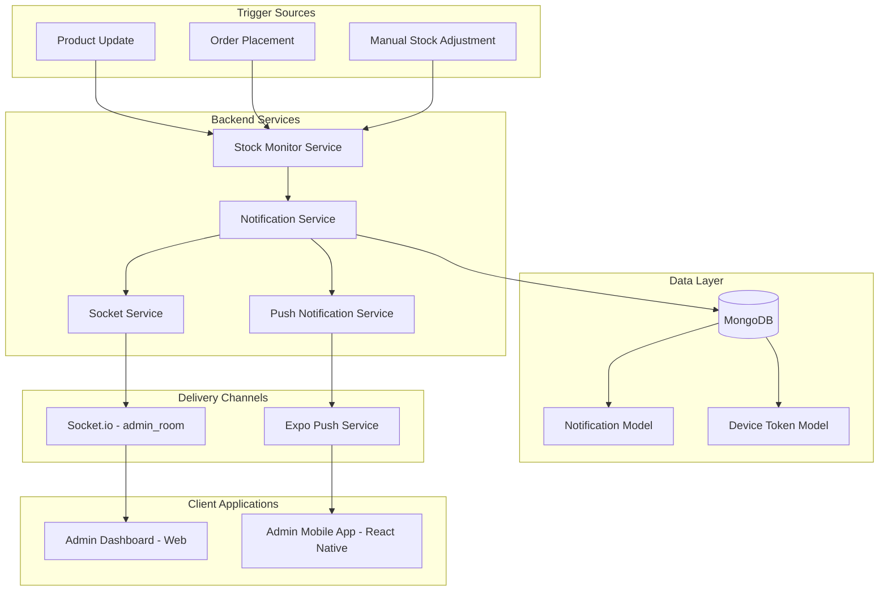

# Design Document: Low Stock Notification System

## Overview

The Low Stock Notification System is a real-time inventory intelligence platform that monitors product stock levels and delivers multi-channel alerts to administrators. The system prevents stockouts through automated monitoring, duplicate prevention, priority-based alerting, and seamless delivery across web dashboards (Socket.io) and mobile devices (Expo Push Notifications).

### Key Design Goals

1. **Real-time Monitoring**: Automatic stock level evaluation on product updates, order placements, and manual adjustments
2. **Duplicate Prevention**: Intelligent deduplication to prevent notification spam for the same low stock event
3. **Multi-Channel Delivery**: Unified notification creation with parallel delivery via Socket.io (web) and push notifications (mobile)
4. **Priority-Based Alerting**: Two-tier priority system (LOW/CRITICAL) with distinct thresholds and delivery characteristics
5. **Persistence & Reliability**: MongoDB-backed notification storage with graceful failure handling
6. **Admin-Centric Design**: Secure admin-only access with JWT authentication and role-based authorization

### System Boundaries

**In Scope:**
- Stock level monitoring and threshold evaluation
- Notification creation with duplicate prevention
- REST API endpoints (GET, PATCH, DELETE)
- Socket.io real-time broadcasting to admin_room
- Expo push notification delivery to registered devices
- Device token registration and management
- Admin dashboard notification bell UI
- Mobile push notification handling

**Out of Scope:**
- Email notifications (optional enhancement)
- Custom threshold configuration per admin (optional enhancement)
- Notification analytics and reporting
- Automated inventory replenishment
- Supplier integration

## Architecture

### High-Level Architecture



### Service Layer Architecture

The system follows a domain-driven service architecture with clear separation of concerns:

1. **Stock Monitor Service**: Evaluates stock levels against thresholds and triggers notification creation
2. **Notification Service**: Core business logic for notification CRUD operations, duplicate prevention, and orchestration
3. **Push Notification Service**: Handles Expo push notification delivery with retry logic and error handling
4. **Socket Service**: Manages Socket.io broadcasting to admin_room

### Data Flow

**Notification Creation Flow:**
```
Product Stock Change → Stock Monitor → Duplicate Check → Create Notification → 
  ├─→ Socket.io Broadcast (admin_room)
  └─→ Push Notification Service → Expo Push API → Mobile Devices
```

**Notification Retrieval Flow:**
```
Admin Dashboard → GET /admin/notifications → Notification Service → MongoDB → Response
```

**Notification Status Update Flow:**
```
Admin Action → PATCH /admin/notifications/:id/read → Update isRead → Socket.io Broadcast (optional)
```

## Components and Interfaces

### 1. Stock Monitor Service

**Responsibility**: Monitor product stock levels and trigger notification creation when thresholds are breached.

**Interface:**
```typescript
interface IStockMonitorService {
  /**
   * Evaluate stock level and trigger notification if needed
   * @param productId - Product to evaluate
   * @param currentStock - Current stock level
   * @returns Created notification or null if no notification needed
   */
  evaluateStockLevel(
    productId: string, 
    currentStock: number
  ): Promise<ILowStockNotification | null>;
  
  /**
   * Check if product already has unread low stock notification
   * @param productId - Product to check
   * @returns true if unread notification exists
   */
  hasUnreadNotification(productId: string): Promise<boolean>;
}
```

**Integration Points:**
- Called by Product update operations (productController, productService)
- Called by Order placement operations (orderController, orderService)
- Called by Inventory adjustment operations (inventoryController)

**Thresholds:**
- `STOCK_THRESHOLD = 10` units (triggers LOW priority)
- `CRITICAL_THRESHOLD = 3` units (triggers CRITICAL priority)

### 2. Notification Service

**Responsibility**: Core business logic for notification lifecycle management, duplicate prevention, and multi-channel delivery orchestration.

**Interface:**
```typescript
interface INotificationService {
  /**
   * Create low stock notification with duplicate prevention
   * @param data - Notification creation data
   * @returns Created notification
   */
  createLowStockNotification(
    data: CreateLowStockNotificationDTO
  ): Promise<ILowStockNotification>;
  
  /**
   * Get all notifications for admin with pagination
   * @param options - Query options (pagination, filters)
   * @returns Paginated notifications
   */
  getNotifications(
    options: NotificationQueryOptions
  ): Promise<PaginatedNotifications>;
  
  /**
   * Mark notification as read
   * @param notificationId - Notification to mark
   * @returns Updated notification
   */
  markAsRead(notificationId: string): Promise<ILowStockNotification>;
  
  /**
   * Delete notification
   * @param notificationId - Notification to delete
   * @returns void
   */
  deleteNotification(notificationId: string): Promise<void>;
  
  /**
   * Check for existing unread notification for product
   * @param productId - Product to check
   * @returns Existing notification or null
   */
  findUnreadNotificationForProduct(
    productId: string
  ): Promise<ILowStockNotification | null>;
}
```

**DTOs:**
```typescript
interface CreateLowStockNotificationDTO {
  productId: string;
  productName: string;
  currentStock: number;
  priority: 'LOW' | 'CRITICAL';
}

interface NotificationQueryOptions {
  page?: number;
  limit?: number;
  isRead?: boolean;
  priority?: 'LOW' | 'CRITICAL';
  sortBy?: 'createdAt' | 'priority';
  sortOrder?: 'asc' | 'desc';
}

interface PaginatedNotifications {
  notifications: ILowStockNotification[];
  total: number;
  page: number;
  limit: number;
  totalPages: number;
}
```

### 3. Push Notification Service

**Responsibility**: Handle Expo push notification delivery with error handling and retry logic.

**Interface:**
```typescript
interface IPushNotificationService {
  /**
   * Send push notification to all registered admin devices
   * @param notification - Notification data
   * @returns Delivery results
   */
  sendLowStockAlert(
    notification: ILowStockNotification
  ): Promise<PushNotificationResult[]>;
  
  /**
   * Register device token for admin
   * @param adminId - Admin user ID
   * @param token - Expo push token
   * @param platform - Device platform
   * @returns Registered device token
   */
  registerDeviceToken(
    adminId: string,
    token: string,
    platform: 'ios' | 'android'
  ): Promise<IDeviceToken>;
  
  /**
   * Unregister device token for admin
   * @param adminId - Admin user ID
   * @returns void
   */
  unregisterDeviceToken(adminId: string): Promise<void>;
  
  /**
   * Get active device tokens for admins
   * @returns Active device tokens (last active within 90 days)
   */
  getActiveAdminTokens(): Promise<IDeviceToken[]>;
}
```

**Push Notification Payload:**
```typescript
interface ExpoPushMessage {
  to: string; // Device token
  title: string; // "Low Stock Alert 🚨" or "Low Stock Alert"
  body: string; // "Product {name} has only {stock} left"
  data: {
    type: 'LOW_STOCK';
    productId: string;
    priority: 'LOW' | 'CRITICAL';
  };
  sound: 'default';
  priority: 'high' | 'normal'; // Based on notification priority
  channelId: 'low-stock-alerts'; // Android notification channel
}
```

### 4. Socket Service Integration

**Responsibility**: Broadcast real-time notifications to admin_room via existing Socket.io instance.

**Interface:**
```typescript
interface ISocketService {
  /**
   * Broadcast low stock alert to admin_room
   * @param notification - Notification to broadcast
   */
  broadcastLowStockAlert(notification: ILowStockNotification): void;
  
  /**
   * Broadcast notification status update
   * @param notificationId - Updated notification ID
   * @param isRead - New read status
   */
  broadcastNotificationStatusUpdate(
    notificationId: string, 
    isRead: boolean
  ): void;
}
```

**Socket.io Events:**
- `low_stock_alert`: Emitted when new notification is created
- `notification:status:update`: Emitted when notification is marked as read (optional)

**Implementation:**
```typescript
// Access existing Socket.io instance
const io = app.get("io");

// Broadcast to admin_room
io.to("admin_room").emit("low_stock_alert", {
  notification: notificationData
});
```

### 5. REST API Endpoints

**Base Path:** `/admin/notifications`

**Authentication:** All endpoints require admin JWT authentication via middleware.

#### GET /admin/notifications

**Description:** Retrieve paginated notifications for admin dashboard.

**Query Parameters:**
- `page` (optional, default: 1): Page number
- `limit` (optional, default: 20): Items per page
- `isRead` (optional): Filter by read status (true/false)
- `priority` (optional): Filter by priority (LOW/CRITICAL)

**Response (200):**
```json
{
  "notifications": [
    {
      "_id": "507f1f77bcf86cd799439011",
      "type": "LOW_STOCK",
      "productId": "507f1f77bcf86cd799439012",
      "productName": "Organic Tomatoes",
      "currentStock": 8,
      "priority": "LOW",
      "message": "Low stock: Organic Tomatoes has only 8 left",
      "isRead": false,
      "createdAt": "2024-01-15T10:30:00.000Z"
    }
  ],
  "total": 45,
  "page": 1,
  "limit": 20,
  "totalPages": 3
}
```

#### PATCH /admin/notifications/:id/read

**Description:** Mark notification as read.

**Response (200):**
```json
{
  "_id": "507f1f77bcf86cd799439011",
  "type": "LOW_STOCK",
  "productId": "507f1f77bcf86cd799439012",
  "productName": "Organic Tomatoes",
  "currentStock": 8,
  "priority": "LOW",
  "message": "Low stock: Organic Tomatoes has only 8 left",
  "isRead": true,
  "createdAt": "2024-01-15T10:30:00.000Z"
}
```

**Error (404):**
```json
{
  "error": "Notification not found"
}
```

#### DELETE /admin/notifications/:id

**Description:** Delete notification.

**Response (204):** No content

**Error (404):**
```json
{
  "error": "Notification not found"
}
```

#### POST /admin/register-device

**Description:** Register device token for push notifications.

**Request Body:**
```json
{
  "deviceToken": "ExponentPushToken[xxxxxxxxxxxxxxxxxxxxxx]",
  "platform": "ios"
}
```

**Validation:**
- `deviceToken`: Required, non-empty string
- `platform`: Required, must be "ios" or "android"

**Response (200):**
```json
{
  "_id": "507f1f77bcf86cd799439013",
  "adminId": "507f1f77bcf86cd799439014",
  "deviceToken": "ExponentPushToken[xxxxxxxxxxxxxxxxxxxxxx]",
  "platform": "ios",
  "lastActiveAt": "2024-01-15T10:30:00.000Z",
  "createdAt": "2024-01-15T10:30:00.000Z"
}
```

**Error (400):**
```json
{
  "error": "Invalid platform. Must be 'ios' or 'android'"
}
```

#### DELETE /admin/unregister-device

**Description:** Unregister device token for authenticated admin.

**Response (204):** No content

## Data Models

### Low Stock Notification Model

**Collection:** `lowstocknotifications`

**Schema:**
```typescript
interface ILowStockNotification extends Document {
  _id: mongoose.Types.ObjectId;
  type: 'LOW_STOCK';
  productId: mongoose.Types.ObjectId;
  productName: string;
  currentStock: number;
  priority: 'LOW' | 'CRITICAL';
  message: string;
  isRead: boolean;
  createdAt: Date;
  updatedAt: Date;
}
```

**Field Specifications:**
- `type`: Always "LOW_STOCK" (distinguishes from other notification types)
- `productId`: Reference to Product model, indexed for fast lookups
- `productName`: Denormalized for display without joins
- `currentStock`: Stock level at notification creation time
- `priority`: "LOW" (stock < 10) or "CRITICAL" (stock < 3)
- `message`: Human-readable message (e.g., "Low stock: Organic Tomatoes has only 8 left")
- `isRead`: Boolean flag for read status, indexed for filtering
- `createdAt`: Timestamp for sorting and display
- `updatedAt`: Timestamp for audit trail

**Indexes:**
- `{ productId: 1, isRead: 1 }`: Fast duplicate detection
- `{ createdAt: -1 }`: Fast sorting for retrieval
- `{ isRead: 1 }`: Fast filtering by read status
- `{ priority: 1 }`: Fast filtering by priority

**Message Format:**
- LOW priority: `"Low stock: {productName} has only {currentStock} left"`
- CRITICAL priority: `"🚨 CRITICAL: {productName} has only {currentStock} left"`

### Device Token Model

**Collection:** `devicetokens`

**Schema:**
```typescript
interface IDeviceToken extends Document {
  _id: mongoose.Types.ObjectId;
  adminId: mongoose.Types.ObjectId;
  deviceToken: string;
  platform: 'ios' | 'android';
  lastActiveAt: Date;
  createdAt: Date;
  updatedAt: Date;
}
```

**Field Specifications:**
- `adminId`: Reference to User model (admin role), indexed
- `deviceToken`: Expo push token (unique per device)
- `platform`: Device platform for platform-specific handling
- `lastActiveAt`: Updated on successful push delivery or token refresh
- `createdAt`: Registration timestamp
- `updatedAt`: Last modification timestamp

**Indexes:**
- `{ adminId: 1, deviceToken: 1 }`: Unique constraint, prevents duplicate registrations
- `{ lastActiveAt: 1 }`: Fast filtering for active tokens (90-day threshold)

**Token Lifecycle:**
- Tokens are created on first registration
- `lastActiveAt` is updated on successful push delivery
- Tokens inactive for >90 days are skipped during push delivery
- Tokens are deleted on explicit unregistration

### Notification Parser and Serializer

**Purpose:** Ensure consistent data handling across API boundaries with validation and round-trip integrity.

**Parser Interface:**
```typescript
interface INotificationParser {
  /**
   * Parse and validate notification creation data
   * @param data - Raw notification data
   * @returns Validated notification DTO
   * @throws ValidationError if required fields missing or invalid
   */
  parseCreateNotificationData(
    data: any
  ): CreateLowStockNotificationDTO;
  
  /**
   * Parse notification query parameters
   * @param query - Raw query parameters
   * @returns Validated query options
   */
  parseQueryOptions(query: any): NotificationQueryOptions;
}
```

**Serializer Interface:**
```typescript
interface INotificationSerializer {
  /**
   * Serialize notification model to API response format
   * @param notification - Notification document
   * @returns Serialized notification object
   */
  serializeNotification(
    notification: ILowStockNotification
  ): SerializedNotification;
  
  /**
   * Serialize paginated notifications
   * @param data - Paginated notification data
   * @returns Serialized paginated response
   */
  serializePaginatedNotifications(
    data: PaginatedNotifications
  ): SerializedPaginatedNotifications;
}
```

**Serialized Format:**
```typescript
interface SerializedNotification {
  _id: string;
  type: 'LOW_STOCK';
  productId: string;
  productName: string;
  currentStock: number;
  priority: 'LOW' | 'CRITICAL';
  message: string;
  isRead: boolean;
  createdAt: string; // ISO 8601 format
}
```

**Validation Rules:**
- `type`: Must be "LOW_STOCK"
- `productId`: Must be valid MongoDB ObjectId
- `productName`: Required, non-empty string, max 200 characters
- `currentStock`: Required, non-negative integer
- `priority`: Must be "LOW" or "CRITICAL"
- `message`: Required, non-empty string
- `isRead`: Must be boolean

**Round-Trip Property:**
For any valid `ILowStockNotification` object, the following must hold:
```
parse(serialize(notification)) ≈ notification
```
(Equivalent in all semantic fields, timestamps formatted consistently)

## Duplicate Prevention Strategy

### Problem Statement

Without duplicate prevention, the system could create multiple notifications for the same low stock event, causing notification spam and alert fatigue.

### Solution Design

**Duplicate Detection Logic:**
1. Before creating a notification, query for existing unread notifications for the same product
2. If an unread notification exists, skip creation and return null
3. If no unread notification exists, proceed with creation

**Query:**
```typescript
const existingNotification = await LowStockNotification.findOne({
  productId: productId,
  isRead: false
});

if (existingNotification) {
  return null; // Skip duplicate
}
```

**Stock Recovery Handling:**
When stock is replenished and drops again:
1. Admin marks previous notification as read (or deletes it)
2. Stock rises above threshold (e.g., restocked to 50 units)
3. Stock drops below threshold again (e.g., drops to 9 units)
4. System creates new notification (no unread notification exists)

**Edge Cases:**
- **Multiple simultaneous stock changes**: MongoDB atomic operations prevent race conditions
- **Threshold oscillation**: Only unread notifications block creation; read notifications don't prevent new alerts
- **Product deletion**: Notifications persist for audit trail; product lookup may fail (handle gracefully)

## Multi-Channel Delivery Architecture

### Delivery Orchestration

**Parallel Delivery Pattern:**
```typescript
async function createAndDeliverNotification(data: CreateLowStockNotificationDTO) {
  // 1. Create notification in database
  const notification = await notificationService.createLowStockNotification(data);
  
  // 2. Parallel delivery (non-blocking)
  await Promise.allSettled([
    socketService.broadcastLowStockAlert(notification),
    pushNotificationService.sendLowStockAlert(notification)
  ]);
  
  return notification;
}
```

**Failure Handling:**
- Socket.io broadcast failure: Log error, continue (web clients can poll API)
- Push notification failure: Log error, continue (notification persisted in DB)
- Database failure: Abort entire operation, return error

### Socket.io Delivery (Web)

**Event:** `low_stock_alert`

**Payload:**
```typescript
{
  notification: {
    _id: string;
    type: 'LOW_STOCK';
    productId: string;
    productName: string;
    currentStock: number;
    priority: 'LOW' | 'CRITICAL';
    message: string;
    isRead: boolean;
    createdAt: string;
  }
}
```

**Client Handling (Admin Dashboard):**
```typescript
socket.on('low_stock_alert', (data) => {
  // 1. Display toast notification
  showToast(data.notification.message, {
    type: data.notification.priority === 'CRITICAL' ? 'error' : 'warning'
  });
  
  // 2. Add to notification list
  addNotificationToList(data.notification);
  
  // 3. Increment unread badge
  incrementUnreadCount();
});
```

### Push Notification Delivery (Mobile)

**Expo Push Notification Format:**
```typescript
{
  to: deviceToken,
  title: priority === 'CRITICAL' 
    ? 'Low Stock Alert 🚨' 
    : 'Low Stock Alert',
  body: `Product ${productName} has only ${currentStock} left`,
  data: {
    type: 'LOW_STOCK',
    productId: productId,
    priority: priority
  },
  sound: 'default',
  priority: priority === 'CRITICAL' ? 'high' : 'normal',
  channelId: 'low-stock-alerts'
}
```

**Client Handling (Mobile App):**
```typescript
// Register notification handler
Notifications.addNotificationResponseReceivedListener((response) => {
  const { productId } = response.notification.request.content.data;
  
  // Navigate to product detail screen
  navigation.navigate('ProductDetail', { productId });
});
```

**Error Handling:**
- Invalid token: Remove from database, log error
- Rate limit exceeded: Retry with exponential backoff
- Service unavailable: Log error, skip delivery (notification persisted)

## Admin Dashboard UI Components

### Notification Bell Component

**Location:** Top right corner of admin navigation bar

**Visual Design:**
- Icon: Bell icon (Ionicons: `notifications-outline`)
- Badge: Circular badge with unread count (background: `#FF6A00`)
- Badge visibility: Hidden when count is 0

**State Management:**
```typescript
interface NotificationBellState {
  unreadCount: number;
  notifications: ILowStockNotification[];
  isDropdownOpen: boolean;
  isLoading: boolean;
}
```

**Behavior:**
- Click bell: Toggle dropdown
- Click outside: Close dropdown
- Real-time updates: Socket.io listener updates state
- Initial load: Fetch notifications on mount

### Notification Dropdown Component

**Visual Design:**
- Max height: 400px with scroll
- Width: 350px
- Position: Absolute, right-aligned below bell icon
- Shadow: Elevated card shadow

**Notification Item Design:**
- **Unread**: Bold text, highlighted background (`#FFF4E6`)
- **Read**: Normal text, white background
- **Priority indicator**: 
  - CRITICAL: Red dot (`#EF4444`)
  - LOW: Orange dot (`#F59E0B`)

**Item Layout:**
```
┌─────────────────────────────────────┐
│ [●] Product Name                    │
│     Stock: 8 units                  │
│     2 hours ago                     │
└─────────────────────────────────────┘
```

**Interactions:**
- Click item: Navigate to product detail, mark as read
- Hover: Highlight background
- Empty state: "No notifications" message

### Real-Time Updates

**Socket.io Integration:**
```typescript
useEffect(() => {
  const socket = io(SOCKET_URL, {
    auth: { token: adminToken }
  });
  
  // Join admin room
  socket.emit('join_room', { room: 'admin_room' });
  
  // Listen for low stock alerts
  socket.on('low_stock_alert', (data) => {
    setNotifications(prev => [data.notification, ...prev]);
    setUnreadCount(prev => prev + 1);
    showToast(data.notification.message);
  });
  
  return () => socket.disconnect();
}, []);
```

## Mobile App Integration

### Device Token Registration Flow

**On App Launch:**
```typescript
async function registerForPushNotifications() {
  // 1. Request permissions
  const { status } = await Notifications.requestPermissionsAsync();
  
  if (status !== 'granted') {
    console.warn('Push notification permissions denied');
    return;
  }
  
  // 2. Get Expo push token
  const token = await Notifications.getExpoPushTokenAsync();
  
  // 3. Register with backend
  await api.post('/admin/register-device', {
    deviceToken: token.data,
    platform: Platform.OS
  });
}
```

### Push Notification Handling

**Foreground Notifications:**
```typescript
Notifications.addNotificationReceivedListener((notification) => {
  // Display in-app alert
  Alert.alert(
    notification.request.content.title,
    notification.request.content.body
  );
});
```

**Background/Tap Notifications:**
```typescript
Notifications.addNotificationResponseReceivedListener((response) => {
  const { productId, priority } = response.notification.request.content.data;
  
  // Navigate to product detail
  navigation.navigate('ProductDetail', { 
    productId,
    highlightLowStock: true 
  });
});
```

### Android Notification Channel

**Configuration:**
```typescript
if (Platform.OS === 'android') {
  Notifications.setNotificationChannelAsync('low-stock-alerts', {
    name: 'Low Stock Alerts',
    importance: Notifications.AndroidImportance.HIGH,
    sound: 'default',
    vibrationPattern: [0, 250, 250, 250],
    lightColor: '#FF6A00'
  });
}
```


## Correctness Properties

*A property is a characteristic or behavior that should hold true across all valid executions of a system—essentially, a formal statement about what the system should do. Properties serve as the bridge between human-readable specifications and machine-verifiable correctness guarantees.*

### Property Reflection

After analyzing all acceptance criteria, the following properties were identified as testable via property-based testing. Redundant properties have been consolidated:

**Consolidated Properties:**
- Properties 3.1 and 3.2 (priority assignment) → Combined into Property 1 (priority assignment based on stock level)
- Properties 2.2, 2.3, 2.5 (field presence and values) → Combined into Property 2 (notification structure invariants)
- Properties 15.4, 15.5, 15.6 (push notification format) → Combined into Property 15 (push notification payload structure)
- Properties 15.7, 15.8 (priority-based delivery config) → Combined into Property 16 (priority-based delivery configuration)
- Property 13.4 is duplicate of 13.1 → Removed

**Properties Excluded from PBT:**
- UI requirements (8.1-11.5, 17.1-17.6): Not suitable for property-based testing
- Smoke tests (4.1, 5.1, 6.1, 7.3, 16.1, 18.3): Single execution tests
- Integration tests with external services (7.1, 7.4, 15.1, 15.2, 15.3): Use mocks for unit PBT, separate integration tests
- Example-based tests (1.2, 1.4, 4.4, 5.3, 6.3, 12.2, 16.3, 18.5): Specific scenarios, not universal properties
- Edge cases (5.5, 6.5): Covered by property generators

### Property 1: Priority Assignment Based on Stock Level

*For any* product with stock level below the Stock_Threshold (10 units), the notification priority SHALL be "CRITICAL" when stock is below the Critical_Threshold (3 units), and "LOW" when stock is between the Critical_Threshold and Stock_Threshold.

**Validates: Requirements 3.1, 3.2**

**Test Strategy:** Generate random stock levels in ranges [0, 3), [3, 10), verify priority assignment is correct for each range.

### Property 2: Notification Structure Invariants

*For any* created low stock notification, the notification SHALL contain all required fields (type="LOW_STOCK", productId, productName, currentStock, priority, message, isRead=false, createdAt), and all fields SHALL have valid types and values.

**Validates: Requirements 2.2, 2.3, 2.5, 3.3**

**Test Strategy:** Generate random notifications, verify all required fields are present with correct types and initial values.

### Property 3: Message Format Consistency

*For any* product name and stock level, the notification message SHALL follow the format "Low stock: {productName} has only {currentStock} left" for LOW priority, or "🚨 CRITICAL: {productName} has only {currentStock} left" for CRITICAL priority.

**Validates: Requirements 2.4, 3.4**

**Test Strategy:** Generate random product names and stock levels, verify message format matches specification including priority indicator.

### Property 4: Duplicate Prevention

*For any* product with an existing unread low stock notification, attempting to create another notification for the same product SHALL be prevented (return null or skip creation).

**Validates: Requirements 2.1, 2.6, 13.2**

**Test Strategy:** Generate random products with existing unread notifications, attempt to create new notifications, verify creation is blocked.

### Property 5: Stock Recovery Re-trigger

*For any* product where stock drops below threshold, then rises above threshold, then drops below threshold again, the system SHALL allow creation of a new notification for the second drop event.

**Validates: Requirements 13.1, 13.4**

**Test Strategy:** Generate random stock level sequences (drop → recover → drop), verify new notification is created on second drop.

### Property 6: Stock Change Does Not Affect Notification Status

*For any* existing notification, changes to product stock levels SHALL NOT automatically modify the notification's isRead status.

**Validates: Requirement 13.3**

**Test Strategy:** Generate random stock level changes with existing notifications, verify isRead field remains unchanged.

### Property 7: Notification Sorting

*For any* set of notifications retrieved via the API, the notifications SHALL be sorted by createdAt in descending order (newest first).

**Validates: Requirement 4.2**

**Test Strategy:** Generate random sets of notifications with various timestamps, retrieve via API, verify sorting order.

### Property 8: Response Completeness

*For any* notification returned by the API, the response SHALL contain all Notification_Model fields with correct serialization.

**Validates: Requirements 4.3, 5.4**

**Test Strategy:** Generate random notifications, retrieve via API, verify all fields are present in response.

### Property 9: Pagination Correctness

*For any* valid pagination parameters (page, limit), the API SHALL return the correct subset of notifications matching the page and limit values.

**Validates: Requirement 4.5**

**Test Strategy:** Generate random notification sets and pagination parameters, verify correct subset is returned with accurate total count.

### Property 10: Mark as Read State Transition

*For any* notification marked as read, the isRead field SHALL transition from false to true, and subsequent retrievals SHALL reflect the updated state.

**Validates: Requirements 5.2, 12.4**

**Test Strategy:** Generate random notifications, mark as read, verify isRead is true and persists.

### Property 11: Deletion Removes Notification

*For any* notification that is deleted, subsequent queries SHALL NOT return the deleted notification, and the notification SHALL NOT exist in the database.

**Validates: Requirements 6.2, 6.4**

**Test Strategy:** Generate random notifications, delete them, verify they're removed from database and API responses.

### Property 12: Socket.io Event Payload Completeness

*For any* notification created, the Socket.io "low_stock_alert" event payload SHALL contain the complete notification object with all fields.

**Validates: Requirements 7.2, 7.5**

**Test Strategy:** Generate random notifications, capture Socket.io emit calls (mocked), verify payload contains all notification fields.

### Property 13: Notification Persistence

*For any* notification created, the notification SHALL be stored in MongoDB and SHALL persist until explicitly deleted by an administrator.

**Validates: Requirements 12.1, 12.3**

**Test Strategy:** Generate random notifications, verify they're persisted in database and remain until deleted.

### Property 14: Round-Trip Serialization

*For any* valid Notification_Model object, serializing to JSON and then parsing back SHALL produce an equivalent object with all semantic fields preserved.

**Validates: Requirement 14.6**

**Test Strategy:** Generate random valid notifications, serialize to JSON, parse back, verify equivalence (timestamps in ISO 8601 format).

### Property 15: Push Notification Payload Structure

*For any* low stock notification, the push notification payload SHALL include title (with priority-based emoji), body in format "Product {productName} has only {currentStock} left", and data payload with fields {type: "LOW_STOCK", productId, priority}.

**Validates: Requirements 15.4, 15.5, 15.6**

**Test Strategy:** Generate random notifications, verify push payload structure matches specification.

### Property 16: Priority-Based Delivery Configuration

*For any* notification with priority "CRITICAL", the push notification SHALL use high priority delivery with sound enabled; for priority "LOW", the push notification SHALL use normal priority delivery with sound enabled.

**Validates: Requirements 15.7, 15.8**

**Test Strategy:** Generate random notifications with different priorities, verify delivery configuration matches priority level.

### Property 17: Duplicate Prevention in Push Delivery

*For any* low stock event, only ONE push notification SHALL be sent per event, respecting the duplicate prevention logic.

**Validates: Requirement 15.9**

**Test Strategy:** Generate random duplicate scenarios, verify only one push notification is sent per event.

### Property 18: Push Failure Isolation

*For any* push notification delivery failure, the notification creation SHALL still succeed and the notification SHALL be persisted in the database.

**Validates: Requirement 15.10**

**Test Strategy:** Generate random push failures (mocked), verify notification is created and persisted despite failure.

### Property 19: Device Token Registration Data Completeness

*For any* device token registration, the stored record SHALL contain all required fields (adminId, deviceToken, platform, lastActiveAt, createdAt) with valid values.

**Validates: Requirements 16.4, 16.5**

**Test Strategy:** Generate random device token registrations, verify all fields are stored correctly.

### Property 20: Device Token Upsert Behavior

*For any* device token registration where the adminId and deviceToken combination already exists, the system SHALL update the lastActiveAt timestamp instead of creating a duplicate record.

**Validates: Requirement 16.6**

**Test Strategy:** Generate random duplicate registrations, verify timestamp is updated and no duplicate is created.

### Property 21: Platform Validation

*For any* device token registration, the platform field SHALL be validated to be either "ios" or "android", and invalid values SHALL result in a 400 error response with descriptive message.

**Validates: Requirements 16.7, 16.8**

**Test Strategy:** Generate random platform values (valid and invalid), verify validation and error responses.

### Property 22: Device Token Activity Timestamp Update

*For any* successful push notification delivery to a device token, the lastActiveAt timestamp for that token SHALL be updated to the current time.

**Validates: Requirement 18.1**

**Test Strategy:** Generate random successful deliveries, verify lastActiveAt is updated.

### Property 23: Inactive Token Filtering

*For any* device token where lastActiveAt is more than 90 days in the past, the token SHALL be excluded from push notification delivery.

**Validates: Requirement 18.2**

**Test Strategy:** Generate random device tokens with various lastActiveAt values, verify tokens older than 90 days are filtered out.

### Property 24: Device Token Deletion

*For any* authenticated admin calling the unregister endpoint, their device token SHALL be removed from the database and SHALL NOT receive future push notifications.

**Validates: Requirement 18.4**

**Test Strategy:** Generate random admins with registered tokens, unregister them, verify tokens are deleted.

### Property 25: Parser Validation

*For any* notification creation data, the parser SHALL validate that all required fields (type, productId, productName, currentStock, message) are present and valid, and SHALL return a validation error with descriptive message if any field is missing or invalid.

**Validates: Requirements 14.3, 14.4**

**Test Strategy:** Generate random inputs with missing or invalid fields, verify validation catches errors and returns descriptive messages.

### Property 26: Timestamp Serialization Format

*For any* notification serialized to JSON, the createdAt field SHALL be formatted as an ISO 8601 timestamp string.

**Validates: Requirement 14.5**

**Test Strategy:** Generate random notifications, serialize to JSON, verify timestamp format matches ISO 8601 specification.

## Error Handling

### Error Categories

**1. Validation Errors (400 Bad Request)**
- Missing required fields in notification creation
- Invalid platform value in device token registration
- Invalid pagination parameters
- Invalid notification ID format

**2. Authentication Errors (401 Unauthorized)**
- Missing JWT token
- Invalid JWT token
- Expired JWT token

**3. Authorization Errors (403 Forbidden)**
- Non-admin user attempting admin operations
- User attempting to access another user's notifications

**4. Not Found Errors (404 Not Found)**
- Notification ID does not exist
- Product ID does not exist
- Device token not found for admin

**5. External Service Errors**
- Socket.io connection failure
- Expo push notification service unavailable
- MongoDB connection failure

### Error Handling Strategies

**Validation Errors:**
```typescript
try {
  const validatedData = notificationParser.parseCreateNotificationData(data);
} catch (error) {
  return res.status(400).json({
    error: 'Validation failed',
    details: error.message
  });
}
```

**External Service Failures:**
```typescript
// Socket.io failure: Log and continue
try {
  socketService.broadcastLowStockAlert(notification);
} catch (error) {
  logger.error('[NotificationService] Socket.io broadcast failed', error);
  // Continue - notification is persisted, clients can poll API
}

// Push notification failure: Log and continue
try {
  await pushNotificationService.sendLowStockAlert(notification);
} catch (error) {
  logger.error('[NotificationService] Push notification failed', error);
  // Continue - notification is persisted, will be visible in dashboard
}
```

**Database Failures:**
```typescript
// Database failure: Abort operation
try {
  const notification = await Notification.create(data);
} catch (error) {
  logger.error('[NotificationService] Database error', error);
  throw new Error('Failed to create notification');
}
```

### Graceful Degradation

**Socket.io Unavailable:**
- Notification creation succeeds
- Clients fall back to polling GET /admin/notifications
- Dashboard displays cached notifications until connection restored

**Push Notification Service Unavailable:**
- Notification creation succeeds
- Mobile users see notifications when they open the app
- Retry logic with exponential backoff for transient failures

**MongoDB Unavailable:**
- Notification creation fails
- Return 503 Service Unavailable
- Stock monitoring continues, will retry on next stock change

### Error Logging

All errors are logged with structured context:
```typescript
logger.error('[NotificationService] Operation failed', {
  operation: 'createLowStockNotification',
  productId: data.productId,
  error: error.message,
  stack: error.stack
});
```

## Testing Strategy

### Dual Testing Approach

The Low Stock Notification System requires both property-based testing and example-based unit testing for comprehensive coverage:

**Property-Based Testing (PBT):** Validates universal properties across all inputs using randomized test data
**Unit Testing:** Validates specific examples, integration points, and edge cases

### Property-Based Testing Configuration

**Library:** `fast-check` (JavaScript/TypeScript property-based testing library)

**Configuration:**
- Minimum 100 iterations per property test
- Each property test references its design document property
- Tag format: `Feature: low-stock-notification-system, Property {number}: {property_text}`

**Example Property Test:**
```typescript
import fc from 'fast-check';

describe('Feature: low-stock-notification-system, Property 1: Priority Assignment', () => {
  it('should assign CRITICAL priority for stock < 3, LOW priority for stock 3-9', () => {
    fc.assert(
      fc.property(
        fc.integer({ min: 0, max: 9 }), // Stock level below threshold
        (stock) => {
          const priority = determinePriority(stock);
          
          if (stock < 3) {
            expect(priority).toBe('CRITICAL');
          } else {
            expect(priority).toBe('LOW');
          }
        }
      ),
      { numRuns: 100 }
    );
  });
});
```

### Property Test Coverage

Each of the 26 correctness properties SHALL have a corresponding property-based test:

1. **Property 1-6:** Notification creation logic (priority, structure, duplicates, recovery)
2. **Property 7-11:** API behavior (sorting, completeness, pagination, state transitions, deletion)
3. **Property 12-13:** Socket.io integration (payload, persistence)
4. **Property 14:** Serialization round-trip
5. **Property 15-18:** Push notification delivery (payload, priority, duplicates, failure isolation)
6. **Property 19-24:** Device token management (registration, upsert, validation, filtering, deletion)
7. **Property 25-26:** Parser validation and timestamp formatting

### Unit Testing Strategy

**Example-Based Tests:**
- Authentication and authorization scenarios (valid token, invalid token, no token, non-admin user)
- Integration trigger points (product update, order placement, manual adjustment)
- API endpoint smoke tests (endpoint exists and responds)
- Specific error scenarios (404 for non-existent ID, 400 for invalid input)

**Integration Tests:**
- Socket.io broadcasting to admin_room (with mocked Socket.io)
- Expo push notification delivery (with mocked Expo service)
- Multi-channel delivery orchestration
- Database persistence and retrieval

**Edge Case Tests:**
- Empty notification list
- Pagination edge cases (page 0, negative limit, page beyond total)
- Concurrent notification creation (race conditions)
- Stock level exactly at threshold boundaries (stock = 3, stock = 10)
- Very long product names (200 characters)
- Special characters in product names

### Test Data Generators

**fast-check Generators:**
```typescript
// Product generator
const productArb = fc.record({
  _id: fc.hexaString({ minLength: 24, maxLength: 24 }),
  name: fc.string({ minLength: 1, maxLength: 200 }),
  stock: fc.integer({ min: 0, max: 100 })
});

// Notification generator
const notificationArb = fc.record({
  type: fc.constant('LOW_STOCK'),
  productId: fc.hexaString({ minLength: 24, maxLength: 24 }),
  productName: fc.string({ minLength: 1, maxLength: 200 }),
  currentStock: fc.integer({ min: 0, max: 9 }),
  priority: fc.oneof(fc.constant('LOW'), fc.constant('CRITICAL')),
  isRead: fc.boolean(),
  createdAt: fc.date()
});

// Device token generator
const deviceTokenArb = fc.record({
  adminId: fc.hexaString({ minLength: 24, maxLength: 24 }),
  deviceToken: fc.string({ minLength: 20, maxLength: 100 }),
  platform: fc.oneof(fc.constant('ios'), fc.constant('android')),
  lastActiveAt: fc.date()
});
```

### Mock Strategy

**Socket.io Mocking:**
```typescript
const mockIo = {
  to: jest.fn().mockReturnThis(),
  emit: jest.fn()
};

app.get = jest.fn().mockReturnValue(mockIo);
```

**Expo Push Service Mocking:**
```typescript
jest.mock('expo-server-sdk', () => ({
  Expo: jest.fn().mockImplementation(() => ({
    sendPushNotificationsAsync: jest.fn().mockResolvedValue([
      { status: 'ok' }
    ])
  }))
}));
```

### Test Organization

```
backend/src/
├── services/
│   ├── __tests__/
│   │   ├── notificationService.property.test.ts  # Property-based tests
│   │   ├── notificationService.unit.test.ts      # Unit tests
│   │   ├── pushNotificationService.property.test.ts
│   │   ├── pushNotificationService.unit.test.ts
│   │   └── stockMonitorService.property.test.ts
├── controllers/
│   └── __tests__/
│       └── notificationController.integration.test.ts
└── models/
    └── __tests__/
        └── LowStockNotification.test.ts
```

### Continuous Integration

**Test Execution:**
- Property-based tests run on every commit (100 iterations per property)
- Unit tests run on every commit
- Integration tests run on every commit
- Full test suite must pass before merge

**Coverage Requirements:**
- Minimum 80% code coverage for notification services
- 100% coverage of correctness properties (all 26 properties tested)
- All API endpoints covered by integration tests

### Performance Testing

**Load Testing:**
- Simulate 1000 concurrent stock changes
- Verify notification creation throughput
- Measure Socket.io broadcast latency
- Measure push notification delivery time

**Stress Testing:**
- Test with 10,000 existing notifications
- Verify pagination performance
- Test duplicate detection with large notification sets

## Implementation Notes

### Technology Stack

**Backend:**
- Node.js with Express.js
- MongoDB with Mongoose ODM
- Socket.io (existing instance via `app.get("io")`)
- Expo Server SDK for push notifications

**Frontend (Admin Dashboard):**
- React with TypeScript
- Socket.io client
- React Query for API state management
- Tailwind CSS for styling

**Mobile (Admin App):**
- React Native with Expo
- Expo Notifications API
- React Navigation

### File Structure

```
backend/src/
├── models/
│   ├── LowStockNotification.ts
│   └── DeviceToken.ts
├── services/
│   ├── stockMonitorService.ts
│   ├── notificationService.ts
│   ├── pushNotificationService.ts
│   └── socketService.ts
├── controllers/
│   └── notificationController.ts
├── routes/
│   └── notificationRoutes.ts
├── middleware/
│   └── adminAuth.ts
└── utils/
    ├── notificationParser.ts
    └── notificationSerializer.ts
```

### Integration Points

**Product Service Integration:**
```typescript
// In productController.updateProduct
const updatedProduct = await Product.findByIdAndUpdate(id, updates);
await stockMonitorService.evaluateStockLevel(
  updatedProduct._id,
  updatedProduct.stock
);
```

**Order Service Integration:**
```typescript
// In orderController.createOrder
const order = await Order.create(orderData);
for (const item of order.items) {
  await stockMonitorService.evaluateStockLevel(
    item.productId,
    item.product.stock
  );
}
```

### Security Considerations

**Authentication:**
- All admin endpoints require JWT authentication
- JWT token validated via existing auth middleware
- Admin role verified before allowing access

**Authorization:**
- Only users with role="admin" can access notification endpoints
- Device token registration restricted to authenticated admins
- No cross-admin data access (admin can only unregister their own tokens)

**Input Validation:**
- All API inputs validated and sanitized
- MongoDB injection prevention via Mongoose
- XSS prevention via output encoding

**Rate Limiting:**
- API endpoints rate-limited to prevent abuse
- Socket.io connections rate-limited
- Push notification delivery rate-limited per Expo guidelines

### Monitoring and Observability

**Metrics:**
- Notification creation rate
- Duplicate prevention hit rate
- Socket.io broadcast success rate
- Push notification delivery success rate
- API endpoint response times
- Database query performance

**Alerts:**
- High notification creation rate (potential stock crisis)
- Push notification delivery failure rate > 10%
- Socket.io connection failures
- Database connection failures

**Logging:**
- Structured logging with Winston
- Log levels: ERROR, WARN, INFO, DEBUG
- Context-rich logs with productId, adminId, notificationId

### Deployment Considerations

**Environment Variables:**
```
STOCK_THRESHOLD=10
CRITICAL_THRESHOLD=3
EXPO_ACCESS_TOKEN=<expo_token>
DEVICE_TOKEN_INACTIVE_DAYS=90
```

**Database Indexes:**
- Ensure indexes are created on deployment
- Monitor index usage and performance
- Consider compound indexes for common queries

**Socket.io Scaling:**
- Use Redis adapter for multi-instance Socket.io
- Ensure admin_room broadcasts reach all instances
- Monitor connection counts per instance

**Push Notification Scaling:**
- Batch push notifications (max 100 per request per Expo guidelines)
- Implement retry logic with exponential backoff
- Monitor Expo service quotas and limits
