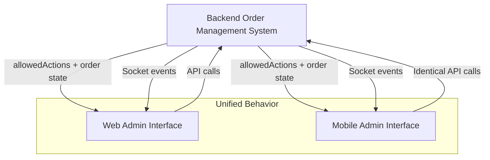

# Design Document: Mobile Admin Backend Parity

## Overview

This design establishes complete behavioral parity between the mobile admin order management system and the web admin system by implementing a unified architecture where the backend serves as the single source of truth. The mobile application will be transformed from a semi-autonomous system with custom logic into a thin client that mirrors the web admin's behavior exactly.

The core principle is **Backend Authority**: all order flow logic, state transitions, and business rules reside in the backend. Both mobile and web clients become presentation layers that render UI based on backend-provided state and execute actions through identical API endpoints.

## Architecture

### Current State Analysis

**Web Admin (Reference Implementation)**:
- Uses `allowedActions` array from backend to control UI
- Calls standardized REST endpoints for all operations
- Receives real-time updates via WebSocket events
- No client-side business logic for order flow

**Mobile Admin (Current Problem)**:
- Contains hardcoded status-based conditionals
- Implements custom order flow logic
- May use different API endpoints or request formats
- Inconsistent real-time update handling

### Target Architecture



### Architectural Principles

1. **Single Source of Truth**: Backend controls all order state and flow logic
2. **API Parity**: Mobile uses identical endpoints, payloads, and response handling as web
3. **State Synchronization**: Real-time updates ensure consistent state across all clients
4. **Thin Client Pattern**: Mobile contains no business logic, only presentation and API interaction
5. **Event-Driven Updates**: Socket events drive UI updates, not manual refreshes

## Components and Interfaces

### 1. Order Action Controller

**Purpose**: Centralized component for handling all order actions in mobile app

**Interface**:
```typescript
interface OrderActionController {
  confirmOrder(orderId: string): Promise<Order>
  packOrder(orderId: string): Promise<Order>
  assignOrder(orderId: string, deliveryBoyId: string): Promise<Order>
  startDelivery(orderId: string): Promise<Order>
  markDelivered(orderId: string): Promise<Order>
}
```

**Implementation Strategy**:
- Replace all existing action handlers with calls to this controller
- Each method calls the exact same API endpoint as web admin
- Returns updated order object from API response
- No custom logic or status manipulation

### 2. Order State Manager

**Purpose**: Manages order data synchronization between API responses and socket events

**Interface**:
```typescript
interface OrderStateManager {
  updateOrder(order: Order): void
  getOrder(orderId: string): Order | null
  subscribeToUpdates(callback: (order: Order) => void): void
  unsubscribeFromUpdates(callback: (order: Order) => void): void
}
```

**Implementation Strategy**:
- Maintains local cache of order objects
- Updates cache from API responses and socket events
- Triggers UI re-renders when order data changes
- No manual status updates or property modifications

### 3. Action Button Renderer

**Purpose**: Renders order action buttons based solely on allowedActions array

**Interface**:
```typescript
interface ActionButtonRenderer {
  renderActionButtons(order: Order): ReactElement[]
  isActionAllowed(order: Order, action: string): boolean
}
```

**Implementation Strategy**:
- Remove all status-based conditionals
- Use only `order.allowedActions.includes(action)` for button visibility
- Standardize button appearance and behavior across all actions

### 4. Socket Event Handler

**Purpose**: Handles real-time order updates from backend

**Interface**:
```typescript
interface SocketEventHandler {
  onOrderStatusChanged(order: Order): void
  onOrderAssigned(order: Order): void
  connect(): void
  disconnect(): void
}
```

**Implementation Strategy**:
- Subscribe to same events as web admin
- Update order state manager when events received
- Ensure event handling is identical to web implementation

### 5. Delivery Partner Assignment Module

**Purpose**: Handles delivery partner selection and assignment

**Interface**:
```typescript
interface DeliveryPartnerAssignment {
  fetchDeliveryPartners(): Promise<DeliveryPartner[]>
  showAssignmentModal(order: Order): void
  assignPartner(orderId: string, partnerId: string): Promise<Order>
}
```

**Implementation Strategy**:
- Use same API endpoint as web admin for fetching partners
- Implement identical UI flow as web admin
- Call same assignment API with identical payload format

## Data Models

### Order Model (Enhanced)

```typescript
interface Order {
  _id: string
  status: OrderStatus
  allowedActions: OrderAction[]  // Backend-controlled
  customer: Customer
  items: OrderItem[]
  deliveryPartner?: DeliveryPartner
  timestamps: {
    created: Date
    confirmed?: Date
    packed?: Date
    assigned?: Date
    outForDelivery?: Date
    delivered?: Date
  }
  // All other existing properties preserved
}

type OrderAction = 
  | "CONFIRM" 
  | "PACK" 
  | "ASSIGN" 
  | "START_DELIVERY" 
  | "MARK_DELIVERED"
  | "CANCEL"
```

### API Response Model

```typescript
interface OrderActionResponse {
  success: boolean
  order: Order  // Complete updated order object
  message?: string
  error?: string
}
```

### Socket Event Models

```typescript
interface OrderStatusChangedEvent {
  type: "order:status:changed"
  order: Order
}

interface OrderAssignedEvent {
  type: "order:assigned"
  order: Order
}
```

## Implementation Strategy

### Phase 1: API Endpoint Standardization

**Step 1.1: Audit Current Mobile API Calls**
- Identify all existing order action API calls in mobile app
- Document differences from web admin API usage
- Create mapping of mobile endpoints to standard endpoints

**Step 1.2: Replace API Endpoints**
```typescript
// BEFORE (mobile-specific)
const confirmOrder = async (orderId) => {
  const response = await api.post(`/mobile/orders/${orderId}/confirm`)
  // Custom mobile logic here
}

// AFTER (web admin parity)
const confirmOrder = async (orderId) => {
  const response = await api.patch(`/api/admin/orders/${orderId}/confirm`)
  return response.data.order  // Use complete order object
}
```

**Step 1.3: Standardize Request Payloads**
- Ensure all API calls use identical payloads as web admin
- Remove any mobile-specific request parameters
- Add any missing parameters required by web admin

### Phase 2: Remove Status-Based Logic

**Step 2.1: Identify Status-Based Conditionals**
```typescript
// REMOVE these patterns:
if (order.status === "PACKED") {
  showAssignButton()
}
if (order.status === "CONFIRMED") {
  showPackButton()
}
```

**Step 2.2: Replace with allowedActions Logic**
```typescript
// REPLACE with:
{order.allowedActions.includes("ASSIGN") && (
  <AssignButton onPress={() => assignOrder(order._id)} />
)}
{order.allowedActions.includes("PACK") && (
  <PackButton onPress={() => packOrder(order._id)} />
)}
```

**Step 2.3: Remove Custom Flow Logic**
- Delete any mobile-specific order flow validation
- Remove hardcoded business rules
- Eliminate status manipulation after API calls

### Phase 3: Implement Response Handling Parity

**Step 3.1: Standardize Response Processing**
```typescript
// BEFORE (manual status updates)
const packOrder = async (orderId) => {
  await api.patch(`/api/admin/orders/${orderId}/pack`)
  order.status = "PACKED"  // ❌ Manual update
  order.allowedActions = ["ASSIGN"]  // ❌ Hardcoded
}

// AFTER (backend authority)
const packOrder = async (orderId) => {
  const response = await api.patch(`/api/admin/orders/${orderId}/pack`)
  updateOrderInState(response.data.order)  // ✅ Complete replacement
}
```

**Step 3.2: Implement Order State Updates**
```typescript
const updateOrderInState = (updatedOrder: Order) => {
  // Replace entire order object in state
  setOrders(prevOrders => 
    prevOrders.map(order => 
      order._id === updatedOrder._id ? updatedOrder : order
    )
  )
}
```

### Phase 4: Socket Event Integration

**Step 4.1: Implement Socket Listeners**
```typescript
useEffect(() => {
  socket.on("order:status:changed", (updatedOrder) => {
    updateOrderInState(updatedOrder)
  })
  
  socket.on("order:assigned", (updatedOrder) => {
    updateOrderInState(updatedOrder)
  })
  
  return () => {
    socket.off("order:status:changed")
    socket.off("order:assigned")
  }
}, [])
```

**Step 4.2: Remove Manual Refresh Dependencies**
- Eliminate polling mechanisms
- Remove manual refresh buttons where not needed
- Rely on socket events for real-time updates

### Phase 5: Assignment Flow Parity

**Step 5.1: Implement Delivery Partner Fetching**
```typescript
const fetchDeliveryPartners = async () => {
  // Use same endpoint as web admin
  const response = await api.get('/api/admin/delivery-partners/available')
  return response.data.deliveryPartners
}
```

**Step 5.2: Standardize Assignment UI Flow**
- Copy assignment modal/screen design from web admin
- Use identical partner selection logic
- Implement same confirmation flow

**Step 5.3: Implement Assignment API Call**
```typescript
const assignOrder = async (orderId: string, deliveryBoyId: string) => {
  const response = await api.patch(`/api/admin/orders/${orderId}/assign`, {
    deliveryBoyId
  })
  return response.data.order
}
```

## Error Handling

### API Error Standardization

```typescript
const handleOrderAction = async (actionFn: () => Promise<Order>) => {
  try {
    const updatedOrder = await actionFn()
    updateOrderInState(updatedOrder)
    showSuccessMessage("Order updated successfully")
  } catch (error) {
    // Handle errors identically to web admin
    if (error.response?.status === 400) {
      showErrorMessage(error.response.data.message)
    } else if (error.response?.status === 403) {
      showErrorMessage("Action not allowed for this order")
    } else {
      showErrorMessage("Failed to update order. Please try again.")
    }
  }
}
```

### Socket Connection Error Handling

```typescript
const handleSocketErrors = () => {
  socket.on("connect_error", () => {
    showWarningMessage("Real-time updates temporarily unavailable")
  })
  
  socket.on("reconnect", () => {
    showSuccessMessage("Real-time updates restored")
    // Optionally refresh order data
  })
}
```

## Testing Strategy

This feature involves mobile application refactoring, API integration, and UI synchronization rather than pure functions with universal properties. Therefore, **property-based testing is not applicable** for this feature. The testing strategy focuses on integration testing, component testing, and behavioral parity verification.

### Unit Testing Approach

**API Integration Tests**:
- Verify each order action calls correct endpoint with proper HTTP method and path
- Validate request payloads exactly match web admin format
- Confirm response handling updates order state correctly without manual modifications
- Test error handling scenarios (400, 403, 500 responses)
- Mock API responses to test state update logic

**Component Tests**:
- Test action button rendering based solely on allowedActions array
- Verify complete removal of status-based conditionals
- Confirm UI updates automatically when order state changes
- Test button visibility/invisibility for all possible allowedActions combinations
- Verify button press handlers call correct API functions

**Socket Event Tests**:
- Mock socket events and verify order state updates occur correctly
- Test UI re-rendering after receiving "order:status:changed" events
- Test UI re-rendering after receiving "order:assigned" events
- Verify event handling logic matches web admin implementation exactly
- Test socket reconnection scenarios and error handling

### Integration Testing Strategy

**API Endpoint Parity Tests**:
- Compare mobile API calls with web admin API calls for identical endpoints
- Verify request headers, payloads, and authentication match exactly
- Test all order actions (confirm, pack, assign, start delivery, mark delivered)
- Validate response format compatibility between mobile and web

**Cross-Platform Synchronization Tests**:
1. **Web-to-Mobile Sync**: Perform action on web admin, verify mobile updates within 1 second
2. **Mobile-to-Web Sync**: Perform action on mobile admin, verify web updates within 1 second  
3. **Concurrent Actions**: Test simultaneous actions from both platforms handle conflicts correctly
4. **Full Lifecycle**: Complete entire order lifecycle on both platforms with identical results

**Real-Time Update Tests**:
- Test socket event delivery and processing under normal conditions
- Verify UI updates occur within specified 1-second timeframe
- Test network interruption and reconnection scenarios
- Validate fallback mechanisms when socket connection fails

### End-to-End Testing Strategy

**Behavioral Parity Verification**:
1. **Action Sequence Testing**: Execute identical action sequences on both platforms
2. **State Consistency**: Verify order state remains identical across platforms
3. **UI Consistency**: Confirm available actions match between mobile and web
4. **Assignment Flow**: Test delivery partner assignment process matches exactly
5. **Error Scenarios**: Verify error handling produces identical results

**Regression Testing**:
- Test existing mobile functionality remains intact after refactoring
- Verify no new bugs introduced during status-based logic removal
- Confirm performance characteristics remain acceptable
- Validate user experience improvements from consistent behavior

### Testing Configuration

**Unit Tests**: Use Jest/React Native Testing Library for component and logic testing
**Integration Tests**: Use real API endpoints in staging environment
**E2E Tests**: Use Detox or similar for full mobile app testing
**Cross-Platform Tests**: Automated scripts to verify parity between platforms

**Test Coverage Requirements**:
- 100% coverage of refactored order action components
- 100% coverage of API integration functions  
- 100% coverage of socket event handlers
- Complete behavioral parity verification across all order management flows

## Migration Strategy

### Phase 1: Preparation (1-2 days)
- Audit existing mobile order management code
- Identify all status-based conditionals and custom logic
- Document current API endpoint usage
- Set up testing environment for cross-platform verification

### Phase 2: Core Implementation (3-4 days)
- Replace API endpoints with web admin equivalents
- Remove all status-based logic
- Implement allowedActions-based UI rendering
- Add socket event handling

### Phase 3: Assignment Flow (1-2 days)
- Implement delivery partner fetching
- Create assignment UI matching web admin
- Integrate assignment API calls

### Phase 4: Testing and Validation (2-3 days)
- Execute comprehensive test suite
- Perform cross-platform parity verification
- Fix any behavioral discrepancies
- Validate real-time synchronization

### Phase 5: Deployment and Monitoring (1 day)
- Deploy mobile app updates
- Monitor for any issues or regressions
- Verify production behavior matches testing

## Risk Mitigation

### Technical Risks

**Risk**: Breaking existing mobile functionality during migration
**Mitigation**: Implement feature flags to enable gradual rollout

**Risk**: Socket connection issues affecting real-time updates
**Mitigation**: Implement fallback polling mechanism with user notification

**Risk**: API response format differences between mobile and web
**Mitigation**: Comprehensive API contract testing and validation

### Business Risks

**Risk**: Temporary inconsistency during deployment
**Mitigation**: Coordinate deployment timing and provide user communication

**Risk**: User confusion from UI changes
**Mitigation**: Minimal UI changes, focus on behavioral consistency

## Success Metrics

### Technical Metrics
- 100% removal of status-based conditionals from mobile code
- 100% API endpoint parity with web admin
- <1 second real-time update latency
- Zero behavioral differences in automated tests

### Business Metrics
- Consistent order management experience across platforms
- Reduced support tickets related to mobile/web inconsistencies
- Improved admin user satisfaction scores

## Conclusion

This design transforms the mobile admin order management system from a semi-autonomous application into a true thin client that achieves complete behavioral parity with the web admin system. By eliminating custom mobile logic and implementing backend authority principles, we ensure consistent order management behavior across all admin interfaces while maintaining a single source of truth in the backend system.

The implementation follows a systematic approach to replace status-based logic with allowedActions-driven UI, standardize API interactions, and implement real-time synchronization. This creates a maintainable, consistent, and reliable order management experience for all admin users regardless of their chosen platform.