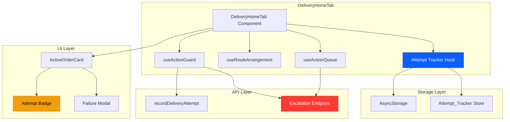
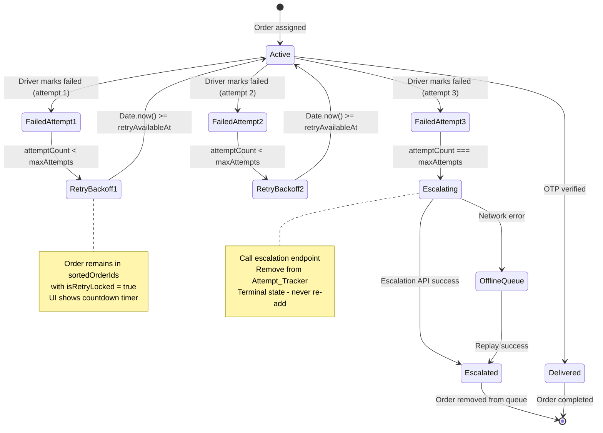
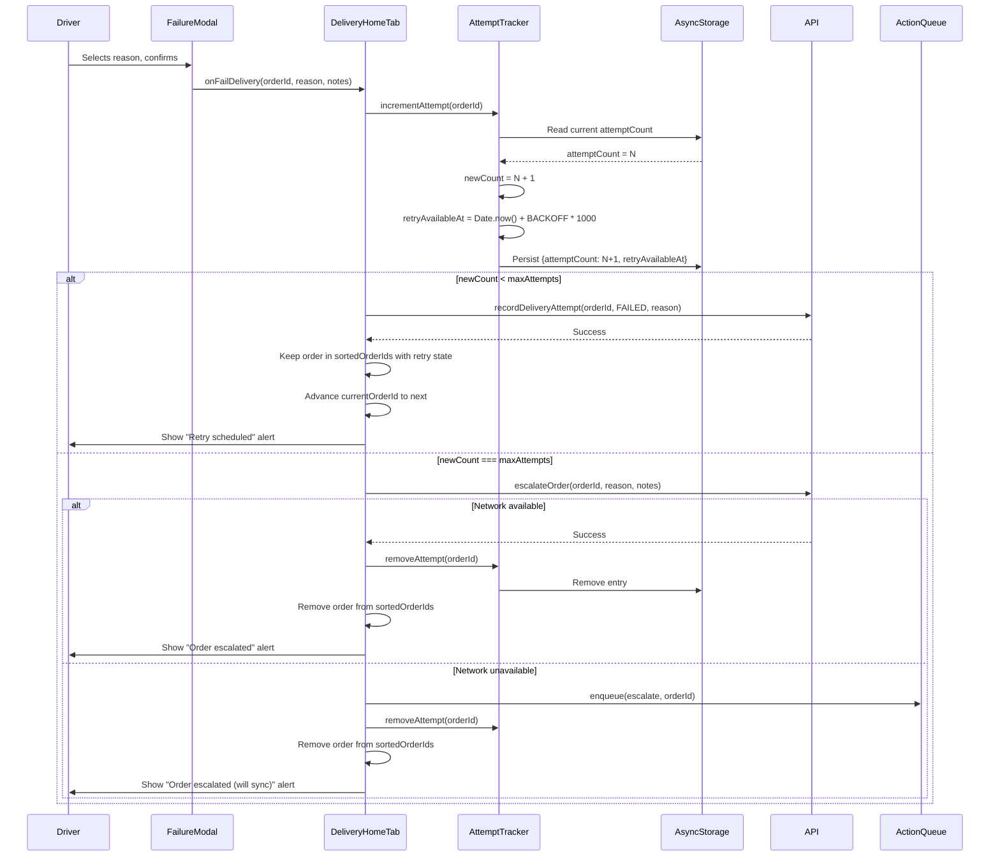

# Design Document: Multi-Attempt Failure Flow

## Overview

The Multi-Attempt Failure Flow feature transforms the delivery driver app's failure handling from a single-attempt-then-remove model to a configurable retry system with automatic escalation. This design preserves the critical architectural principle that **retry is a STATE, not a STRUCTURE** — all retry state lives within the existing `sortedOrderIds` route structure using per-order flags, never creating separate queues or data structures.

### Key Design Principles

1. **Retry as State**: Retry state (`attemptCount`, `retryAvailableAt`) is stored as metadata within the existing route structure, not as a separate queue
2. **Timestamp-Based Backoff**: Use `retryAvailableAt = Date.now() + BACKOFF_SECONDS * 1000` for retry delays, never timers or intervals
3. **Route Determinism**: Preserve the single-current invariant — failed current order advances immediately to next
4. **Escalation is Terminal**: Once escalated, an order never reappears, even from stale server state
5. **Offline Safety**: Local attempt counts take precedence over server responses to prevent data loss during offline operation
6. **Immediate Advance**: Failed current order must advance to next immediately to preserve single-current invariant

### Feature Scope

**In Scope:**
- Attempt count tracking with AsyncStorage persistence
- Configurable max-attempts policy (default: 3)
- Timestamp-based retry backoff with visual countdown
- Automatic escalation on max attempts reached
- Offline-resilient retry and escalation logic
- Attempt badge UI with countdown timer
- Cleanup of stale attempt data

**Out of Scope:**
- Server-side retry scheduling or reassignment logic
- Modification of existing route arrangement algorithm
- Changes to existing failure modal UI (reuse existing)
- Real-time sync of attempt counts across devices

## Architecture

### High-Level Component Diagram



### State Machine: Order Retry Flow



### Data Flow: Failed Attempt Processing



## Components and Interfaces

### 1. Attempt Tracker Hook (`useAttemptTracker`)

**Purpose**: Manages attempt count persistence and retry state for all orders.

**Interface**:
```typescript
interface AttemptState {
  attemptCount: number;
  retryAvailableAt: number; // Unix timestamp in milliseconds
}

interface UseAttemptTrackerReturn {
  // Get attempt state for an order
  getAttemptState: (orderId: string) => AttemptState | null;
  
  // Increment attempt count and set retry timestamp
  incrementAttempt: (orderId: string) => Promise<AttemptState>;
  
  // Remove attempt state (on delivery success or escalation)
  removeAttempt: (orderId: string) => Promise<void>;
  
  // Cleanup stale entries not in active orders
  cleanup: (activeOrderIds: string[]) => Promise<void>;
  
  // Check if order is in retry backoff
  isRetryLocked: (orderId: string) => boolean;
  
  // Get remaining backoff seconds for countdown
  getRemainingSeconds: (orderId: string) => number;
  
  // Merge server attempt count (only if server count is higher)
  mergeServerAttempt: (orderId: string, serverCount: number) => Promise<void>;
}
```

**Storage Schema** (AsyncStorage):
```typescript
// Key: `@delivery_attempt_tracker`
// Value: JSON string of Record<orderId, AttemptState>
{
  "order_123": {
    "attemptCount": 2,
    "retryAvailableAt": 1704067200000
  },
  "order_456": {
    "attemptCount": 1,
    "retryAvailableAt": 1704067230000
  }
}
```

**Implementation Notes**:
- Use a single AsyncStorage key for all attempt data to minimize I/O operations
- Implement debounced writes to prevent excessive AsyncStorage calls
- Initialize with empty object `{}` if storage key is missing
- Handle JSON parse errors gracefully by resetting to empty object

### 2. Configuration Constants

**File**: `apps/customer-app/src/constants/deliveryConfig.ts` (new file)

```typescript
export const DELIVERY_CONFIG = {
  // Maximum delivery attempts before escalation
  MAX_DELIVERY_ATTEMPTS: 3,
  
  // Retry backoff delay in seconds
  RETRY_BACKOFF_SECONDS: 30,
  
  // Countdown update interval in milliseconds
  COUNTDOWN_UPDATE_INTERVAL: 1000,
} as const;
```

**Validation Rules**:
- `MAX_DELIVERY_ATTEMPTS`: Must be >= 1, default to 3 if invalid
- `RETRY_BACKOFF_SECONDS`: Must be >= 10, default to 30 if invalid
- `COUNTDOWN_UPDATE_INTERVAL`: Must be >= 100, default to 1000 if invalid

### 3. Enhanced DeliveryHomeTab

**New State**:
```typescript
// No new state needed - attempt state lives in useAttemptTracker hook
```

**Modified Handler** (`handleFailDelivery`):
```typescript
const { guarded: handleFailDelivery } = useActionGuard(
  async (orderId: string, reason: FailureReasonKey, notes?: string) => {
    // 1. Increment attempt count
    const attemptState = await incrementAttempt(orderId);
    const { attemptCount } = attemptState;
    
    // 2. Check if max attempts reached
    if (attemptCount >= MAX_DELIVERY_ATTEMPTS) {
      // Escalation path
      try {
        await escalateOrder({ orderId, reason, notes, idempotencyKey: `escalate:${orderId}:${Date.now()}` }).unwrap();
        await removeAttempt(orderId);
        Alert.alert('Order Escalated', 'Order has been escalated for reassignment');
      } catch (error: any) {
        if (!error?.status) {
          // Network error - enqueue for offline replay
          enqueue({
            id: `${orderId}-escalate-${Date.now()}`,
            action: 'escalate',
            orderId,
            targetStatus: 'escalated',
            args: [orderId, reason, notes],
            fn: async (id: string, r: string, n?: string) => {
              await escalateOrder({ orderId: id, reason: r, notes: n, idempotencyKey: `escalate:${id}:${Date.now()}` }).unwrap();
            },
            idempotencyKey: `escalate:${orderId}:${Date.now()}`,
            enqueuedAt: Date.now(),
          });
          await removeAttempt(orderId);
          Alert.alert('Order Escalated', 'Order escalated (will sync when online)');
        } else {
          // Server error - show error and keep order
          Alert.alert('Escalation Failed', error?.data?.error || 'Failed to escalate order');
          return; // Don't remove order
        }
      }
      // Remove order from active list (handled by invalidatesTags)
    } else {
      // Retry path
      try {
        await recordDeliveryAttempt({
          orderId,
          status: 'FAILED',
          failureReason: reason,
          failureNotes: notes || undefined,
        }).unwrap();
        Alert.alert('Attempt Recorded', `Retry available in ${RETRY_BACKOFF_SECONDS} seconds`);
        // Order stays in sortedOrderIds with retry state
        // Auto-advance to next order (handled by useRouteArrangement)
      } catch (error: any) {
        Alert.alert('Error', error?.data?.error || 'Failed to record attempt');
      }
    }
  }
);
```

**Cleanup Effect**:
```typescript
useEffect(() => {
  // Cleanup stale attempt entries when active orders change
  const activeOrderIds = activeOrders.map(o => o._id);
  cleanup(activeOrderIds);
}, [activeOrders, cleanup]);
```

### 4. Enhanced ActiveOrderCard

**New Props**:
```typescript
interface ActiveOrderCardProps {
  // ... existing props
  attemptState?: AttemptState | null;
  isRetryLocked?: boolean;
  remainingSeconds?: number;
}
```

**Attempt Badge Component**:
```typescript
const AttemptBadge: React.FC<{
  attemptCount: number;
  maxAttempts: number;
  isRetryLocked: boolean;
  remainingSeconds: number;
}> = ({ attemptCount, maxAttempts, isRetryLocked, remainingSeconds }) => {
  const isFinalAttempt = attemptCount === maxAttempts - 1;
  const badgeColor = isFinalAttempt ? DELIVERY_COLORS.danger : DELIVERY_COLORS.warning;
  const badgeBg = isFinalAttempt ? DELIVERY_COLORS.dangerBg : DELIVERY_COLORS.warningBg;
  
  return (
    <View style={[styles.attemptBadge, { backgroundColor: badgeBg }]}>
      <Ionicons 
        name={isFinalAttempt ? "alert-circle" : "refresh-circle"} 
        size={12} 
        color={badgeColor} 
      />
      <Text style={[styles.attemptBadgeText, { color: badgeColor }]}>
        {isRetryLocked 
          ? `Retry in ${remainingSeconds}s`
          : isFinalAttempt
            ? "Final Attempt"
            : `Attempt ${attemptCount} of ${maxAttempts}`
        }
      </Text>
    </View>
  );
};
```

**Countdown Timer Logic**:
```typescript
// Inside SingleOrderCard component
const [currentTime, setCurrentTime] = useState(Date.now());

useEffect(() => {
  if (!isRetryLocked) return;
  
  const interval = setInterval(() => {
    setCurrentTime(Date.now());
  }, COUNTDOWN_UPDATE_INTERVAL);
  
  return () => clearInterval(interval);
}, [isRetryLocked]);

const remainingSeconds = isRetryLocked 
  ? Math.max(0, Math.ceil((attemptState.retryAvailableAt - currentTime) / 1000))
  : 0;
```

**Visual States**:
```typescript
// Retry-locked order card styling
const cardStyle = [
  styles.card,
  isCurrent && styles.cardCurrent,
  isLocked && styles.cardLocked,
  isRetryLocked && styles.cardRetryLocked, // New style
];

const pointerEvents = (isLocked || isRetryLocked) ? 'none' : 'auto';
```

**Failure Modal Warning**:
```typescript
// Inside Failure Modal render
{attemptCount === maxAttempts - 1 && (
  <View style={styles.finalAttemptWarning}>
    <Ionicons name="warning" size={16} color={DELIVERY_COLORS.danger} />
    <Text style={styles.finalAttemptWarningText}>
      This is your final attempt. Confirming will escalate this order for reassignment.
    </Text>
  </View>
)}
```

### 5. API Integration

**New Mutation**: `escalateOrder`

```typescript
// In deliveryApi.ts
escalateOrder: builder.mutation<
  { success: boolean; message: string },
  { orderId: string; reason: string; notes?: string; idempotencyKey: string }
>({
  query: ({ orderId, reason, notes, idempotencyKey }) => ({
    url: `/delivery/orders/${orderId}/escalate`,
    method: 'POST',
    body: { reason, notes },
    headers: { 'Idempotency-Key': idempotencyKey },
  }),
  invalidatesTags: ['DeliveryOrders'],
}),
```

**Alternative Approach** (if backend prefers single endpoint):
```typescript
// Modify existing recordDeliveryAttempt to accept escalate flag
recordDeliveryAttempt: builder.mutation<
  { success: boolean; order?: Order },
  { orderId: string; status: 'FAILED'; failureReason: string; failureNotes?: string; escalate?: boolean }
>({
  query: ({ orderId, status, failureReason, failureNotes, escalate }) => ({
    url: `/delivery/orders/${orderId}/attempt`,
    method: 'POST',
    body: { status, failureReason, failureNotes, escalate },
  }),
  invalidatesTags: ['DeliveryOrders'],
}),
```

**Action Queue Integration**:
```typescript
// Add escalate action to VALID_TRANSITIONS
export const VALID_TRANSITIONS: Record<string, string[]> = {
  pending:    ['assigned'],
  assigned:   ['picked_up'],
  picked_up:  ['in_transit'],
  in_transit: ['arrived'],
  arrived:    ['delivered', 'failed', 'escalated'], // Add escalated
};
```

### 6. Route Arrangement Integration

**No modifications needed** to `useRouteArrangement` hook. The hook already handles auto-advance when current order disappears from active orders list.

**Integration Points**:
1. When failed order is retained for retry, it stays in `sortedOrderIds`
2. `isRetryLocked` flag prevents actions on retry-locked orders
3. Auto-advance logic moves to next order when current fails
4. Escalated orders are removed via `invalidatesTags`, triggering auto-advance

## Data Models

### AttemptState

```typescript
interface AttemptState {
  attemptCount: number;        // Number of failed attempts (0-indexed before first failure)
  retryAvailableAt: number;    // Unix timestamp (ms) when retry becomes available
}
```

**Invariants**:
- `attemptCount >= 0`
- `attemptCount <= MAX_DELIVERY_ATTEMPTS`
- `retryAvailableAt > Date.now()` when order is in backoff
- `retryAvailableAt === 0` when `attemptCount === 0`

### Enhanced Order Type

```typescript
// No changes to Order type - attempt state is stored separately in Attempt_Tracker
// This preserves the principle that retry is STATE, not STRUCTURE
```

### Configuration

```typescript
interface DeliveryConfig {
  MAX_DELIVERY_ATTEMPTS: number;    // Default: 3
  RETRY_BACKOFF_SECONDS: number;    // Default: 30
  COUNTDOWN_UPDATE_INTERVAL: number; // Default: 1000
}
```

## Error Handling

### Network Errors

**Scenario**: Failed attempt recorded while offline

**Handling**:
1. Increment local `attemptCount` immediately
2. Apply retry or escalation logic based on local count
3. If escalation, enqueue escalation call in `useActionQueue`
4. Show appropriate alert to driver
5. Replay queued escalation when network returns

**Code**:
```typescript
if (!error?.status) {
  // Network error
  if (attemptCount >= MAX_DELIVERY_ATTEMPTS) {
    enqueue({
      id: `${orderId}-escalate-${Date.now()}`,
      action: 'escalate',
      orderId,
      targetStatus: 'escalated',
      args: [orderId, reason, notes],
      fn: async (id: string, r: string, n?: string) => {
        await escalateOrder({ orderId: id, reason: r, notes: n, idempotencyKey: `escalate:${id}:${Date.now()}` }).unwrap();
      },
      idempotencyKey: `escalate:${orderId}:${Date.now()}`,
      enqueuedAt: Date.now(),
    });
    await removeAttempt(orderId);
    Alert.alert('Order Escalated', 'Order escalated (will sync when online)');
  } else {
    // Retry path - no queue needed, order stays in route
    Alert.alert('Offline', 'Attempt recorded locally. Will sync when online.');
  }
}
```

### Server Errors

**Scenario**: Escalation endpoint returns 4xx error

**Handling**:
1. Show error alert to driver
2. Keep order in active list
3. Do NOT remove attempt state
4. Allow driver to retry or contact support

**Code**:
```typescript
if (error?.status >= 400 && error?.status < 500) {
  Alert.alert('Escalation Failed', error?.data?.error || 'Failed to escalate order');
  return; // Don't remove order or attempt state
}
```

### Conflict Errors (409)

**Scenario**: Queued escalation replayed, but order already reassigned

**Handling**:
1. Silently discard queued action
2. Do NOT show error alert
3. Order already removed from active list

**Code**:
```typescript
// In replayQueue logic
if (error?.status === 409) {
  // Conflict - order already escalated, silently discard
  toRemove.push(item.id);
  continue;
}
```

### AsyncStorage Errors

**Scenario**: Failed to read or write attempt state

**Handling**:
1. Log error to console
2. Treat missing data as `attemptCount = 0`
3. Continue normal operation
4. Retry write on next attempt

**Code**:
```typescript
try {
  const data = await AsyncStorage.getItem(ATTEMPT_TRACKER_KEY);
  return data ? JSON.parse(data) : {};
} catch (error) {
  console.error('[AttemptTracker] Failed to read storage:', error);
  return {}; // Safe default
}
```

### Stale State Protection

**Scenario**: Server returns lower attempt count than local

**Handling**:
1. Compare server count with local count
2. Keep higher count (local takes precedence)
3. Persist merged state

**Code**:
```typescript
const mergeServerAttempt = async (orderId: string, serverCount: number) => {
  const local = getAttemptState(orderId);
  if (!local || serverCount > local.attemptCount) {
    // Server count is higher or no local state - use server count
    await setAttemptState(orderId, {
      attemptCount: serverCount,
      retryAvailableAt: 0, // Server doesn't track retry timestamp
    });
  }
  // Otherwise keep local count (offline safety)
};
```

## Testing Strategy

### Dual Testing Approach

This feature requires both **unit tests** (for specific examples and edge cases) and **property-based tests** (for universal properties across all inputs). Together, they provide comprehensive coverage:

- **Unit tests**: Verify specific examples, edge cases, and error conditions
- **Property tests**: Verify universal properties across randomized inputs (minimum 100 iterations per test)

### Property-Based Testing Requirements

**Library Selection**: Use `fast-check` for React Native/TypeScript property-based testing.

**Test Configuration**:
- Minimum 100 iterations per property test (due to randomization)
- Each property test MUST reference its design document property using a comment tag
- Tag format: `// Feature: multi-attempt-failure-flow, Property {number}: {property_text}`

**Example Property Test Structure**:
```typescript
// Feature: multi-attempt-failure-flow, Property 1: AsyncStorage Round-Trip Preservation
it('should preserve AttemptState through AsyncStorage round-trip', async () => {
  await fc.assert(
    fc.asyncProperty(
      fc.record({
        attemptCount: fc.integer({ min: 0, max: 10 }),
        retryAvailableAt: fc.integer({ min: 0, max: Date.now() + 1000000 }),
      }),
      async (attemptState) => {
        const orderId = `order_${Math.random()}`;
        await persistAttemptState(orderId, attemptState);
        const restored = await getAttemptState(orderId);
        expect(restored).toEqual(attemptState);
      }
    ),
    { numRuns: 100 }
  );
});
```

### Unit Tests

**Test Suite**: `useAttemptTracker.test.ts`
- Test `incrementAttempt` increments count and sets timestamp (example-based)
- Test `removeAttempt` clears entry from storage (example-based)
- Test `cleanup` removes stale entries (example-based)
- Test `isRetryLocked` returns correct boolean based on timestamp (example-based)
- Test `getRemainingSeconds` calculates correct countdown (example-based)
- Test `mergeServerAttempt` keeps higher count (example-based)
- Test AsyncStorage error handling (missing key, parse error) (edge cases)
- Test initialization with empty storage (example-based)

**Test Suite**: `useAttemptTracker.properties.test.ts` (Property-Based)
- **Property 1**: AsyncStorage round-trip preservation (100+ iterations)
- **Property 2**: Server merge preserves maximum count (100+ iterations)
- **Property 3**: Increment produces correct state (100+ iterations)
- **Property 4**: Remove clears state (100+ iterations)
- **Property 5**: Missing entry defaults to null (100+ iterations)
- **Property 14**: Retry lock derived from timestamp (100+ iterations)
- **Property 15**: Countdown calculation from timestamp (100+ iterations)

**Test Suite**: `DeliveryHomeTab.failureFlow.test.tsx`
- Test `handleFailDelivery` increments attempt on first failure (example-based)
- Test `handleFailDelivery` retains order in route when `attemptCount < maxAttempts` (example-based)
- Test `handleFailDelivery` calls escalation endpoint when `attemptCount === maxAttempts` (example-based)
- Test `handleFailDelivery` enqueues escalation on network error (example-based)
- Test `handleFailDelivery` shows correct alerts for retry vs escalation (example-based)
- Test cleanup effect removes stale attempt entries (example-based)

**Test Suite**: `DeliveryHomeTab.failureFlow.properties.test.tsx` (Property-Based)
- **Property 6**: Max attempts validation enforces minimum (100+ iterations)
- **Property 7**: Invalid config defaults to 3 (100+ iterations)
- **Property 8**: Retry preserves order in route (100+ iterations)
- **Property 9**: Escalation removes order and state (100+ iterations)
- **Property 10**: Network error enqueues escalation (100+ iterations)
- **Property 11**: Server error retains order (100+ iterations)
- **Property 12**: Idempotency keys are unique (100+ iterations)
- **Property 13**: Cleanup removes stale entries (100+ iterations)
- **Property 20**: Current order advances on failure (100+ iterations)
- **Property 21**: Offline failure increments local count (100+ iterations)
- **Property 22**: Conflict response discards silently (100+ iterations)
- **Property 23**: Terminal state prevents re-addition (100+ iterations)

**Test Suite**: `ActiveOrderCard.attemptBadge.test.tsx`
- Test attempt badge shows "Attempt N of M" when not locked (example-based)
- Test attempt badge shows "Retry in Xs" when locked (example-based)
- Test attempt badge shows "Final Attempt" when `attemptCount === maxAttempts - 1` (example-based)
- Test attempt badge uses warning color for non-final attempts (example-based)
- Test attempt badge uses danger color for final attempt (example-based)
- Test countdown timer updates every second (example-based)
- Test failure modal shows warning on final attempt (example-based)

**Test Suite**: `ActiveOrderCard.attemptBadge.properties.test.tsx` (Property-Based)
- **Property 16**: Badge text format for active attempts (100+ iterations)
- **Property 17**: Badge text for final attempt (100+ iterations)
- **Property 18**: Badge color for non-final attempts (100+ iterations)
- **Property 19**: Badge color for final attempt (100+ iterations)

### Integration Tests

**Test Suite**: `retryFlow.integration.test.tsx`
- Test end-to-end retry flow: fail → backoff → unlock → retry → success
- Test end-to-end escalation flow: fail 3 times → escalate → remove
- Test offline retry: fail offline → increment local → sync when online
- Test offline escalation: fail 3 times offline → enqueue → replay when online
- Test stale state protection: server returns lower count → keep local count
- Test cleanup: order delivered → attempt state removed
- Test cleanup: order cancelled → attempt state removed

### Manual Testing Scenarios

1. **Happy Path Retry**:
   - Accept order, pickup, start delivery, mark arrived
   - Fail delivery with reason "Customer not available"
   - Verify attempt badge shows "Attempt 1 of 3"
   - Verify order card is locked with countdown timer
   - Wait 30 seconds
   - Verify order card unlocks
   - Complete delivery successfully

2. **Escalation Path**:
   - Accept order, pickup, start delivery, mark arrived
   - Fail delivery 3 times with different reasons
   - Verify attempt badge shows "Final Attempt" on 3rd attempt
   - Verify failure modal shows escalation warning
   - Confirm 3rd failure
   - Verify "Order escalated" alert
   - Verify order removed from queue

3. **Offline Retry**:
   - Turn off network
   - Fail delivery
   - Verify attempt incremented locally
   - Turn on network
   - Verify no errors, order stays in queue

4. **Offline Escalation**:
   - Turn off network
   - Fail delivery 3 times
   - Verify "Order escalated (will sync)" alert
   - Verify order removed from queue
   - Turn on network
   - Verify escalation synced successfully

5. **App Restart During Backoff**:
   - Fail delivery
   - Force close app during backoff countdown
   - Reopen app
   - Verify countdown resumes from correct timestamp
   - Verify order unlocks at correct time

## Implementation Plan

### Phase 1: Core Infrastructure (Tasks 1-4)
1. Create `deliveryConfig.ts` with configuration constants
2. Implement `useAttemptTracker` hook with AsyncStorage persistence
3. Add attempt state to `DeliveryHomeTab` state management
4. Implement `incrementAttempt`, `removeAttempt`, `cleanup` functions

### Phase 2: Failure Flow Integration (Tasks 5-7)
5. Modify `handleFailDelivery` to use attempt tracker
6. Implement retry path (keep order, set backoff)
7. Implement escalation path (call endpoint, remove order)

### Phase 3: UI Components (Tasks 8-10)
8. Create `AttemptBadge` component with countdown timer
9. Integrate attempt badge into `ActiveOrderCard`
10. Add final attempt warning to failure modal

### Phase 4: API Integration (Tasks 11-12)
11. Add `escalateOrder` mutation to `deliveryApi`
12. Update `VALID_TRANSITIONS` in `useActionQueue`

### Phase 5: Offline Support (Tasks 13-14)
13. Implement offline escalation queueing
14. Add conflict error handling for replayed escalations

### Phase 6: Cleanup & Polish (Tasks 15-16)
15. Implement cleanup effect in `DeliveryHomeTab`
16. Add visual states for retry-locked orders

### Phase 7: Testing (Tasks 17-19)
17. Write unit tests for `useAttemptTracker`
18. Write integration tests for retry and escalation flows
19. Perform manual testing of all scenarios

## Open Questions

1. **Backend Endpoint Design**: Should escalation use a dedicated `/escalate` endpoint or a flag on the existing `/attempt` endpoint?
   - **Recommendation**: Dedicated endpoint for clarity and separation of concerns

2. **Escalation Response**: What data should the escalation endpoint return?
   - **Recommendation**: `{ success: boolean, message: string, reassignedTo?: string }`

3. **Server Attempt Tracking**: Should the server track attempt counts independently?
   - **Recommendation**: Yes, for audit trail and cross-device sync, but client takes precedence during offline operation

4. **Backoff Strategy**: Should backoff increase with each attempt (exponential backoff)?
   - **Recommendation**: Start with fixed 30s backoff, consider exponential in future iteration

5. **Max Attempts Configuration**: Should max attempts be configurable per order or globally?
   - **Recommendation**: Global configuration for MVP, per-order in future if needed

6. **Cleanup Timing**: When should stale attempt entries be cleaned up?
   - **Recommendation**: On every active orders list update, debounced to avoid excessive writes

## Dependencies

### External Dependencies
- `@react-native-async-storage/async-storage`: Already installed, used for attempt state persistence
- `react-native`: Already installed, used for UI components and timers

### Internal Dependencies
- `useRouteArrangement`: Existing hook, no modifications needed
- `useActionGuard`: Existing hook, used for guarded mutations
- `useActionQueue`: Existing hook, requires `VALID_TRANSITIONS` update
- `deliveryApi`: Existing API slice, requires new `escalateOrder` mutation
- `ActiveOrderCard`: Existing component, requires attempt badge integration
- `DELIVERY_COLORS`: Existing constants, used for attempt badge styling

### Backend Dependencies
- New escalation endpoint: `POST /delivery/orders/:id/escalate`
- Existing attempt endpoint: `POST /delivery/orders/:id/attempt` (no changes)
- Order status updates via WebSocket (existing)

## Correctness Properties

*A property is a characteristic or behavior that should hold true across all valid executions of a system—essentially, a formal statement about what the system should do. Properties serve as the bridge between human-readable specifications and machine-verifiable correctness guarantees.*

### Property Reflection

Before defining properties, I analyzed all acceptance criteria to identify redundancy:

**Redundancies Identified:**
1. Properties 1.4 and 3.6 both test persistence across restarts → Combined into Property 1
2. Properties 1.7 and 7.5 both test merge logic → Combined into Property 2
3. Properties 5.2 and 5.8 both test cleanup on escalation → Combined into Property 9
4. Properties 8.1, 8.2, 8.3 all test cleanup logic → Combined into Property 13

**Properties Eliminated:**
- Property 4.4 (implementation detail, not functional requirement)
- Property 4.7 (visual layout, not testable property)
- Property 7.2 (integration test, not property)

### Property 1: AsyncStorage Round-Trip Preservation

*For any* valid AttemptState object (with attemptCount >= 0 and retryAvailableAt >= 0), persisting to AsyncStorage then reading back SHALL produce an equivalent AttemptState with the same attemptCount and retryAvailableAt values.

**Validates: Requirements 1.1, 1.4, 3.6**

### Property 2: Server Merge Preserves Maximum Count

*For any* local attempt count L and server attempt count S, calling mergeServerAttempt SHALL result in an attempt count equal to max(L, S), protecting local state during offline operation.

**Validates: Requirements 1.7, 7.5**

### Property 3: Increment Produces Correct State

*For any* initial attemptCount N (where 0 <= N < MAX_ATTEMPTS) and current timestamp T, calling incrementAttempt SHALL produce attemptCount = N + 1 and retryAvailableAt = T + RETRY_BACKOFF_SECONDS * 1000.

**Validates: Requirements 1.2**

### Property 4: Remove Clears State

*For any* order ID with existing attempt state, calling removeAttempt SHALL result in getAttemptState returning null for that order ID.

**Validates: Requirements 1.3**

### Property 5: Missing Entry Defaults to Null

*For any* order ID not present in the Attempt_Tracker, calling getAttemptState SHALL return null, allowing safe initialization.

**Validates: Requirements 1.5**

### Property 6: Max Attempts Validation Enforces Minimum

*For any* configuration value V < 1, the validated MAX_DELIVERY_ATTEMPTS SHALL equal 1, preventing infinite retry loops.

**Validates: Requirements 2.3**

### Property 7: Invalid Config Defaults to 3

*For any* invalid configuration value (undefined, null, NaN, non-number), the validated MAX_DELIVERY_ATTEMPTS SHALL equal 3.

**Validates: Requirements 2.2**

### Property 8: Retry Preserves Order in Route

*For any* order with attemptCount < MAX_ATTEMPTS, calling handleFailDelivery SHALL keep the order in sortedOrderIds while setting retry state.

**Validates: Requirements 3.1**

### Property 9: Escalation Removes Order and State

*For any* order with attemptCount = MAX_ATTEMPTS, calling handleFailDelivery with successful escalation SHALL remove the order from activeOrders AND clear its entry from Attempt_Tracker.

**Validates: Requirements 5.1, 5.2, 5.8**

### Property 10: Network Error Enqueues Escalation

*For any* order with attemptCount = MAX_ATTEMPTS, calling handleFailDelivery with network error SHALL enqueue the escalation action in the offline queue AND remove the order from activeOrders.

**Validates: Requirements 5.3**

### Property 11: Server Error Retains Order

*For any* order with attemptCount = MAX_ATTEMPTS, calling handleFailDelivery with 4xx server error SHALL retain the order in activeOrders AND preserve its attempt state.

**Validates: Requirements 5.4**

### Property 12: Idempotency Keys Are Unique

*For any* two escalation calls for the same order at different times, the generated idempotency keys SHALL be different (incorporating timestamp).

**Validates: Requirements 5.6**

### Property 13: Cleanup Removes Stale Entries

*For any* set of active order IDs, calling cleanup SHALL remove all attempt entries whose order IDs are not in the active set.

**Validates: Requirements 8.1, 8.2, 8.3**

### Property 14: Retry Lock Derived from Timestamp

*For any* order with retryAvailableAt timestamp R and current time T, isRetryLocked SHALL return true if and only if T < R.

**Validates: Requirements 3.3, 3.4**

### Property 15: Countdown Calculation from Timestamp

*For any* order with retryAvailableAt timestamp R and current time T where T < R, getRemainingSeconds SHALL return Math.ceil((R - T) / 1000).

**Validates: Requirements 4.3**

### Property 16: Badge Text Format for Active Attempts

*For any* order with attemptCount N > 0 and N < MAX_ATTEMPTS - 1, the attempt badge text SHALL equal "Attempt N of MAX_ATTEMPTS".

**Validates: Requirements 4.1**

### Property 17: Badge Text for Final Attempt

*For any* order with attemptCount = MAX_ATTEMPTS - 1, the attempt badge text SHALL equal "Final Attempt".

**Validates: Requirements 6.4**

### Property 18: Badge Color for Non-Final Attempts

*For any* order with 0 < attemptCount < MAX_ATTEMPTS - 1, the attempt badge color SHALL equal DELIVERY_COLORS.warning.

**Validates: Requirements 4.5**

### Property 19: Badge Color for Final Attempt

*For any* order with attemptCount = MAX_ATTEMPTS - 1, the attempt badge color SHALL equal DELIVERY_COLORS.danger.

**Validates: Requirements 4.6**

### Property 20: Current Order Advances on Failure

*For any* route with currentOrderId at index 0 in sortedOrderIds, calling handleFailDelivery on the current order with attemptCount < MAX_ATTEMPTS SHALL advance currentOrderId to sortedOrderIds[1] while preserving the failed order in sortedOrderIds.

**Validates: Requirements 3.7**

### Property 21: Offline Failure Increments Local Count

*For any* order, calling handleFailDelivery while offline SHALL increment the local attemptCount immediately without waiting for server response.

**Validates: Requirements 7.1**

### Property 22: Conflict Response Discards Silently

*For any* queued escalation action, replaying with 409 conflict response SHALL remove the action from the queue without displaying an error alert.

**Validates: Requirements 7.4**

### Property 23: Terminal State Prevents Re-Addition

*For any* order that has been escalated and removed, subsequent server updates containing that order ID SHALL NOT re-add the order to activeOrders.

**Validates: Requirements 5.7**

## Deployment Considerations

### Rollout Strategy
1. **Phase 1**: Deploy backend escalation endpoint
2. **Phase 2**: Deploy mobile app with feature flag disabled
3. **Phase 3**: Enable feature flag for 10% of drivers (canary)
4. **Phase 4**: Monitor metrics (escalation rate, retry success rate)
5. **Phase 5**: Gradual rollout to 100% of drivers

### Monitoring Metrics
- Escalation rate (escalations per 100 deliveries)
- Retry success rate (successful deliveries after retry)
- Average attempts per delivery
- Backoff duration effectiveness
- Offline escalation queue size

### Rollback Plan
- Feature flag to disable retry logic
- Fallback to single-attempt-then-remove behavior
- Preserve attempt data in AsyncStorage for future re-enable

### Migration Strategy
- No data migration needed (new feature)
- Existing orders continue with single-attempt behavior
- New failures use retry logic
- AsyncStorage schema is forward-compatible
