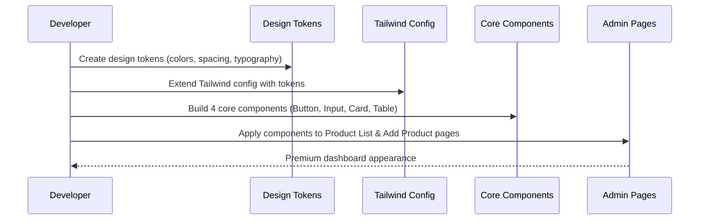

# Design Document: MVP Design System

## Overview

Transform admin dashboard from basic → premium in 2-3 days maximum. Focus on the 20% of components that deliver 80% of visual impact through clean spacing, typography, and consistency. Target: Stripe/Shopify-level polish with minimal engineering overhead.

## Main Algorithm/Workflow



## Core Interfaces/Types

```typescript
// Design Tokens
interface DesignTokens {
  colors: {
    primary: ColorScale;
    neutral: ColorScale;
    semantic: SemanticColors;
  };
  spacing: SpacingScale;
  typography: TypographyScale;
}

interface ColorScale {
  50: string;
  100: string;
  200: string;
  300: string;
  400: string;
  500: string;
  600: string;
  700: string;
  800: string;
  900: string;
}

interface SemanticColors {
  success: string;
  warning: string;
  error: string;
  info: string;
}

// Component Props
interface ButtonProps {
  variant: 'primary' | 'secondary' | 'danger';
  size?: 'sm' | 'md' | 'lg';
  loading?: boolean;
  disabled?: boolean;
  children: React.ReactNode;
  onClick?: () => void;
}

interface InputProps {
  label: string;
  error?: string;
  placeholder?: string;
  value: string;
  onChange: (value: string) => void;
}

interface CardProps {
  header?: React.ReactNode;
  children: React.ReactNode;
  className?: string;
}

interface TableProps {
  headers: string[];
  data: Record<string, any>[];
  actions?: (row: any) => React.ReactNode;
}
```

## Key Functions with Formal Specifications

### Function 1: createDesignTokens()

```typescript
function createDesignTokens(): DesignTokens
```

**Preconditions:**
- Function is called during design system initialization
- No existing design tokens are required

**Postconditions:**
- Returns complete DesignTokens object
- All color scales have 10 values (50-900)
- Spacing follows 4px base scale
- Typography includes 6 font sizes with proper line heights

**Loop Invariants:** N/A (no loops in token creation)

### Function 2: extendTailwindConfig()

```typescript
function extendTailwindConfig(tokens: DesignTokens): TailwindConfig
```

**Preconditions:**
- `tokens` is a valid DesignTokens object
- Existing tailwind.config.js exists

**Postconditions:**
- Returns updated Tailwind configuration
- All design tokens are mapped to Tailwind utilities
- Existing configuration is preserved and extended

**Loop Invariants:** N/A (configuration mapping is declarative)

### Function 3: renderButton()

```typescript
function Button({ variant, size, loading, disabled, children, onClick }: ButtonProps): JSX.Element
```

**Preconditions:**
- `variant` is one of: 'primary', 'secondary', 'danger'
- `children` is valid React content
- If `loading` is true, button should be disabled

**Postconditions:**
- Returns accessible button element with proper ARIA attributes
- Visual state matches variant and size specifications
- Loading state shows spinner and disables interaction
- Disabled state prevents clicks and shows disabled styling

**Loop Invariants:** N/A (single render function)

## Algorithmic Pseudocode

### Main Implementation Algorithm

```typescript
ALGORITHM implementMVPDesignSystem()
INPUT: existing admin dashboard codebase
OUTPUT: premium-styled dashboard

BEGIN
  // Step 1: Create design tokens
  tokens ← createDesignTokens()
  ASSERT tokens.colors.primary[500] exists
  ASSERT tokens.spacing[4] = "1rem"
  
  // Step 2: Update Tailwind configuration
  tailwindConfig ← extendTailwindConfig(tokens)
  writeFile("frontend/tailwind.config.js", tailwindConfig)
  
  // Step 3: Build core components with formal specifications
  FOR each component IN [Button, Input, Card, Table] DO
    ASSERT component implements accessibility standards
    ASSERT component uses design tokens consistently
    
    component ← buildComponent(component, tokens)
    writeFile(`frontend/src/components/ui/${component.name}.tsx`, component)
  END FOR
  
  // Step 4: Apply to real screens
  productListPage ← refactorPage("AdminProductsPage", components)
  addProductPage ← refactorPage("AddProductPage", components)
  
  ASSERT productListPage uses Card and Table components
  ASSERT addProductPage uses Input and Button components
  ASSERT visual consistency across all pages
  
  RETURN premiumDashboard
END
```

**Preconditions:**
- Existing React/TypeScript admin dashboard exists
- Tailwind CSS is configured
- Component directory structure exists

**Postconditions:**
- Dashboard has premium visual appearance
- All components follow design system
- Visual consistency maintained across pages
- Implementation completed in 2-3 days maximum

**Loop Invariants:**
- All built components use design tokens consistently
- Each component maintains accessibility standards throughout build process

### Component Building Algorithm

```typescript
ALGORITHM buildComponent(componentType, tokens)
INPUT: componentType (Button|Input|Card|Table), tokens (DesignTokens)
OUTPUT: React component with premium styling

BEGIN
  // Initialize component with base structure
  component ← createReactComponent(componentType)
  
  // Apply design tokens
  IF componentType = Button THEN
    styles ← {
      primary: `bg-${tokens.colors.primary[600]} hover:bg-${tokens.colors.primary[700]}`,
      secondary: `bg-${tokens.colors.neutral[100]} hover:bg-${tokens.colors.neutral[200]}`,
      danger: `bg-${tokens.semantic.error} hover:bg-red-700`
    }
    component.addStyles(styles)
    component.addLoadingState()
    component.addAccessibilityAttributes()
  END IF
  
  IF componentType = Input THEN
    component.addLabel()
    component.addErrorState()
    component.addFocusStyles(`ring-2 ring-${tokens.colors.primary[500]}`)
  END IF
  
  IF componentType = Card THEN
    component.addShadow("shadow-sm hover:shadow-md")
    component.addBorder(`border border-${tokens.colors.neutral[200]}`)
    component.addSpacing(`p-${tokens.spacing[6]}`)
  END IF
  
  IF componentType = Table THEN
    component.addHeaderStyling(`bg-${tokens.colors.neutral[50]}`)
    component.addRowHover(`hover:bg-${tokens.colors.neutral[25]}`)
    component.addBorders(`border-${tokens.colors.neutral[200]}`)
  END IF
  
  ASSERT component.isAccessible() = true
  ASSERT component.usesDesignTokens() = true
  
  RETURN component
END
```

**Preconditions:**
- componentType is valid component name
- tokens object contains all required design values
- React component creation utilities are available

**Postconditions:**
- Component follows design system specifications
- Component is accessible (WCAG compliant)
- Component uses design tokens exclusively
- Component has proper TypeScript types

**Loop Invariants:** N/A (conditional logic, not loops)

## Example Usage

```typescript
// Example 1: Using design tokens
import { designTokens } from './tokens/colors';

const primaryButton = `bg-${designTokens.colors.primary[600]} hover:bg-${designTokens.colors.primary[700]}`;

// Example 2: Button component usage
<Button variant="primary" loading={isSubmitting} onClick={handleSubmit}>
  Save Product
</Button>

<Button variant="secondary" onClick={handleCancel}>
  Cancel
</Button>

<Button variant="danger" onClick={handleDelete}>
  Delete Product
</Button>

// Example 3: Input component usage
<Input
  label="Product Name"
  value={productName}
  onChange={setProductName}
  error={errors.name}
  placeholder="Enter product name"
/>

// Example 4: Card component usage
<Card header={<h2>Product Details</h2>}>
  <ProductForm />
</Card>

// Example 5: Table component usage
<Table
  headers={['Name', 'Category', 'Price', 'Stock', 'Actions']}
  data={products}
  actions={(product) => (
    <div className="flex space-x-2">
      <Button variant="secondary" size="sm" onClick={() => editProduct(product)}>
        Edit
      </Button>
      <Button variant="danger" size="sm" onClick={() => deleteProduct(product)}>
        Delete
      </Button>
    </div>
  )}
/>

// Example 6: Complete page transformation
function AdminProductsPage() {
  return (
    <div className="space-y-6">
      <Card header={
        <div className="flex justify-between items-center">
          <h1 className="text-2xl font-semibold text-neutral-900">Products</h1>
          <Button variant="primary" onClick={() => navigate('/admin/products/new')}>
            Add Product
          </Button>
        </div>
      }>
        <Table
          headers={['Product', 'Category', 'Price', 'Stock', 'Actions']}
          data={products}
          actions={renderProductActions}
        />
      </Card>
    </div>
  );
}
```

## Correctness Properties

*A property is a characteristic or behavior that should hold true across all valid executions of a system-essentially, a formal statement about what the system should do. Properties serve as the bridge between human-readable specifications and machine-verifiable correctness guarantees.*

### Property 1: Design Token Structure Completeness

*For any* design system, the color scales should contain exactly 10 values (50-900) for primary and neutral colors, and include all four semantic colors (success, warning, error, info)

**Validates: Requirements 1.1, 1.2**

### Property 2: Spacing Scale Mathematical Consistency

*For any* design system, all spacing values should be multiples of 4px

**Validates: Requirement 1.3**

### Property 3: Typography Scale Completeness

*For any* design system, the typography scale should contain exactly 6 font sizes with appropriate line heights

**Validates: Requirement 1.4**

### Property 4: Tailwind Configuration Preservation

*For any* existing Tailwind configuration, extending it with design tokens should preserve all original configuration values while adding token mappings

**Validates: Requirements 2.1, 2.2**

### Property 5: Design Token Mapping Completeness

*For any* set of design tokens, all color, spacing, and typography values should be mapped to corresponding Tailwind utility classes

**Validates: Requirements 2.3, 2.4, 2.5**

### Property 6: Button Component Variant Support

*For any* button component, setting variant props (primary, secondary, danger) should result in appropriate styling, and setting size props (sm, md, lg) should result in appropriate size styling

**Validates: Requirements 3.1, 3.2**

### Property 7: Button State Behavior

*For any* button component, when loading is true it should display a spinner and be disabled, and when disabled is true it should prevent clicks and show disabled styling

**Validates: Requirements 3.3, 3.4**

### Property 8: Component Accessibility Attributes

*For any* core component, the rendered output should include appropriate ARIA attributes and support keyboard navigation

**Validates: Requirements 3.5, 7.1, 7.2**

### Property 9: Input Component Error Display

*For any* input component, when an error prop is provided it should display the error message, and when focused it should show a colored ring using primary color tokens

**Validates: Requirements 4.2, 4.3**

### Property 10: Input Component Value Handling

*For any* input component, it should display labels, support placeholder text, and trigger onChange callbacks when values change

**Validates: Requirements 4.1, 4.4, 4.5**

### Property 11: Card Component Conditional Rendering

*For any* card component, it should render headers when header props are provided and omit them when not provided, while applying consistent spacing from design tokens

**Validates: Requirements 5.1, 5.2**

### Property 12: Card Component Styling

*For any* card component, it should use neutral color tokens for borders, include hover-enhanced shadows, and accept custom className props

**Validates: Requirements 5.3, 5.4, 5.5**

### Property 13: Table Component Data Rendering

*For any* table component, it should render the correct number of header cells from header arrays and the correct number of data rows from object arrays

**Validates: Requirements 6.1, 6.2**

### Property 14: Table Component Action Support

*For any* table component with actions, it should render action elements for each data row

**Validates: Requirement 6.3**

### Property 15: Table Component Styling

*For any* table component, it should apply hover effects to rows, style headers with neutral background colors, and use neutral color tokens for borders

**Validates: Requirements 6.4, 6.5, 6.6**

### Property 16: Component Design Token Usage

*For any* core component, all styling should use values exclusively from design tokens

**Validates: Requirements 3.6, 4.6, 10.3, 10.4**

### Property 17: Dashboard Component Usage

*For any* admin dashboard page, all interactive actions should use Button components and all form fields should use Input components

**Validates: Requirements 8.3, 8.4**

### Property 18: Component Performance

*For any* core component, render time should be less than 16ms

**Validates: Requirement 9.2**

### Property 19: Color Contrast Accessibility

*For any* core component, color combinations should maintain proper contrast ratios for accessibility

**Validates: Requirement 7.3**