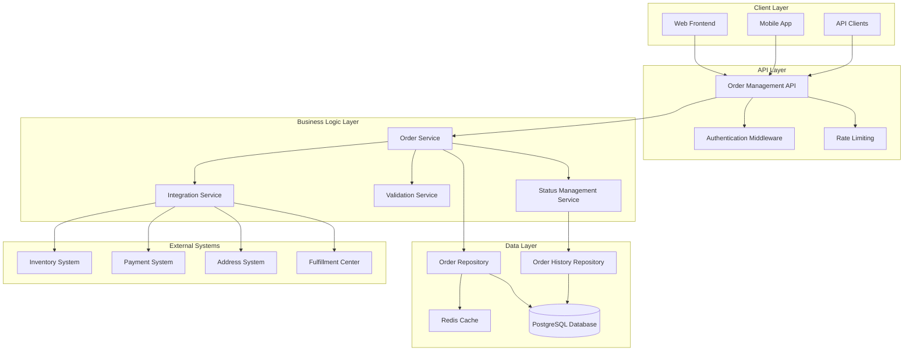

# Design Document: Order Management System

## Overview

The Order Management System is a comprehensive order lifecycle management service that orchestrates the complete order workflow from creation through fulfillment and delivery. The system serves as the central hub for order processing, integrating with existing address and payment modules while coordinating with inventory and fulfillment systems.

The system handles order creation, status management, modification, cancellation, and tracking while ensuring data consistency and reliability. It provides both customer-facing APIs for order management and internal APIs for system integration.

## Architecture

The Order Management System follows a layered architecture with clear separation of concerns:



### Architectural Principles

1. **Separation of Concerns**: Clear boundaries between API, business logic, and data layers
2. **Integration Abstraction**: External system dependencies are abstracted through service interfaces
3. **Data Consistency**: ACID transactions ensure order data integrity
4. **Scalability**: Stateless services with caching and connection pooling
5. **Reliability**: Graceful error handling and retry mechanisms for external integrations

## Components and Interfaces

### Core Components

#### Order Service
- **Responsibility**: Core order lifecycle management
- **Key Methods**:
  - `createOrder(customerId, items, addressId, paymentId): Order`
  - `getOrder(orderId): Order`
  - `getCustomerOrders(customerId, filters): Order[]`
  - `modifyOrder(orderId, modifications): Order`
  - `cancelOrder(orderId, reason): void`

#### Status Management Service
- **Responsibility**: Order status transitions and history tracking
- **Key Methods**:
  - `updateStatus(orderId, newStatus, reason): void`
  - `getOrderHistory(orderId): OrderHistoryEntry[]`
  - `validateStatusTransition(currentStatus, newStatus): boolean`

#### Validation Service
- **Responsibility**: Order data validation and business rule enforcement
- **Key Methods**:
  - `validateOrderCreation(orderData): ValidationResult`
  - `validateOrderModification(orderId, modifications): ValidationResult`
  - `validateInventoryAvailability(items): ValidationResult`

#### Integration Service
- **Responsibility**: External system communication and coordination
- **Key Methods**:
  - `reserveInventory(items): ReservationResult`
  - `processPayment(paymentData): PaymentResult`
  - `validateAddress(addressId): AddressValidationResult`
  - `notifyFulfillment(order): void`

### External Interfaces

#### Inventory System Interface
```typescript
interface InventorySystem {
  checkAvailability(productId: string, quantity: number): Promise<boolean>
  reserveItems(items: OrderItem[]): Promise<ReservationId>
  commitReservation(reservationId: ReservationId): Promise<void>
  releaseReservation(reservationId: ReservationId): Promise<void>
}
```

#### Payment System Interface
```typescript
interface PaymentSystem {
  processPayment(paymentData: PaymentRequest): Promise<PaymentResult>
  initiateRefund(orderId: string, amount: number): Promise<RefundResult>
}
```

#### Address System Interface
```typescript
interface AddressSystem {
  validateAddress(addressId: string): Promise<Address>
  getCustomerAddresses(customerId: string): Promise<Address[]>
}
```

#### Fulfillment System Interface
```typescript
interface FulfillmentSystem {
  submitOrder(order: Order): Promise<void>
  updateTrackingNumber(orderId: string, trackingNumber: string): Promise<void>
  confirmDelivery(orderId: string): Promise<void>
}
```

## Data Models

### Order Entity
```typescript
interface Order {
  id: string
  customerId: string
  status: OrderStatus
  items: OrderItem[]
  totalAmount: number
  currency: string
  deliveryAddressId: string
  paymentId: string
  trackingNumber?: string
  reservationId?: string
  createdAt: Date
  updatedAt: Date
}
```

### Order Item Entity
```typescript
interface OrderItem {
  id: string
  orderId: string
  productId: string
  productName: string
  quantity: number
  unitPrice: number
  totalPrice: number
}
```

### Order Status Enum
```typescript
enum OrderStatus {
  PENDING = 'pending',
  CONFIRMED = 'confirmed',
  PROCESSING = 'processing',
  SHIPPED = 'shipped',
  DELIVERED = 'delivered',
  CANCELLED = 'cancelled'
}
```

### Order History Entity
```typescript
interface OrderHistoryEntry {
  id: string
  orderId: string
  previousStatus: OrderStatus
  newStatus: OrderStatus
  reason: string
  timestamp: Date
  updatedBy: string
}
```

### Database Schema

#### Orders Table
```sql
CREATE TABLE orders (
  id UUID PRIMARY KEY DEFAULT gen_random_uuid(),
  customer_id UUID NOT NULL,
  status VARCHAR(20) NOT NULL,
  total_amount DECIMAL(10,2) NOT NULL,
  currency VARCHAR(3) NOT NULL DEFAULT 'USD',
  delivery_address_id UUID NOT NULL,
  payment_id UUID NOT NULL,
  tracking_number VARCHAR(100),
  reservation_id VARCHAR(100),
  created_at TIMESTAMP WITH TIME ZONE DEFAULT NOW(),
  updated_at TIMESTAMP WITH TIME ZONE DEFAULT NOW(),
  
  CONSTRAINT valid_status CHECK (status IN ('pending', 'confirmed', 'processing', 'shipped', 'delivered', 'cancelled'))
);

CREATE INDEX idx_orders_customer_id ON orders(customer_id);
CREATE INDEX idx_orders_status ON orders(status);
CREATE INDEX idx_orders_created_at ON orders(created_at DESC);
```

#### Order Items Table
```sql
CREATE TABLE order_items (
  id UUID PRIMARY KEY DEFAULT gen_random_uuid(),
  order_id UUID NOT NULL REFERENCES orders(id) ON DELETE CASCADE,
  product_id UUID NOT NULL,
  product_name VARCHAR(255) NOT NULL,
  quantity INTEGER NOT NULL CHECK (quantity > 0),
  unit_price DECIMAL(10,2) NOT NULL,
  total_price DECIMAL(10,2) NOT NULL,
  
  CONSTRAINT valid_total_price CHECK (total_price = quantity * unit_price)
);

CREATE INDEX idx_order_items_order_id ON order_items(order_id);
CREATE INDEX idx_order_items_product_id ON order_items(product_id);
```

#### Order History Table
```sql
CREATE TABLE order_history (
  id UUID PRIMARY KEY DEFAULT gen_random_uuid(),
  order_id UUID NOT NULL REFERENCES orders(id) ON DELETE CASCADE,
  previous_status VARCHAR(20),
  new_status VARCHAR(20) NOT NULL,
  reason TEXT,
  timestamp TIMESTAMP WITH TIME ZONE DEFAULT NOW(),
  updated_by VARCHAR(100) NOT NULL
);

CREATE INDEX idx_order_history_order_id ON order_history(order_id);
CREATE INDEX idx_order_history_timestamp ON order_history(timestamp DESC);
```
## Correctness Properties

*A property is a characteristic or behavior that should hold true across all valid executions of a system-essentially, a formal statement about what the system should do. Properties serve as the bridge between human-readable specifications and machine-verifiable correctness guarantees.*

### Property 1: Order Creation Uniqueness

*For any* valid order creation request, the system should generate a unique order identifier that has never been used before.

**Validates: Requirements 1.1**

### Property 2: Order Creation Validation Round Trip

*For any* order creation request, if the order is successfully created, then all order items must have passed inventory validation, address validation, and payment processing.

**Validates: Requirements 1.2, 1.3, 1.4**

### Property 3: Insufficient Inventory Rejection

*For any* order creation request containing items with insufficient inventory, the system should reject the order and return specific error details about which items are unavailable.

**Validates: Requirements 1.5**

### Property 4: New Order Initial Status

*For any* successfully created order, the initial status should be "pending".

**Validates: Requirements 1.6**

### Property 5: Valid Status Values

*For any* status update attempt, the system should only accept the values: pending, confirmed, processing, shipped, delivered, cancelled.

**Validates: Requirements 2.1**

### Property 6: Status Change History Recording

*For any* order status change, the system should create a history entry with timestamp, reason, previous status, and new status.

**Validates: Requirements 2.2, 4.6, 5.6**

### Property 7: Status Transition Validation

*For any* status transition attempt, the system should only allow valid transitions and reject invalid ones (e.g., delivered cannot transition to processing).

**Validates: Requirements 2.3**

### Property 8: Inventory Reservation Lifecycle

*For any* order, when confirmed the system should reserve inventory, when shipped the system should commit the reservation, and when cancelled the system should release the reservation.

**Validates: Requirements 2.4, 2.5, 6.2, 6.3, 6.4**

### Property 9: Authorization for Status Updates

*For any* status update attempt, the system should only allow updates from authorized system components and reject unauthorized attempts.

**Validates: Requirements 2.6**

### Property 10: Customer Order Retrieval Completeness

*For any* customer requesting their orders, the system should return all orders associated with their account and no orders from other customers.

**Validates: Requirements 3.1**

### Property 11: Order Filtering Accuracy

*For any* order query with status or date range filters, the system should return only orders that match the specified criteria.

**Validates: Requirements 3.2, 3.3**

### Property 12: Order Query Sorting

*For any* order query, the results should be sorted by creation date in descending order (newest first).

**Validates: Requirements 3.4**

### Property 13: Order History Completeness

*For any* order returned by a query, the order should include its complete order history.

**Validates: Requirements 3.5**

### Property 14: Order Modification Status Rules

*For any* order modification attempt, the system should allow modifications only when the order status is "pending" or "confirmed", and reject modifications for orders with status "processing", "shipped", or "delivered".

**Validates: Requirements 4.1, 4.2, 4.5**

### Property 15: Modification Inventory Validation

*For any* order modification, the system should validate new quantities against the inventory system before applying changes.

**Validates: Requirements 4.3**

### Property 16: Order Total Recalculation

*For any* order modification, the system should recalculate the total price based on the new quantities and unit prices.

**Validates: Requirements 4.4**

### Property 17: Order Cancellation Status Rules

*For any* order cancellation attempt, the system should allow cancellation only when the order status is "pending", "confirmed", or "processing", and reject cancellation for orders with status "shipped" or "delivered".

**Validates: Requirements 5.1, 5.5**

### Property 18: Cancellation Status Update

*For any* order cancellation, the system should set the order status to "cancelled".

**Validates: Requirements 5.2**

### Property 19: Cancellation Side Effects

*For any* order cancellation, the system should initiate refund processing and release all reserved inventory.

**Validates: Requirements 5.3, 5.4**

### Property 20: Inventory Availability Verification

*For any* order creation, the system should verify product availability with the inventory system before creating the order.

**Validates: Requirements 6.1**

### Property 21: Inventory System Failure Handling

*For any* inventory system failure during order operations, the system should reject the operation with appropriate error messages.

**Validates: Requirements 6.5**

### Property 22: Order-Inventory Consistency

*For any* order with reserved inventory, the order quantities should always match the inventory reservation quantities.

**Validates: Requirements 6.6**

### Property 23: Fulfillment Center Notification

*For any* order status change to "confirmed", the system should notify the fulfillment center with complete order details including items, quantities, and delivery address.

**Validates: Requirements 7.1, 7.2**

### Property 24: Tracking Number Processing

*For any* tracking number provided by the fulfillment center, the system should store the tracking number and update the order status to "shipped".

**Validates: Requirements 7.3, 7.4**

### Property 25: Delivery Confirmation Processing

*For any* delivery confirmation from carriers, the system should update the order status to "delivered".

**Validates: Requirements 7.5**

### Property 26: Order Data Persistence

*For any* order operation, all order data should be persisted to the database with proper referential integrity between orders and order items.

**Validates: Requirements 8.1, 8.2**

### Property 27: Order History Audit Trail

*For any* order change, the system should store complete history records for audit purposes.

**Validates: Requirements 8.3**

### Property 28: Database Transaction Integrity

*For any* order operation, the system should use database transactions to ensure data consistency.

**Validates: Requirements 8.4**

### Property 29: Database Failure Handling

*For any* database failure during order operations, the system should respond with appropriate error messages.

**Validates: Requirements 8.5**

### Property 30: Input Validation Error Messages

*For any* invalid order data, the system should return descriptive error messages that clearly identify the validation failures.

**Validates: Requirements 9.1**

### Property 31: Order Item Quantity Validation

*For any* order item, the system should only accept positive integer quantities and reject zero, negative, or non-integer values.

**Validates: Requirements 9.2**

### Property 32: Product Existence Validation

*For any* order containing product references, the system should validate that all referenced products exist before creating the order.

**Validates: Requirements 9.3**

### Property 33: Customer Authentication Validation

*For any* order operation, the system should validate customer authentication before processing the request.

**Validates: Requirements 9.4**

### Property 34: External System Failure Handling

*For any* external system integration failure, the system should return appropriate error codes and messages.

**Validates: Requirements 9.5**

### Property 35: Rate Limiting Protection

*For any* sequence of requests exceeding the rate limit, the system should reject excess requests with appropriate rate limiting responses.

**Validates: Requirements 10.5**

## Error Handling

The Order Management System implements comprehensive error handling across all layers:

### Error Categories

1. **Validation Errors**: Invalid input data, business rule violations
2. **Integration Errors**: External system failures, network timeouts
3. **System Errors**: Database failures, internal service errors
4. **Authorization Errors**: Authentication failures, permission violations

### Error Response Format

```typescript
interface ErrorResponse {
  error: {
    code: string
    message: string
    details?: Record<string, any>
    timestamp: string
    requestId: string
  }
}
```

### Error Handling Strategies

#### Validation Errors
- Return HTTP 400 with detailed validation messages
- Include field-specific error details
- Maintain request context for debugging

#### Integration Errors
- Implement circuit breaker pattern for external services
- Use exponential backoff for retries
- Fallback to cached data where appropriate
- Return HTTP 503 for temporary service unavailability

#### System Errors
- Log errors with correlation IDs
- Return HTTP 500 with generic error messages
- Implement health checks for system monitoring
- Use database connection pooling with retry logic

#### Authorization Errors
- Return HTTP 401 for authentication failures
- Return HTTP 403 for authorization failures
- Log security events for audit purposes

### Retry and Circuit Breaker Configuration

```typescript
const retryConfig = {
  maxRetries: 3,
  baseDelay: 100, // milliseconds
  maxDelay: 5000,
  backoffMultiplier: 2
}

const circuitBreakerConfig = {
  failureThreshold: 5,
  resetTimeout: 30000, // 30 seconds
  monitoringPeriod: 60000 // 1 minute
}
```

## Testing Strategy

The Order Management System employs a comprehensive dual testing approach combining unit tests and property-based tests to ensure correctness and reliability.

### Testing Framework Selection

- **Unit Testing**: Jest with TypeScript support
- **Property-Based Testing**: fast-check library for JavaScript/TypeScript
- **Integration Testing**: Supertest for API testing
- **Database Testing**: In-memory PostgreSQL for isolated testing

### Unit Testing Strategy

Unit tests focus on specific examples, edge cases, and integration points:

#### Core Areas for Unit Testing
- **API Endpoints**: Request/response validation, error handling
- **Service Layer**: Business logic implementation, edge cases
- **Repository Layer**: Database operations, query correctness
- **Integration Layer**: External system communication, error scenarios

#### Example Unit Test Structure
```typescript
describe('OrderService', () => {
  describe('createOrder', () => {
    it('should create order with valid data', async () => {
      // Test specific example with known inputs/outputs
    })
    
    it('should reject order with empty items array', async () => {
      // Test specific edge case
    })
    
    it('should handle inventory service timeout', async () => {
      // Test specific error condition
    })
  })
})
```

### Property-Based Testing Strategy

Property-based tests verify universal properties across all possible inputs using the fast-check library with minimum 100 iterations per test:

#### Property Test Configuration
```typescript
import fc from 'fast-check'

const propertyTestConfig = {
  numRuns: 100, // Minimum iterations
  timeout: 5000, // 5 second timeout per test
  seed: 42, // Reproducible randomization
  verbose: true // Detailed failure reporting
}
```

#### Property Test Implementation

Each correctness property from the design document must be implemented as a single property-based test with proper tagging:

```typescript
describe('Order Management System Properties', () => {
  it('Property 1: Order Creation Uniqueness', async () => {
    // Feature: order-management-system, Property 1: For any valid order creation request, the system should generate a unique order identifier that has never been used before
    
    await fc.assert(
      fc.asyncProperty(
        fc.record({
          customerId: fc.uuid(),
          items: fc.array(orderItemArbitrary, { minLength: 1 }),
          addressId: fc.uuid(),
          paymentId: fc.uuid()
        }),
        async (orderData) => {
          const order1 = await orderService.createOrder(orderData)
          const order2 = await orderService.createOrder(orderData)
          
          expect(order1.id).not.toBe(order2.id)
        }
      ),
      propertyTestConfig
    )
  })
  
  it('Property 8: Inventory Reservation Lifecycle', async () => {
    // Feature: order-management-system, Property 8: For any order, when confirmed the system should reserve inventory, when shipped the system should commit the reservation, and when cancelled the system should release the reservation
    
    await fc.assert(
      fc.asyncProperty(
        validOrderArbitrary,
        async (order) => {
          // Test reservation on confirmation
          await orderService.updateStatus(order.id, 'confirmed', 'Payment processed')
          const reservationAfterConfirm = await inventoryService.getReservation(order.id)
          expect(reservationAfterConfirm).toBeDefined()
          
          // Test commitment on shipping
          await orderService.updateStatus(order.id, 'shipped', 'Order shipped')
          const reservationAfterShip = await inventoryService.getReservation(order.id)
          expect(reservationAfterShip.status).toBe('committed')
          
          // Test release on cancellation (create new order for this test)
          const cancelOrder = await orderService.createOrder(order)
          await orderService.updateStatus(cancelOrder.id, 'confirmed', 'Payment processed')
          await orderService.cancelOrder(cancelOrder.id, 'Customer request')
          const reservationAfterCancel = await inventoryService.getReservation(cancelOrder.id)
          expect(reservationAfterCancel).toBeNull()
        }
      ),
      propertyTestConfig
    )
  })
})
```

#### Test Data Generators

Property-based tests require sophisticated data generators:

```typescript
// Order item generator
const orderItemArbitrary = fc.record({
  productId: fc.uuid(),
  productName: fc.string({ minLength: 1, maxLength: 100 }),
  quantity: fc.integer({ min: 1, max: 100 }),
  unitPrice: fc.float({ min: 0.01, max: 1000, noNaN: true })
})

// Valid order generator
const validOrderArbitrary = fc.record({
  customerId: fc.uuid(),
  items: fc.array(orderItemArbitrary, { minLength: 1, maxLength: 10 }),
  addressId: fc.uuid(),
  paymentId: fc.uuid()
})

// Order status generator
const orderStatusArbitrary = fc.constantFrom(
  'pending', 'confirmed', 'processing', 'shipped', 'delivered', 'cancelled'
)
```

### Integration Testing

Integration tests verify system behavior across component boundaries:

- **Database Integration**: Test repository layer with real database
- **External Service Integration**: Test with mock external services
- **API Integration**: End-to-end API testing with realistic scenarios

### Performance Testing

Performance tests validate system behavior under load:

- **Load Testing**: Verify performance requirements (2-second response time)
- **Concurrency Testing**: Test 100+ concurrent operations
- **Stress Testing**: Identify system breaking points

### Test Coverage Requirements

- **Unit Test Coverage**: Minimum 90% line coverage
- **Property Test Coverage**: All 35 correctness properties implemented
- **Integration Test Coverage**: All external integrations tested
- **API Test Coverage**: All endpoints with success and error scenarios

### Continuous Integration

All tests run automatically on every commit:

```yaml
# .github/workflows/test.yml
name: Test Suite
on: [push, pull_request]
jobs:
  test:
    runs-on: ubuntu-latest
    steps:
      - uses: actions/checkout@v2
      - uses: actions/setup-node@v2
        with:
          node-version: '18'
      - run: npm ci
      - run: npm run test:unit
      - run: npm run test:property
      - run: npm run test:integration
      - run: npm run test:coverage
```

The dual testing approach ensures comprehensive validation: unit tests catch concrete bugs and verify specific behaviors, while property-based tests verify general correctness across all possible inputs. Together, they provide confidence in system reliability and correctness.