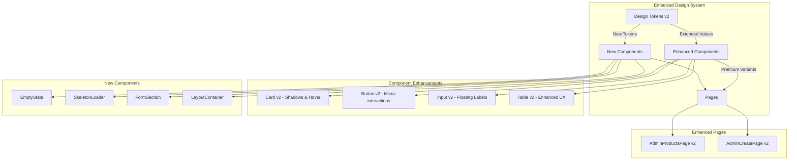

# Premium UI Upgrade - Design Document

## Overview

This design document outlines the technical implementation approach for transforming the admin dashboard from its current structured UI foundation to a premium ₹100000Cr product experience with Stripe/Shopify-level polish. Building on the existing MVP Design System (design tokens, 4 core UI components, refactored pages), this upgrade focuses on visual depth, hierarchy, micro-interactions, and premium user experience patterns.

### Design Goals

- **Premium Visual Quality**: Achieve Stripe/Shopify-level visual polish through enhanced shadows, spacing, and typography
- **Enhanced User Experience**: Implement micro-interactions and smooth transitions for responsive feedback
- **Improved Information Architecture**: Create clear visual hierarchy and organized content sections
- **Responsive Excellence**: Ensure seamless experience across all device sizes
- **Component Enhancement**: Extend existing UI components with premium features while maintaining API compatibility

### Success Metrics

- Improved visual hierarchy scores through design system consistency
- Enhanced user engagement through micro-interactions
- Reduced cognitive load through better spacing and organization
- Maintained development velocity through component API compatibility

## Architecture

### System Architecture Overview

The Premium UI Upgrade builds upon the existing MVP Design System architecture with the following enhancements:



### Design System Extension Strategy

1. **Backward Compatibility**: All existing component APIs remain unchanged
2. **Progressive Enhancement**: New features added through optional props and variants
3. **Token Extension**: New design tokens added without breaking existing values
4. **Modular Implementation**: New components can be adopted incrementally

### File Structure Organization

```
frontend/src/
├── components/ui/
│   ├── enhanced/           # Enhanced versions of existing components
│   │   ├── Card.tsx       # Enhanced Card with premium features
│   │   ├── Button.tsx     # Enhanced Button with micro-interactions
│   │   ├── Input.tsx      # Enhanced Input with floating labels
│   │   └── Table.tsx      # Enhanced Table with premium UX
│   ├── layout/            # New layout components
│   │   ├── LayoutContainer.tsx
│   │   ├── FormSection.tsx
│   │   └── PageHeader.tsx
│   └── feedback/          # New feedback components
│       ├── EmptyState.tsx
│       ├── SkeletonLoader.tsx
│       └── LoadingSpinner.tsx
├── tokens/
│   └── premium.ts         # Extended design tokens
└── pages/
    ├── AdminProductsPage.tsx  # Enhanced with premium components
    └── ProductCreatePage.tsx  # Enhanced with form sections
```

## Components and Interfaces

### Enhanced Design Tokens

#### Extended Shadow System

```typescript
// frontend/src/tokens/premium.ts
export const premiumTokens = {
  shadows: {
    // Soft shadows for cards and containers
    soft: '0 1px 3px 0 rgba(0, 0, 0, 0.1), 0 1px 2px 0 rgba(0, 0, 0, 0.06)',
    // Medium shadows for interactive elements
    medium: '0 4px 6px -1px rgba(0, 0, 0, 0.1), 0 2px 4px -1px rgba(0, 0, 0, 0.06)',
    // Strong shadows for elevated states
    strong: '0 10px 15px -3px rgba(0, 0, 0, 0.1), 0 4px 6px -2px rgba(0, 0, 0, 0.05)',
    // Premium card shadow
    card: '0 4px 6px -1px rgba(0, 0, 0, 0.1), 0 2px 4px -1px rgba(0, 0, 0, 0.06)',
    // Hover state shadow
    cardHover: '0 10px 15px -3px rgba(0, 0, 0, 0.1), 0 4px 6px -2px rgba(0, 0, 0, 0.05)'
  },
  
  spacing: {
    // Extended spacing for premium layouts
    18: '4.5rem',  // 72px - Large section spacing
    20: '5rem',    // 80px - Extra large spacing
    24: '6rem',    // 96px - Maximum spacing
  },
  
  borderRadius: {
    // Premium border radius values
    card: '12px',
    button: '12px',
    input: '8px',
    large: '16px'
  },
  
  typography: {
    // Premium typography scale
    '3xl': {
      fontSize: '2rem',      // 32px - Page titles
      lineHeight: '2.5rem',  // 40px
      fontWeight: '600'
    },
    '4xl': {
      fontSize: '2.5rem',    // 40px - Hero titles
      lineHeight: '3rem',    // 48px
      fontWeight: '700'
    }
  },
  
  transitions: {
    // Smooth transition timings
    fast: '150ms ease-out',
    medium: '200ms ease-out',
    slow: '300ms ease-out',
    bounce: '200ms cubic-bezier(0.68, -0.55, 0.265, 1.55)'
  }
}
```

#### Animation System

```typescript
export const animations = {
  // Micro-interaction animations
  buttonHover: 'transform 150ms ease-out',
  buttonPress: 'transform 100ms ease-out',
  cardHover: 'box-shadow 200ms ease-out, transform 200ms ease-out',
  inputFocus: 'border-color 200ms ease-out, box-shadow 200ms ease-out',
  
  // Page transition animations
  fadeIn: 'opacity 300ms ease-out',
  slideUp: 'transform 300ms ease-out, opacity 300ms ease-out',
  
  // Loading animations
  pulse: 'opacity 2s ease-in-out infinite',
  spin: 'transform 1s linear infinite'
}
```

### Enhanced Card Component

#### Interface Definition

```typescript
// frontend/src/components/ui/enhanced/Card.tsx
export interface EnhancedCardProps extends CardProps {
  // Premium visual variants
  variant?: 'default' | 'elevated' | 'interactive';
  
  // Hover effects
  hoverable?: boolean;
  
  // Loading state
  loading?: boolean;
  
  // Custom shadow intensity
  shadowIntensity?: 'soft' | 'medium' | 'strong';
  
  // Border radius variant
  borderRadius?: 'default' | 'large';
}
```

#### Implementation Strategy

1. **Backward Compatibility**: Extend existing Card component without breaking changes
2. **Progressive Enhancement**: New features available through optional props
3. **Performance**: Use CSS transforms for hover effects to avoid layout thrashing
4. **Accessibility**: Maintain focus states and ARIA attributes

```typescript
const EnhancedCard: React.FC<EnhancedCardProps> = ({
  variant = 'default',
  hoverable = false,
  loading = false,
  shadowIntensity = 'medium',
  borderRadius = 'default',
  className = '',
  ...props
}) => {
  const variantClasses = {
    default: 'bg-white border border-neutral-200',
    elevated: 'bg-white border-0',
    interactive: 'bg-white border border-neutral-200 cursor-pointer'
  };
  
  const shadowClasses = {
    soft: 'shadow-soft',
    medium: 'shadow-medium',
    strong: 'shadow-strong'
  };
  
  const hoverClasses = hoverable ? 
    'hover:shadow-strong hover:scale-[1.01] transition-all duration-200' : '';
  
  // Implementation continues...
}
```

### Enhanced Button Component

#### Micro-Interaction Implementation

```typescript
// frontend/src/components/ui/enhanced/Button.tsx
export interface EnhancedButtonProps extends ButtonProps {
  // New variants
  variant?: 'primary' | 'secondary' | 'tertiary' | 'danger';
  
  // Micro-interaction controls
  enableHoverScale?: boolean;
  enablePressAnimation?: boolean;
  
  // Icon support
  leftIcon?: React.ReactNode;
  rightIcon?: React.ReactNode;
}
```

#### Animation Implementation Strategy

1. **CSS Transforms**: Use transform properties for smooth scaling
2. **Transition Timing**: 150ms for hover, 100ms for press states
3. **Accessibility**: Respect `prefers-reduced-motion` media query
4. **Performance**: Use `will-change` property for animated elements

```css
/* Button micro-interactions */
.button-enhanced {
  transition: transform 150ms ease-out, box-shadow 150ms ease-out;
  will-change: transform;
}

.button-enhanced:hover:not(:disabled) {
  transform: scale(1.02);
}

.button-enhanced:active:not(:disabled) {
  transform: scale(0.98);
  transition-duration: 100ms;
}

@media (prefers-reduced-motion: reduce) {
  .button-enhanced {
    transition: none;
  }
  
  .button-enhanced:hover:not(:disabled) {
    transform: none;
  }
}
```

### Enhanced Input Component

#### Floating Label Implementation

```typescript
// frontend/src/components/ui/enhanced/Input.tsx
export interface EnhancedInputProps extends InputProps {
  // Floating label variant
  labelVariant?: 'static' | 'floating';
  
  // Helper text
  helperText?: string;
  
  // Success state
  success?: boolean;
  
  // Icon support
  leftIcon?: React.ReactNode;
  rightIcon?: React.ReactNode;
}
```

#### Floating Label Animation Strategy

1. **CSS Transitions**: Smooth label movement using transform and scale
2. **Focus Management**: Coordinate label state with input focus and value
3. **Accessibility**: Maintain proper label association and screen reader support

```css
/* Floating label animation */
.floating-label {
  position: absolute;
  left: 12px;
  top: 50%;
  transform: translateY(-50%);
  transition: all 200ms ease-out;
  pointer-events: none;
  color: theme('colors.neutral.500');
}

.floating-label.active {
  top: 8px;
  transform: translateY(0) scale(0.875);
  color: theme('colors.primary.600');
}

.input-field:focus + .floating-label,
.input-field:not(:placeholder-shown) + .floating-label {
  top: 8px;
  transform: translateY(0) scale(0.875);
}
```

### Enhanced Table Component

#### Premium Table Features

```typescript
// frontend/src/components/ui/enhanced/Table.tsx
export interface EnhancedTableProps extends TableProps {
  // Row height variant
  rowHeight?: 'compact' | 'comfortable' | 'spacious';
  
  // Zebra striping
  striped?: boolean;
  
  // Hover effects
  hoverable?: boolean;
  
  // Loading state
  loading?: boolean;
  
  // Empty state
  emptyState?: React.ReactNode;
}
```

#### Implementation Features

1. **Improved Row Heights**: 64px default for better touch targets
2. **Smooth Hover Transitions**: 200ms transition for row highlighting
3. **Zebra Striping**: Alternating row colors for better readability
4. **Loading States**: Skeleton loader integration
5. **Empty States**: Custom empty state component integration

### New Layout Components

#### LayoutContainer Component

```typescript
// frontend/src/components/ui/layout/LayoutContainer.tsx
export interface LayoutContainerProps {
  // Container width variants
  maxWidth?: '7xl' | '6xl' | '5xl' | '4xl';
  
  // Padding variants
  padding?: 'sm' | 'md' | 'lg';
  
  // Background variants
  background?: 'transparent' | 'neutral' | 'white';
  
  children: React.ReactNode;
  className?: string;
}
```

#### FormSection Component

```typescript
// frontend/src/components/ui/layout/FormSection.tsx
export interface FormSectionProps {
  // Section metadata
  title: string;
  description?: string;
  icon?: React.ReactNode;
  
  // Layout options
  columns?: 1 | 2 | 3;
  spacing?: 'sm' | 'md' | 'lg';
  
  children: React.ReactNode;
  className?: string;
}
```

### New Feedback Components

#### EmptyState Component

```typescript
// frontend/src/components/ui/feedback/EmptyState.tsx
export interface EmptyStateProps {
  // Visual elements
  icon?: React.ReactNode;
  illustration?: string;
  
  // Content
  title: string;
  description?: string;
  
  // Actions
  primaryAction?: {
    label: string;
    onClick: () => void;
    variant?: 'primary' | 'secondary';
  };
  secondaryAction?: {
    label: string;
    onClick: () => void;
  };
  
  // Variants
  variant?: 'default' | 'search' | 'error';
  
  className?: string;
}
```

#### SkeletonLoader Component

```typescript
// frontend/src/components/ui/feedback/SkeletonLoader.tsx
export interface SkeletonLoaderProps {
  // Shape variants
  variant?: 'text' | 'circular' | 'rectangular' | 'card' | 'table';
  
  // Size options
  width?: string | number;
  height?: string | number;
  
  // Animation
  animation?: 'pulse' | 'wave' | 'none';
  
  // Multiple skeletons
  count?: number;
  
  className?: string;
}
```

## Data Models

### Enhanced Component State Models

#### Card State Model

```typescript
interface CardState {
  isHovered: boolean;
  isLoading: boolean;
  shadowIntensity: 'soft' | 'medium' | 'strong';
  variant: 'default' | 'elevated' | 'interactive';
}
```

#### Input State Model

```typescript
interface InputState {
  isFocused: boolean;
  hasValue: boolean;
  isValid: boolean;
  validationState: 'idle' | 'validating' | 'success' | 'error';
  labelPosition: 'static' | 'floating';
}
```

#### Table State Model

```typescript
interface TableState {
  hoveredRowIndex: number | null;
  isLoading: boolean;
  sortColumn: string | null;
  sortDirection: 'asc' | 'desc' | null;
  selectedRows: Set<string>;
}
```

### Animation State Models

#### Micro-Interaction State

```typescript
interface MicroInteractionState {
  isHovered: boolean;
  isPressed: boolean;
  isFocused: boolean;
  animationPhase: 'idle' | 'enter' | 'active' | 'exit';
}
```

#### Loading State Model

```typescript
interface LoadingState {
  isLoading: boolean;
  loadingType: 'skeleton' | 'spinner' | 'pulse';
  progress?: number;
  message?: string;
}
```

### Form Organization Models

#### FormSection Model

```typescript
interface FormSectionConfig {
  id: string;
  title: string;
  description?: string;
  icon?: string;
  fields: FormFieldConfig[];
  validation?: ValidationRule[];
  layout: {
    columns: number;
    spacing: 'sm' | 'md' | 'lg';
  };
}

interface FormFieldConfig {
  name: string;
  type: 'text' | 'number' | 'email' | 'textarea' | 'select' | 'file';
  label: string;
  placeholder?: string;
  helperText?: string;
  required: boolean;
  validation?: ValidationRule[];
}
```

## Correctness Properties

*A property is a characteristic or behavior that should hold true across all valid executions of a system-essentially, a formal statement about what the system should do. Properties serve as the bridge between human-readable specifications and machine-verifiable correctness guarantees.*

### Property Reflection

After analyzing all acceptance criteria, I identified several areas where properties can be consolidated to eliminate redundancy:

**Layout and Spacing Consolidation:**
- Properties 1.1, 1.2, 1.3 can be combined into a comprehensive layout system property
- Properties 2.1, 2.2, 2.3 can be combined into a typography hierarchy property
- Properties 5.5, 10.2 both deal with spacing and can be consolidated

**Component Styling Consolidation:**
- Properties 3.1, 3.2, 3.4 can be combined into a comprehensive card styling property
- Properties 4.3, 4.4, 4.5 can be combined into a table cell styling property
- Properties 8.2, 8.3, 8.5 can be combined into a button styling property

**Animation Consolidation:**
- Properties 6.1, 6.3 both deal with button animations and can be combined
- Properties 7.5, 6.5 both deal with loading animations and can be combined

This consolidation reduces redundancy while maintaining comprehensive coverage of all testable requirements.

### Property 1: Layout System Consistency

*For any* dashboard page, the layout container should have max-width of 1280px, be horizontally centered, and maintain consistent padding (24px mobile, 48px desktop) with 32px vertical spacing between sections.

**Validates: Requirements 1.1, 1.2, 1.3**

### Property 2: Typography Hierarchy Consistency

*For any* dashboard page, page titles should use 32px font-size with 600 font-weight, section subtitles should use 20px font-size with 500 font-weight, and content groups should have 24px spacing between them.

**Validates: Requirements 2.1, 2.2, 2.3**

### Property 3: Card Component Styling

*For any* card component, it should implement the specified shadow values (0 4px 6px -1px rgba(0, 0, 0, 0.1), 0 2px 4px -1px rgba(0, 0, 0, 0.06)), use 12px border-radius, and maintain 24px internal padding.

**Validates: Requirements 3.1, 3.2, 3.4**

### Property 4: Card Hover Interaction

*For any* interactive card component, hovering should increase shadow depth with smooth 200ms transition.

**Validates: Requirements 3.3**

### Property 5: Table Styling Consistency

*For any* table component, rows should have 64px height, cells should have 16px horizontal and 20px vertical padding, and headers should use 14px font-size with 500 font-weight.

**Validates: Requirements 4.3, 4.4, 4.5**

### Property 6: Table Row Interactions

*For any* table component, it should implement zebra striping with neutral-50 background for alternating rows, and hovering should highlight rows with neutral-100 background and 200ms transition.

**Validates: Requirements 4.1, 4.2**

### Property 7: Form Section Structure

*For any* form system, related fields should be grouped into sections with descriptive titles, section icons should be displayed alongside titles, and helper text should be provided below form fields.

**Validates: Requirements 5.1, 5.3, 5.4**

### Property 8: Form Spacing Consistency

*For any* form system, there should be 20px spacing between form sections and 16px spacing between fields within sections, with responsive adjustments (16px padding on mobile, 2-column grid on tablet).

**Validates: Requirements 5.5, 10.2, 10.3**

### Property 9: Button Micro-Interactions

*For any* button component, hovering should scale to 1.02x with 150ms ease-out transition, and clicking should provide visual feedback with 100ms press animation.

**Validates: Requirements 6.1, 6.3**

### Property 10: Input Focus Animations

*For any* input component, focusing should animate border color change with 200ms transition and implement floating label animation when field gains focus or has content.

**Validates: Requirements 6.2, 9.1**

### Property 11: Loading State Animations

*For any* loading state, skeleton loaders should use pulse animations with 2-second duration and neutral-200 background, matching the expected content structure.

**Validates: Requirements 6.5, 7.3, 7.5**

### Property 12: Page Transition Smoothness

*For any* dashboard content area, page transitions should implement smooth 300ms fade-in animations.

**Validates: Requirements 6.4**

### Property 13: Empty State Content Structure

*For any* empty state, it should display contextual messages explaining the current state, include relevant icons sized at 48px with neutral-400 color, and provide appropriate action buttons when applicable.

**Validates: Requirements 7.2, 7.4**

### Property 14: Button Variant Styling

*For any* button component, it should implement three distinct visual styles (filled primary, outlined secondary, text-only tertiary) with 12px border-radius and size-appropriate padding (sm: 12px/8px, md: 16px/12px, lg: 20px/16px).

**Validates: Requirements 8.1, 8.2**

### Property 15: Button State Management

*For any* button component, disabled state should reduce opacity to 0.5 with not-allowed cursor, loading state should display spinner with disabled interaction, and focus state should implement 2px outline offset.

**Validates: Requirements 8.3, 8.4, 8.5**

### Property 16: Input Component Styling

*For any* input component, it should use 8px border-radius with 12px horizontal padding, display red border and error message for validation errors, show green border for success states, and support helper text below fields.

**Validates: Requirements 9.2, 9.3, 9.4, 9.5**

### Property 17: Responsive Layout Behavior

*For any* layout system, it should implement responsive breakpoints at 640px (mobile), 768px (tablet), and 1024px (desktop), maintain 44px minimum touch targets on mobile, and implement responsive typography scaling.

**Validates: Requirements 10.1, 10.4, 10.5**

## Error Handling

### Component Error Boundaries

#### Enhanced Component Error Handling

```typescript
// Error boundary for enhanced components
class PremiumUIErrorBoundary extends React.Component<
  { children: React.ReactNode; fallback?: React.ComponentType<any> },
  { hasError: boolean; error?: Error }
> {
  constructor(props: any) {
    super(props);
    this.state = { hasError: false };
  }

  static getDerivedStateFromError(error: Error) {
    return { hasError: true, error };
  }

  componentDidCatch(error: Error, errorInfo: React.ErrorInfo) {
    console.error('Premium UI Component Error:', error, errorInfo);
    
    // Report to error tracking service
    if (typeof window !== 'undefined' && window.analytics) {
      window.analytics.track('Premium UI Error', {
        error: error.message,
        stack: error.stack,
        componentStack: errorInfo.componentStack
      });
    }
  }

  render() {
    if (this.state.hasError) {
      const FallbackComponent = this.props.fallback || DefaultErrorFallback;
      return <FallbackComponent error={this.state.error} />;
    }

    return this.props.children;
  }
}
```

### Animation Error Handling

#### CSS Animation Fallbacks

```css
/* Graceful degradation for animations */
@media (prefers-reduced-motion: reduce) {
  *,
  *::before,
  *::after {
    animation-duration: 0.01ms !important;
    animation-iteration-count: 1 !important;
    transition-duration: 0.01ms !important;
    scroll-behavior: auto !important;
  }
}

/* Fallback for unsupported CSS features */
@supports not (backdrop-filter: blur(10px)) {
  .backdrop-blur {
    background-color: rgba(255, 255, 255, 0.9);
  }
}
```

#### JavaScript Animation Error Handling

```typescript
// Safe animation utilities with error handling
export const safeAnimate = (
  element: HTMLElement,
  keyframes: Keyframe[],
  options: KeyframeAnimationOptions
): Animation | null => {
  try {
    if (!element.animate) {
      console.warn('Web Animations API not supported');
      return null;
    }
    
    return element.animate(keyframes, options);
  } catch (error) {
    console.error('Animation error:', error);
    return null;
  }
};

// Intersection Observer with error handling
export const createSafeObserver = (
  callback: IntersectionObserverCallback,
  options?: IntersectionObserverInit
): IntersectionObserver | null => {
  try {
    if (!window.IntersectionObserver) {
      console.warn('IntersectionObserver not supported');
      return null;
    }
    
    return new IntersectionObserver(callback, options);
  } catch (error) {
    console.error('Observer creation error:', error);
    return null;
  }
};
```

### Loading State Error Handling

#### Skeleton Loader Fallbacks

```typescript
// Skeleton loader with error boundaries
const SafeSkeletonLoader: React.FC<SkeletonLoaderProps> = (props) => {
  const [hasError, setHasError] = useState(false);
  
  useEffect(() => {
    const timer = setTimeout(() => {
      if (props.loading) {
        console.warn('Skeleton loader timeout - possible loading state stuck');
      }
    }, 30000); // 30 second timeout
    
    return () => clearTimeout(timer);
  }, [props.loading]);
  
  if (hasError) {
    return <div className="text-neutral-500">Loading...</div>;
  }
  
  try {
    return <SkeletonLoader {...props} />;
  } catch (error) {
    setHasError(true);
    return <div className="text-neutral-500">Loading...</div>;
  }
};
```

### Form Validation Error Handling

#### Enhanced Input Error States

```typescript
// Input component with comprehensive error handling
const EnhancedInputWithErrorHandling: React.FC<EnhancedInputProps> = ({
  validation,
  ...props
}) => {
  const [validationError, setValidationError] = useState<string | null>(null);
  
  const handleValidation = useCallback(async (value: string) => {
    try {
      if (validation) {
        await validation(value);
        setValidationError(null);
      }
    } catch (error) {
      if (error instanceof ValidationError) {
        setValidationError(error.message);
      } else {
        console.error('Unexpected validation error:', error);
        setValidationError('Validation failed');
      }
    }
  }, [validation]);
  
  return (
    <EnhancedInput
      {...props}
      error={props.error || validationError}
      onBlur={(e) => {
        handleValidation(e.target.value);
        props.onBlur?.(e);
      }}
    />
  );
};
```

## Testing Strategy

### Dual Testing Approach

The Premium UI Upgrade requires both unit testing and property-based testing to ensure comprehensive coverage:

**Unit Testing Focus:**
- Specific component rendering scenarios
- Edge cases for animations and transitions
- Error boundary behavior
- Accessibility compliance
- Integration between enhanced components

**Property-Based Testing Focus:**
- Universal styling properties across all components
- Responsive behavior across viewport ranges
- Animation consistency and timing
- Form validation patterns
- Layout system constraints

### Property-Based Testing Configuration

**Testing Library Selection:**
- **React Testing Library** for component testing
- **@testing-library/jest-dom** for DOM assertions
- **jest-axe** for accessibility testing
- **@storybook/test-runner** for visual regression testing

**Property Test Configuration:**
- Minimum 100 iterations per property test
- Each property test references its design document property
- Tag format: **Feature: premium-ui-upgrade, Property {number}: {property_text}**

### Testing Implementation Strategy

#### Component Property Tests

```typescript
// Example property test for Card component styling
describe('Property 3: Card Component Styling', () => {
  test('Feature: premium-ui-upgrade, Property 3: Card component styling consistency', () => {
    fc.assert(fc.property(
      fc.record({
        variant: fc.constantFrom('default', 'elevated', 'interactive'),
        shadowIntensity: fc.constantFrom('soft', 'medium', 'strong'),
        children: fc.string()
      }),
      (props) => {
        const { container } = render(
          <EnhancedCard {...props}>
            {props.children}
          </EnhancedCard>
        );
        
        const card = container.firstChild as HTMLElement;
        const styles = window.getComputedStyle(card);
        
        // Verify shadow implementation
        expect(styles.boxShadow).toContain('rgba(0, 0, 0, 0.1)');
        
        // Verify border radius
        expect(styles.borderRadius).toBe('12px');
        
        // Verify internal padding
        expect(styles.padding).toBe('24px');
      }
    ), { numRuns: 100 });
  });
});
```

#### Animation Property Tests

```typescript
// Example property test for button micro-interactions
describe('Property 9: Button Micro-Interactions', () => {
  test('Feature: premium-ui-upgrade, Property 9: Button hover and press animations', () => {
    fc.assert(fc.property(
      fc.record({
        variant: fc.constantFrom('primary', 'secondary', 'tertiary'),
        size: fc.constantFrom('sm', 'md', 'lg'),
        children: fc.string()
      }),
      async (props) => {
        const { container } = render(
          <EnhancedButton {...props}>
            {props.children}
          </EnhancedButton>
        );
        
        const button = container.firstChild as HTMLElement;
        
        // Test hover state
        fireEvent.mouseEnter(button);
        await waitFor(() => {
          const styles = window.getComputedStyle(button);
          expect(styles.transform).toBe('scale(1.02)');
          expect(styles.transitionDuration).toBe('0.15s');
        });
        
        // Test press state
        fireEvent.mouseDown(button);
        await waitFor(() => {
          const styles = window.getComputedStyle(button);
          expect(styles.transitionDuration).toBe('0.1s');
        });
      }
    ), { numRuns: 100 });
  });
});
```

#### Responsive Layout Property Tests

```typescript
// Example property test for responsive layout behavior
describe('Property 17: Responsive Layout Behavior', () => {
  test('Feature: premium-ui-upgrade, Property 17: Layout system responsive breakpoints', () => {
    fc.assert(fc.property(
      fc.integer({ min: 320, max: 1920 }),
      (viewportWidth) => {
        // Set viewport width
        Object.defineProperty(window, 'innerWidth', {
          writable: true,
          configurable: true,
          value: viewportWidth,
        });
        
        const { container } = render(<LayoutContainer />);
        const layout = container.firstChild as HTMLElement;
        const styles = window.getComputedStyle(layout);
        
        if (viewportWidth < 640) {
          // Mobile breakpoint
          expect(styles.padding).toBe('16px');
        } else if (viewportWidth < 768) {
          // Tablet breakpoint
          expect(styles.padding).toBe('24px');
        } else {
          // Desktop breakpoint
          expect(styles.padding).toBe('48px');
        }
        
        // Verify max-width constraint
        expect(styles.maxWidth).toBe('1280px');
      }
    ), { numRuns: 100 });
  });
});
```

### Unit Testing Strategy

#### Component Integration Tests

```typescript
// Integration test for enhanced components working together
describe('Enhanced Component Integration', () => {
  test('should render enhanced admin products page with premium components', () => {
    const mockProducts = [
      { id: '1', name: 'Test Product', price: 100, category: 'Test' }
    ];
    
    render(
      <AdminProductsPage products={mockProducts} />
    );
    
    // Verify layout container
    expect(screen.getByTestId('layout-container')).toHaveClass('max-w-7xl');
    
    // Verify enhanced cards
    expect(screen.getByTestId('products-card')).toHaveClass('shadow-medium');
    
    // Verify enhanced table
    expect(screen.getByTestId('products-table')).toHaveClass('hover:bg-neutral-100');
    
    // Verify enhanced buttons
    expect(screen.getByRole('button', { name: /add product/i }))
      .toHaveClass('hover:scale-[1.02]');
  });
});
```

#### Accessibility Testing

```typescript
// Accessibility tests for enhanced components
describe('Enhanced Component Accessibility', () => {
  test('should maintain accessibility standards with premium enhancements', async () => {
    const { container } = render(
      <div>
        <EnhancedButton>Test Button</EnhancedButton>
        <EnhancedInput label="Test Input" value="" onChange={() => {}} />
        <EnhancedCard>Test Card</EnhancedCard>
      </div>
    );
    
    const results = await axe(container);
    expect(results).toHaveNoViolations();
    
    // Verify focus management
    const button = screen.getByRole('button');
    button.focus();
    expect(button).toHaveFocus();
    expect(button).toHaveClass('focus:outline-offset-2');
  });
});
```

### Visual Regression Testing

#### Storybook Integration

```typescript
// Storybook stories for visual regression testing
export default {
  title: 'Enhanced Components/Card',
  component: EnhancedCard,
  parameters: {
    docs: {
      description: {
        component: 'Enhanced Card component with premium styling and interactions'
      }
    }
  }
};

export const Default = {
  args: {
    children: 'Default card content'
  }
};

export const Interactive = {
  args: {
    hoverable: true,
    variant: 'interactive',
    children: 'Interactive card with hover effects'
  }
};

export const AllVariants = () => (
  <div className="space-y-4">
    <EnhancedCard variant="default">Default Card</EnhancedCard>
    <EnhancedCard variant="elevated">Elevated Card</EnhancedCard>
    <EnhancedCard variant="interactive" hoverable>Interactive Card</EnhancedCard>
  </div>
);
```

### Performance Testing

#### Animation Performance Tests

```typescript
// Performance tests for animations
describe('Animation Performance', () => {
  test('should maintain 60fps during hover animations', async () => {
    const { container } = render(
      <EnhancedButton>Test Button</EnhancedButton>
    );
    
    const button = container.firstChild as HTMLElement;
    
    // Monitor frame rate during animation
    const startTime = performance.now();
    fireEvent.mouseEnter(button);
    
    await new Promise(resolve => {
      const checkAnimation = () => {
        const currentTime = performance.now();
        if (currentTime - startTime > 200) { // Animation duration
          resolve(undefined);
        } else {
          requestAnimationFrame(checkAnimation);
        }
      };
      requestAnimationFrame(checkAnimation);
    });
    
    // Verify smooth animation completion
    const styles = window.getComputedStyle(button);
    expect(styles.transform).toBe('scale(1.02)');
  });
});
```

This comprehensive testing strategy ensures that all premium UI enhancements maintain high quality, accessibility, and performance standards while providing comprehensive coverage through both property-based and unit testing approaches.