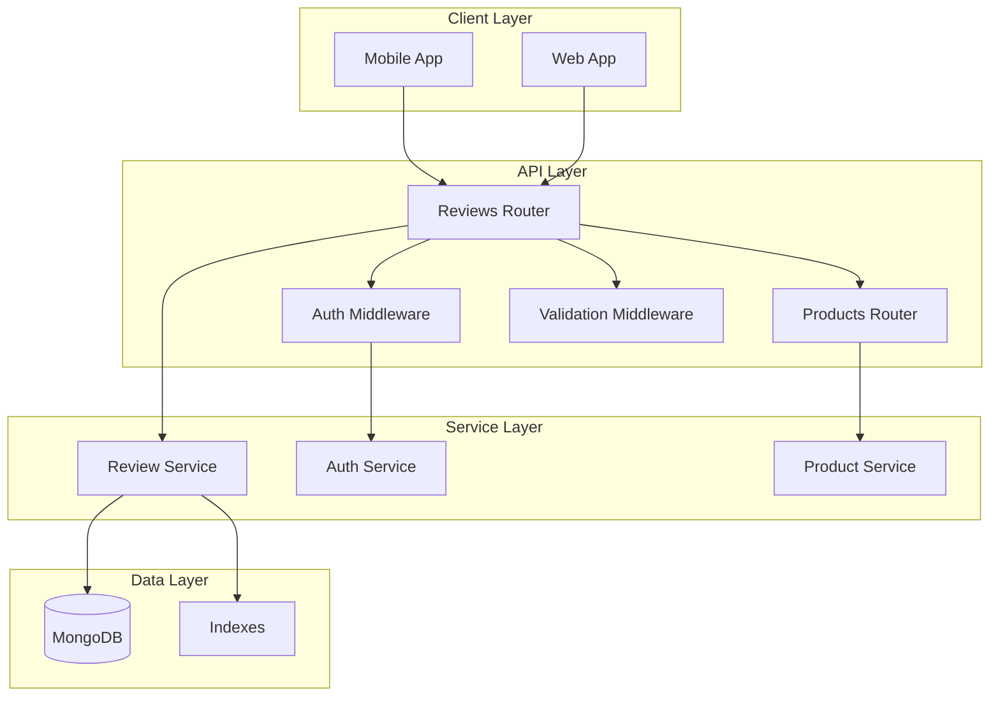

# Design Document: Product Reviews System

## Overview

The Product Reviews System is a comprehensive review management solution for an e-commerce platform that enables customers to submit, view, and manage product reviews. The system provides trust signals and conversion optimization through authentic customer feedback, following patterns similar to established platforms like Amazon or Flipkart.

### Key Features
- Customer review submission with ratings, comments, and optional images
- Review uniqueness enforcement (one review per user per product)
- Paginated review retrieval with summary statistics
- User authentication and authorization for review operations
- Administrative review management capabilities
- RESTful API integration with existing product catalog

### Success Metrics
- Review submission rate and completion
- API response times under load
- Data consistency and integrity
- User engagement with review features

## Architecture

### System Architecture

The Product Reviews System follows a layered architecture pattern integrated into the existing e-commerce platform:



### Integration Points

The system integrates with existing platform components:
- **Products Router**: Reviews endpoints mount under `/api/products/:productId/reviews`
- **Authentication System**: Leverages existing user authentication middleware
- **Database**: Uses existing MongoDB instance with new reviews collection
- **User Management**: Integrates with existing user service for user data

## Components and Interfaces

### Core Components

#### Review Service
**Responsibilities:**
- Review CRUD operations
- Business logic validation
- Rating calculations and statistics
- Pagination handling

**Key Methods:**
```typescript
interface ReviewService {
  createReview(productId: string, userId: string, reviewData: CreateReviewRequest): Promise<Review>
  getReviews(productId: string, pagination: PaginationOptions): Promise<ReviewsResponse>
  updateReview(reviewId: string, userId: string, updateData: UpdateReviewRequest): Promise<Review>
  deleteReview(reviewId: string, userId: string, isAdmin: boolean): Promise<void>
  calculateRatingStats(productId: string): Promise<RatingStats>
}
```

#### Review Router
**Responsibilities:**
- HTTP request handling
- Route parameter validation
- Response formatting
- Error handling

**Endpoints:**
- `GET /api/products/:productId/reviews` - Get paginated reviews
- `POST /api/products/:productId/reviews` - Create new review
- `PUT /api/products/:productId/reviews/:reviewId` - Update existing review
- `DELETE /api/products/:productId/reviews/:reviewId` - Delete review

#### Validation Middleware
**Responsibilities:**
- Input parameter validation
- Rating range validation (1-5)
- Required field validation
- Data type validation

### External Interfaces

#### Database Schema
```typescript
interface Review {
  _id: ObjectId
  productId: string
  userId: string
  rating: number        // 1-5 inclusive
  comment?: string      // Optional
  images?: string[]     // Optional array of image URLs
  createdAt: Date
  updatedAt: Date
}

interface User {
  _id: ObjectId
  name: string
  email: string
  // ... other user fields
}
```

#### API Request/Response Formats
```typescript
interface CreateReviewRequest {
  rating: number
  comment?: string
  images?: string[]
}

interface ReviewsResponse {
  reviews: ReviewWithUser[]
  pagination: PaginationMeta
  stats: RatingStats
}

interface ReviewWithUser {
  _id: string
  productId: string
  userId: string
  rating: number
  comment?: string
  images?: string[]
  createdAt: string     // ISO 8601
  updatedAt: string     // ISO 8601
  user: {
    _id: string
    name: string
  }
}

interface RatingStats {
  averageRating: number
  totalReviews: number
  ratingBreakdown: {
    1: number
    2: number
    3: number
    4: number
    5: number
  }
}
```

## Data Models

### Review Collection

The reviews collection stores all review data with the following structure:

```javascript
{
  _id: ObjectId,
  productId: String,      // Reference to product
  userId: String,         // Reference to user
  rating: Number,         // 1-5 inclusive, required
  comment: String,        // Optional text review
  images: [String],       // Optional array of image URLs
  createdAt: Date,        // Auto-generated
  updatedAt: Date         // Auto-updated
}
```

### Database Indexes

Performance-critical indexes for efficient queries:

```javascript
// Compound index for uniqueness constraint
db.reviews.createIndex({ productId: 1, userId: 1 }, { unique: true })

// Individual indexes for common queries
db.reviews.createIndex({ productId: 1 })
db.reviews.createIndex({ userId: 1 })
db.reviews.createIndex({ createdAt: -1 })
```

### Data Relationships

- **Review → Product**: Many-to-one relationship via productId
- **Review → User**: Many-to-one relationship via userId
- **User → Reviews**: One-to-many relationship (one review per product per user)

### Data Validation Rules

- `productId`: Required, non-empty string
- `userId`: Required, non-empty string
- `rating`: Required, integer between 1 and 5 inclusive
- `comment`: Optional, string with reasonable length limits
- `images`: Optional, array of valid URL strings
- `createdAt`: Auto-generated, immutable
- `updatedAt`: Auto-updated on modifications
## Correctness Properties

*A property is a characteristic or behavior that should hold true across all valid executions of a system-essentially, a formal statement about what the system should do. Properties serve as the bridge between human-readable specifications and machine-verifiable correctness guarantees.*

### Property 1: Review Data Structure Completeness

*For any* created review, the stored review object should contain all required fields (productId, userId, rating, createdAt, updatedAt) and preserve any provided optional fields (comment, images).

**Validates: Requirements 1.1, 1.4**

### Property 2: Rating Validation

*For any* review creation or update request, if the rating is outside the range 1-5 inclusive or missing, the system should reject the request with appropriate validation errors.

**Validates: Requirements 1.2, 1.3, 4.3**

### Property 3: Timestamp Management

*For any* review operation, created reviews should have automatically generated createdAt and updatedAt timestamps, and updated reviews should preserve createdAt while updating updatedAt.

**Validates: Requirements 1.5, 4.5, 5.3, 5.4**

### Property 4: Review Uniqueness Constraint

*For any* user and product combination, attempting to create a second review should be rejected with an error, while updating the existing review should succeed.

**Validates: Requirements 2.1, 2.2, 2.3**

### Property 5: Pagination Consistency

*For any* product with reviews, requesting reviews with different page sizes should return the correct number of results per page and maintain consistent total counts across all pages.

**Validates: Requirements 3.1, 3.4**

### Property 6: Rating Statistics Accuracy

*For any* product with reviews, the calculated average rating and rating breakdown should accurately reflect the actual ratings of all reviews for that product.

**Validates: Requirements 3.2, 3.3**

### Property 7: Review Sorting Order

*For any* product with multiple reviews, the returned reviews should be sorted by createdAt timestamp in descending order (newest first).

**Validates: Requirements 3.5**

### Property 8: Authentication Requirement

*For any* review creation, update, or deletion request, the operation should be rejected if no valid user authentication is provided.

**Validates: Requirements 4.1**

### Property 9: Review Persistence

*For any* valid review submission, the review should be successfully stored in the database and retrievable through the API.

**Validates: Requirements 4.2**

### Property 10: Authorization for Updates

*For any* review update request, only the original author of the review should be able to modify it, while other users should receive authorization errors.

**Validates: Requirements 5.1, 5.2, 5.5**

### Property 11: Deletion Permissions

*For any* review deletion request, the operation should succeed if performed by the review author or an administrator, and fail with authorization errors for other users.

**Validates: Requirements 6.1, 6.2, 6.3, 6.5**

### Property 12: Review Removal Completeness

*For any* successfully deleted review, the review should be permanently removed from the database and no longer appear in any API responses.

**Validates: Requirements 6.4**

### Property 13: Input Validation

*For any* API request with invalid input parameters, the system should validate all inputs before processing and reject invalid requests with descriptive error messages.

**Validates: Requirements 4.4, 8.1**

### Property 14: HTTP Status Code Accuracy

*For any* API request, the response should include the appropriate HTTP status code: 400 for validation errors, 401 for authentication failures, 403 for authorization failures, 404 for not found, and 200/201 for successful operations.

**Validates: Requirements 7.5, 8.2, 8.3, 8.4, 8.5**

### Property 15: Response Format Consistency

*For any* API response, the JSON structure should follow consistent formatting with standardized field names, ISO 8601 timestamps, complete user information in reviews, and proper pagination metadata where applicable.

**Validates: Requirements 7.4, 10.1, 10.2, 10.3, 10.4, 10.5**

## Error Handling

### Error Categories

The system handles several categories of errors with appropriate responses:

#### Validation Errors (400 Bad Request)
- Missing required fields (rating)
- Invalid rating values (outside 1-5 range)
- Invalid data types
- Malformed request bodies

#### Authentication Errors (401 Unauthorized)
- Missing authentication tokens
- Invalid or expired tokens
- Unauthenticated access attempts

#### Authorization Errors (403 Forbidden)
- Attempting to modify another user's review
- Insufficient permissions for admin operations
- Access to restricted resources

#### Not Found Errors (404 Not Found)
- Non-existent product IDs
- Non-existent review IDs
- Invalid route endpoints

#### Conflict Errors (409 Conflict)
- Duplicate review creation attempts
- Concurrent modification conflicts

#### Server Errors (500 Internal Server Error)
- Database connection failures
- Unexpected system errors
- Service unavailability

### Error Response Format

All errors follow a consistent JSON format:

```json
{
  "error": {
    "code": "VALIDATION_ERROR",
    "message": "Rating must be between 1 and 5",
    "details": {
      "field": "rating",
      "value": 6,
      "constraint": "range"
    }
  }
}
```

### Error Recovery Strategies

- **Retry Logic**: Implement exponential backoff for transient failures
- **Graceful Degradation**: Return cached data when possible during service issues
- **Circuit Breaker**: Prevent cascade failures in dependent services
- **Logging**: Comprehensive error logging for debugging and monitoring

## Testing Strategy

### Dual Testing Approach

The Product Reviews System requires both unit testing and property-based testing for comprehensive coverage:

**Unit Tests** focus on:
- Specific examples and edge cases
- Integration points between components
- Error conditions and boundary cases
- Mock external dependencies

**Property Tests** focus on:
- Universal properties that hold for all inputs
- Comprehensive input coverage through randomization
- Business rule validation across all scenarios
- Data consistency and integrity

### Property-Based Testing Configuration

**Testing Library**: Use `fast-check` for JavaScript/TypeScript property-based testing

**Test Configuration**:
- Minimum 100 iterations per property test
- Each property test references its design document property
- Tag format: **Feature: product-reviews-system, Property {number}: {property_text}**

**Example Property Test Structure**:
```typescript
describe('Property 2: Rating Validation', () => {
  it('should reject ratings outside 1-5 range', () => {
    // Feature: product-reviews-system, Property 2: Rating Validation
    fc.assert(fc.property(
      fc.oneof(
        fc.integer().filter(n => n < 1 || n > 5),
        fc.constant(null),
        fc.constant(undefined)
      ),
      (invalidRating) => {
        const result = validateRating(invalidRating);
        expect(result.isValid).toBe(false);
        expect(result.error).toBeDefined();
      }
    ), { numRuns: 100 });
  });
});
```

### Unit Testing Strategy

**Test Categories**:
- **API Endpoint Tests**: Verify HTTP methods, status codes, and response formats
- **Service Layer Tests**: Test business logic and data transformations
- **Validation Tests**: Verify input validation and error handling
- **Integration Tests**: Test database operations and external service calls

**Key Test Scenarios**:
- Review CRUD operations with valid and invalid data
- Authentication and authorization edge cases
- Pagination boundary conditions
- Rating calculation accuracy
- Error response formatting

### Test Data Management

**Test Data Strategy**:
- Use factories for generating test reviews and users
- Implement database seeding for integration tests
- Clean up test data after each test run
- Use separate test database to avoid data pollution

**Property Test Generators**:
```typescript
// Custom generators for domain objects
const reviewGenerator = fc.record({
  productId: fc.string({ minLength: 1 }),
  userId: fc.string({ minLength: 1 }),
  rating: fc.integer({ min: 1, max: 5 }),
  comment: fc.option(fc.string()),
  images: fc.option(fc.array(fc.webUrl()))
});
```

### Performance Testing

**Load Testing Scenarios**:
- Concurrent review submissions
- High-volume review retrieval
- Database query performance under load
- API response time benchmarks

**Performance Targets**:
- Review creation: < 200ms response time
- Review retrieval: < 100ms response time
- Rating calculation: < 50ms for products with 1000+ reviews
- Database queries: Utilize indexes for sub-10ms query times