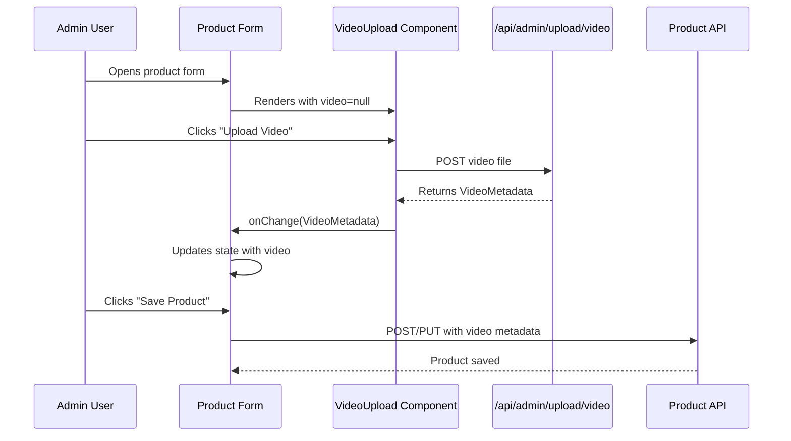

# Design Document: Product Video Upload UI

## Overview

This design document describes the integration of the existing VideoUpload component into the product management pages (ProductCreatePage and AdminProductsPage). The VideoUpload component is already complete with all core features including upload, progress tracking, thumbnail display, replace, and remove functionality. The backend endpoint `/api/admin/upload/video` is fully operational and returns video metadata in the required format.

The integration focuses on:
1. Adding video state management to product forms
2. Placing the VideoUpload component in the correct location (above images section)
3. Including video metadata in product save/update API calls
4. Loading existing video data when editing products

This is a UI integration task, not a component development task. All video processing, validation, and upload logic already exists in the VideoUpload component.

## Architecture

### Component Integration Points

```
ProductCreatePage.tsx
├── Form State (formData)
│   └── video: VideoMetadata | null (NEW)
├── VideoUpload Component (NEW)
│   ├── video prop: formData.video
│   └── onChange handler: updates formData.video
└── handleSubmit
    └── Include video in FormData payload (NEW)

AdminProductsPage.tsx
├── Edit Modal State (editFormData)
│   └── video: VideoMetadata | null (NEW)
├── VideoUpload Component (NEW)
│   ├── video prop: editFormData.video
│   └── onChange handler: updates editFormData.video
├── handleEditProduct
│   └── Load existing video from product (NEW)
└── handleUpdateProduct
    └── Include video in update payload (NEW)
```

### Data Flow



### State Management

Both ProductCreatePage and AdminProductsPage will manage video state locally within their form state:

```typescript
interface VideoMetadata {
  url: string;
  thumbnail: string;
  publicId: string;
  hash: string;
  duration: number;
}

// ProductCreatePage
const [formData, setFormData] = useState({
  // ... existing fields
  video: null as VideoMetadata | null
});

// AdminProductsPage
const [editFormData, setEditFormData] = useState({
  // ... existing fields
  video: null as VideoMetadata | null
});
```

## Components and Interfaces

### VideoUpload Component (Existing)

The VideoUpload component is already complete and provides:

**Props:**
```typescript
interface VideoUploadProps {
  video: VideoMetadata | null;
  onChange: (video: VideoMetadata | null) => void;
}
```

**Features:**
- File picker restricted to video/mp4
- Client-side validation (20MB max, mp4 only)
- Upload progress indicator with loading spinner
- Thumbnail display with play icon and duration
- Replace video button
- Remove video button with confirmation
- Error handling and display

**Location:** `frontend/src/components/VideoUpload.tsx`

### ProductCreatePage Integration

**File:** `frontend/src/pages/Admin/ProductCreatePage.tsx`

**Changes Required:**
1. Import VideoUpload component
2. Add `video` field to formData state
3. Add VideoUpload section between Pricing and Images sections
4. Include video in FormData when submitting

**State Addition:**
```typescript
const [formData, setFormData] = useState({
  name: '',
  description: '',
  category: '',
  price: '',
  stock: '',
  mrp: '',
  weight: '',
  sku: '',
  tags: '',
  video: null as VideoMetadata | null  // NEW
});
```

**Handler:**
```typescript
const handleVideoChange = (video: VideoMetadata | null) => {
  setFormData({ ...formData, video });
};
```

**Submit Logic Update:**
```typescript
const handleSubmit = async (e: React.FormEvent) => {
  e.preventDefault();
  
  const formDataToSend = new FormData();
  // ... existing fields
  
  // Add video metadata if present
  if (formData.video) {
    formDataToSend.append('video', JSON.stringify(formData.video));
  }
  
  // ... rest of submit logic
};
```

### AdminProductsPage Integration

**File:** `frontend/src/pages/AdminProductsPage.tsx`

**Changes Required:**
1. Import VideoUpload component
2. Add `video` field to editFormData state
3. Load existing video when editing product
4. Add VideoUpload section in edit modal
5. Include video in update payload

**State Addition:**
```typescript
const [editFormData, setEditFormData] = useState({
  name: "",
  description: "",
  price: 0,
  mrp: 0,
  category: "",
  stock: 0,
  weight: 0,
  images: [] as { full: string; thumb: string }[],
  video: null as VideoMetadata | null  // NEW
});
```

**Load Video When Editing:**
```typescript
const handleEditProduct = (product: Product) => {
  setEditingProduct(product);
  
  // ... existing image conversion logic
  
  setEditFormData({
    name: product.name,
    description: product.description,
    price: product.price,
    mrp: product.mrp || 0,
    category: product.category,
    stock: product.stock,
    weight: product.weight || 0,
    images: convertedImages,
    video: product.video || null  // NEW
  });
  setShowEditModal(true);
};
```

**Handler:**
```typescript
const handleVideoChange = (video: VideoMetadata | null) => {
  setEditFormData({ ...editFormData, video });
};
```

**Update Logic:**
```typescript
const handleUpdateProduct = async (e: React.FormEvent<HTMLFormElement>) => {
  e.preventDefault();
  if (!editingProduct) return;

  try {
    await updateProductMutation({
      id: editingProduct._id,
      ...editFormData,
      images: editFormData.images,
      video: editFormData.video  // NEW
    }).unwrap();
    
    // ... rest of update logic
  } catch (error) {
    // ... error handling
  }
};
```

## Data Models

### Product Interface Extension

The Product interface in both pages needs to include the video field:

```typescript
interface Product {
  _id: string;
  name: string;
  description: string;
  price: number;
  mrp?: number;
  category: string;
  stock: number;
  weight?: number;
  images?: string[] | { full: string; thumb: string }[];
  video?: {  // NEW
    url: string;
    thumbnail: string;
    publicId: string;
    hash?: string;
    duration?: number;
  };
  createdAt: string;
  updatedAt: string;
}
```

### VideoMetadata Type

```typescript
interface VideoMetadata {
  url: string;
  thumbnail: string;
  publicId: string;
  hash: string;
  duration: number;
}
```

This matches the response from `/api/admin/upload/video` and the Product model's video field structure.

## Error Handling

### VideoUpload Component Error Handling (Existing)

The VideoUpload component already handles:
- File type validation (mp4 only)
- File size validation (20MB max)
- Upload failures with error messages
- Network errors

### Form-Level Error Handling

The product forms should handle:
- Video upload failures during product save
- Backend validation errors related to video
- Network errors during product save/update

**Implementation:**
```typescript
try {
  await createProduct(formDataToSend).unwrap();
  toast.success("Product created successfully!");
  navigate("/admin/products");
} catch (error: any) {
  // Existing error handling covers video errors
  toast.error(error?.data?.message || error?.message || "Failed to create product");
}
```

No additional error handling is needed since the VideoUpload component manages its own errors, and the form's existing error handling covers backend errors.

## Testing Strategy

### Unit Tests

**ProductCreatePage Tests:**
1. Video state initialization (video should be null initially)
2. Video onChange handler updates state correctly
3. Video metadata included in FormData when present
4. Video field omitted from FormData when null
5. Form submission works with and without video

**AdminProductsPage Tests:**
1. Video state initialization in edit modal
2. Existing video loaded when editing product
3. Video onChange handler updates editFormData
4. Video metadata included in update payload
5. Video removal sets video to null
6. Edit modal displays VideoUpload component

**VideoUpload Component Tests (Already Exist):**
- File picker opens on button click
- File validation (type, size)
- Upload progress display
- Thumbnail display after upload
- Replace video functionality
- Remove video functionality
- Error message display

### Integration Tests

1. **Create Product with Video:**
   - Upload video through VideoUpload component
   - Save product
   - Verify video metadata saved to backend
   - Verify product appears in list with video

2. **Edit Product - Add Video:**
   - Open edit modal for product without video
   - Upload video
   - Save changes
   - Verify video added to product

3. **Edit Product - Replace Video:**
   - Open edit modal for product with video
   - Click "Replace Video"
   - Upload new video
   - Save changes
   - Verify video replaced

4. **Edit Product - Remove Video:**
   - Open edit modal for product with video
   - Click "Remove Video"
   - Confirm removal
   - Save changes
   - Verify video removed from product

5. **Edit Product - Load Existing Video:**
   - Open edit modal for product with video
   - Verify VideoUpload displays existing video thumbnail
   - Verify duration and play icon displayed
   - Cancel without changes
   - Verify video unchanged

### Manual Testing Checklist

- [ ] VideoUpload component appears above images section in ProductCreatePage
- [ ] VideoUpload component appears in AdminProductsPage edit modal
- [ ] Video upload works in create form
- [ ] Video upload works in edit modal
- [ ] Existing video loads correctly in edit modal
- [ ] Replace video works in both forms
- [ ] Remove video works in both forms
- [ ] Product saves with video metadata
- [ ] Product updates with video changes
- [ ] Error messages display correctly
- [ ] Upload progress indicator works
- [ ] Responsive design works on mobile and desktop
- [ ] Keyboard navigation works for all buttons
- [ ] Screen reader announces video actions

### Accessibility Testing

- [ ] Video upload button has accessible label
- [ ] Replace/remove buttons have accessible labels
- [ ] Video thumbnail has alt text
- [ ] Error messages announced to screen readers
- [ ] All buttons keyboard accessible
- [ ] Focus indicators visible
- [ ] Tab order logical

## Implementation Plan

### Phase 1: ProductCreatePage Integration

1. Import VideoUpload component
2. Add video field to formData state
3. Create video section Card component (between Pricing and Images)
4. Add VideoUpload component with onChange handler
5. Update handleSubmit to include video in payload
6. Test video upload and product creation

### Phase 2: AdminProductsPage Integration

1. Import VideoUpload component
2. Add video field to editFormData state
3. Update Product interface to include video field
4. Update handleEditProduct to load existing video
5. Add VideoUpload component to edit modal
6. Update handleUpdateProduct to include video in payload
7. Update handleCancelEdit to reset video state
8. Test video upload, edit, replace, and remove

### Phase 3: Testing and Refinement

1. Write unit tests for both integrations
2. Write integration tests for video workflows
3. Perform manual testing on all scenarios
4. Perform accessibility testing
5. Fix any bugs or issues found
6. Update documentation

### Phase 4: React Native (Future)

This phase is out of scope for the current design but will include:
- AdminCreateProductScreen integration
- AdminEditProductScreen integration
- Mobile-specific video upload UI
- Native video picker integration

## UI Layout

### ProductCreatePage Layout

```
┌─────────────────────────────────────────┐
│ Page Header: "Add New Product"         │
│ [Save Product Button]                   │
└─────────────────────────────────────────┘

┌─────────────────────────────────────────┐
│ Basic Information Card                  │
│ - Product Name                          │
│ - Category                              │
│ - SKU                                   │
│ - Tags                                  │
│ - Description                           │
└─────────────────────────────────────────┘

┌─────────────────────────────────────────┐
│ Pricing & Inventory Card                │
│ - Selling Price                         │
│ - MRP                                   │
│ - Stock Quantity                        │
│ - Weight                                │
└─────────────────────────────────────────┘

┌─────────────────────────────────────────┐
│ Product Video Card (NEW)                │
│ ┌─────────────────────────────────────┐ │
│ │ VideoUpload Component               │ │
│ │ - Upload button OR                  │ │
│ │ - Thumbnail with replace/remove     │ │
│ └─────────────────────────────────────┘ │
└─────────────────────────────────────────┘

┌─────────────────────────────────────────┐
│ Product Images Card                     │
│ - FileUpload Component                  │
└─────────────────────────────────────────┘
```

### AdminProductsPage Edit Modal Layout

```
┌─────────────────────────────────────────┐
│ Edit Product Modal                      │
│                                    [X]  │
├─────────────────────────────────────────┤
│ Product Name: [____________]            │
│ Description:  [____________]            │
│               [____________]            │
│ MRP: [____]  Price: [____]              │
│ Stock: [____]  Category: [____]         │
│ Weight: [____]                          │
│                                         │
│ Product Video: (NEW)                    │
│ ┌─────────────────────────────────────┐ │
│ │ VideoUpload Component               │ │
│ │ - Upload button OR                  │ │
│ │ - Thumbnail with replace/remove     │ │
│ └─────────────────────────────────────┘ │
│                                         │
│ Product Images:                         │
│ ┌─────────────────────────────────────┐ │
│ │ FileUpload Component                │ │
│ └─────────────────────────────────────┘ │
│                                         │
│ [Cancel]              [Save Changes]    │
└─────────────────────────────────────────┘
```

## Security Considerations

### Authentication

- Video upload requires admin authentication (handled by VideoUpload component)
- Product save/update requires admin authentication (already implemented)
- No additional authentication logic needed

### Authorization

- Only admin users can access product management pages (already implemented)
- Only admin users can upload videos (enforced by backend)
- No additional authorization logic needed

### Input Validation

- File type validation (mp4 only) - handled by VideoUpload component
- File size validation (20MB max) - handled by VideoUpload component
- Video duration validation (30s max) - handled by backend
- No additional validation needed in integration code

### Data Sanitization

- Video metadata from backend is trusted (already validated)
- No user-provided video metadata (all comes from Cloudinary)
- No XSS risk from video metadata

## Performance Considerations

### Upload Performance

- Video upload handled by VideoUpload component with progress tracking
- Large files (up to 20MB) may take time - progress indicator provides feedback
- Upload happens before product save, so user sees progress

### Form Performance

- Video metadata is small (< 1KB) - no performance impact on form state
- No additional API calls needed (video already uploaded before save)
- Form submission includes video metadata in existing payload

### Rendering Performance

- VideoUpload component renders conditionally (only when needed)
- Thumbnail images are optimized by Cloudinary
- No performance impact on product list or edit modal

## Deployment Considerations

### Frontend Deployment

- No new dependencies required (VideoUpload component already exists)
- No environment variables needed
- No build configuration changes
- Standard frontend deployment process

### Backend Compatibility

- Backend endpoint `/api/admin/upload/video` already exists and works
- Product model already supports video field
- No backend changes required for this integration
- Backward compatible (video field is optional)

### Database Migration

- No database migration needed
- Product model already has video field
- Existing products without video continue to work

### Rollback Plan

- Remove VideoUpload component from forms
- Remove video field from form state
- Remove video from save/update payloads
- No data loss (video field remains in database)

## Future Enhancements

### Phase 2: React Native Integration

- Integrate VideoUpload equivalent in AdminCreateProductScreen
- Integrate VideoUpload equivalent in AdminEditProductScreen
- Use React Native video picker
- Handle mobile-specific video upload UI

### Phase 3: Video Preview

- Add video preview modal when clicking thumbnail
- Play video inline in admin interface
- Show video metadata (resolution, codec, bitrate)

### Phase 4: Multiple Videos

- Support multiple videos per product
- Video gallery management
- Video ordering/reordering
- Primary video selection

### Phase 5: Video Analytics

- Track video upload success/failure rates
- Monitor video processing times
- Analyze video engagement on product pages

## Appendix

### File Locations

- VideoUpload Component: `frontend/src/components/VideoUpload.tsx`
- ProductCreatePage: `frontend/src/pages/Admin/ProductCreatePage.tsx`
- AdminProductsPage: `frontend/src/pages/AdminProductsPage.tsx`
- Product Model: `backend/src/models/Product.ts`
- Video Upload Endpoint: `backend/src/routes/admin/upload.ts`

### API Endpoints

- **POST /api/admin/upload/video**
  - Uploads video file
  - Returns VideoMetadata
  - Requires admin authentication

- **POST /api/admin/products**
  - Creates new product
  - Accepts video metadata in payload
  - Requires admin authentication

- **PUT /api/admin/products/:id**
  - Updates existing product
  - Accepts video metadata in payload
  - Requires admin authentication

### Dependencies

- React (already installed)
- lucide-react (already installed for icons)
- apiClient utility (already exists)
- useToast hook (already exists)

### Code Style Guidelines

- Follow existing code style in ProductCreatePage and AdminProductsPage
- Use TypeScript for type safety
- Use functional components with hooks
- Follow existing naming conventions
- Use existing UI components (Card, Button, Input)
- Maintain consistent spacing and indentation
- Add comments for complex logic

### Testing Tools

- Jest for unit tests
- React Testing Library for component tests
- Cypress for integration tests
- Manual testing for accessibility
