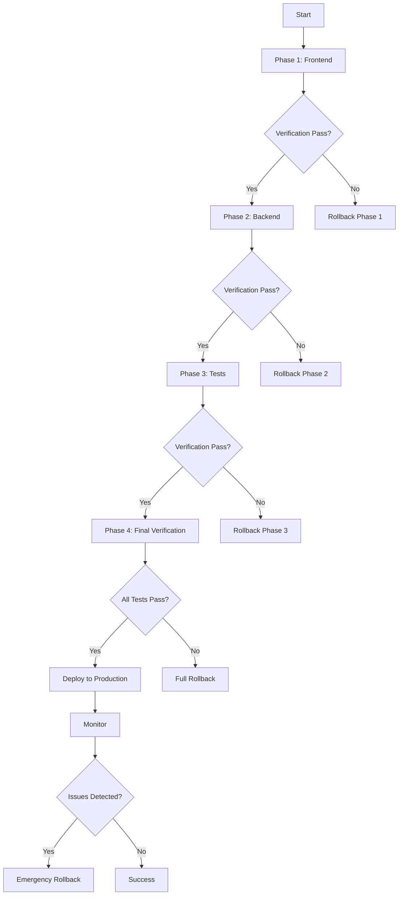

# 🤖 Kiro Automation Workflow - Email to Phone Migration

## Overview

This document provides a Kiro-specific automation workflow for executing the email-to-phone migration with built-in verification gates and rollback capabilities.

---

## 🎯 Workflow Structure



---

## 📋 Phase 1: Frontend Migration

### Kiro Command

```bash
kiro execute --phase frontend-migration --verify
```

### Tasks

1. **Remove Email from Customer Components**
   ```typescript
   // SignupForm.tsx
   - Remove email field from interface
   - Remove email state variable
   - Remove email input JSX
   - Remove email validation
   - Update API payload (omit email)
   
   // OtpLoginModal.tsx
   - Remove email from AuthMethod type
   - Remove email state
   - Remove email input
   - Update placeholder text
   - Update API calls (phone-only)
   
   // OnboardingForm.tsx
   - Remove email display field
   - Remove Mail icon import
   ```

2. **Update Admin Pages (Conditional Rendering)**
   ```typescript
   // AdminUsersPage.tsx
   {user.email && user.email.toLowerCase().includes(searchQuery)}
   {user.email && <div>{user.email}</div>}
   
   // AdminDeliveryBoysPage.tsx
   {boy.user.email && <div>{boy.user.email}</div>}
   
   // AdminOrderDetailsPage.tsx
   {order.userId.email && <div>{order.userId.email}</div>}
   
   // AdminOrdersPage.tsx
   {order.userId?.email || 'No email'}
   ```

3. **TypeScript Safety**
   ```bash
   npm run type-check
   # Must pass with no errors
   ```

### Verification Gates

```bash
# Gate 1: Code-Level Verification
kiro verify --phase frontend --type code-level

# Checks:
# - No email field in customer components
# - No leftover email fallback logic
# - TypeScript diagnostics pass
# - Conditional rendering in admin pages

# Gate 2: Build Verification
npm run build
# Must complete without errors

# Gate 3: Manual Verification (Optional)
# - Network payload check
# - Hard refresh test
# - Phone validation test
```

### Success Criteria

- ✅ All TypeScript diagnostics pass
- ✅ Build completes successfully
- ✅ No email field in customer API payloads
- ✅ Admin pages handle optional email

### Rollback Trigger

If any verification fails:
```bash
kiro rollback --phase frontend
```

---

## 📋 Phase 2: Backend Integration

### Kiro Command

```bash
kiro execute --phase backend-integration --verify
```

### Tasks

1. **Create Email Generation Utility**
   ```bash
   kiro create-file backend/src/utils/generateCustomerEmail.ts
   ```
   
   ```typescript
   export function generateCustomerEmail(user) {
     return user.email || `${user.phone}@customer.internal`;
   }
   
   export function isInternalEmail(email: string): boolean {
     return email.endsWith('@customer.internal');
   }
   
   export function extractPhoneFromEmail(email: string): string | null {
     if (!isInternalEmail(email)) return null;
     const match = email.match(/^(\d+)@customer\.internal$/);
     return match ? match[1] : null;
   }
   ```

2. **Update Payment Integration**
   ```typescript
   // CheckoutPage.tsx (2 locations)
   prefill: {
     name: (user as any)?.name,
     email: (user as any)?.email || `${(user as any)?.phone}@customer.internal`,
     contact: (user as any)?.phone,
   }
   ```

3. **Verify Auth Controller**
   ```bash
   kiro verify --file backend/src/domains/identity/controllers/authController.ts
   # Should already handle optional email correctly
   ```

### Verification Gates

```bash
# Gate 1: TypeScript Compilation
npm run build
# Must pass

# Gate 2: Unit Tests
npm test -- generateCustomerEmail.test.ts
# Must pass

# Gate 3: Integration Tests
npm test -- --testPathPattern="auth.test"
# Must pass (22/22 tests)
```

### Success Criteria

- ✅ Utility functions work correctly
- ✅ Payment integration updated
- ✅ Auth controller verified
- ✅ All tests pass

### Rollback Trigger

If any verification fails:
```bash
kiro rollback --phase backend
```

---

## 📋 Phase 3: Test Infrastructure

### Kiro Command

```bash
kiro execute --phase test-infrastructure --verify
```

### Tasks

1. **Update Test Helper**
   ```typescript
   // backend/tests/helpers/auth.ts
   
   export async function createTestUser(overrides: any = {}) {
     const role = overrides.role || "customer";
     const shouldHaveEmail = role !== "customer";
     
     const emailField = overrides.email !== undefined 
       ? { email: overrides.email }
       : shouldHaveEmail 
         ? { email: `test.${role}.${Date.now()}@example.com` }
         : {}; // No email for customers
     
     return await User.create({
       name: "Test User",
       phone: uniquePhone,
       referralCode: uniqueReferralCode,
       passwordHash: hashedPassword,
       role: "customer",
       ...emailField,
       ...overrides,
     });
   }
   ```

2. **Update Admin Test Helper**
   ```typescript
   export async function createTestAdmin(overrides: any = {}) {
     const adminEmail = overrides.email || `admin.${Date.now()}@example.com`;
     
     return await User.create({
       name: "Admin User",
       phone: uniquePhone,
       email: adminEmail,
       referralCode: uniqueReferralCode,
       passwordHash: hashedPassword,
       role: "admin",
       isAdmin: true,
       ...overrides,
     });
   }
   ```

### Verification Gates

```bash
# Gate 1: Auth Tests
npm test -- --testPathPattern="auth.test"
# Must pass (22/22 tests)

# Gate 2: Integration Tests
npm test -- --testPathPattern="integration"
# Must pass (97/97 tests)

# Gate 3: All Tests
npm test
# Must pass (287/287 tests)
```

### Success Criteria

- ✅ Test helper updated
- ✅ All auth tests pass (22/22)
- ✅ All integration tests pass (97/97)
- ✅ Full test suite passes (287/287)

### Rollback Trigger

If any verification fails:
```bash
kiro rollback --phase tests
```

---

## 📋 Phase 4: Final Verification

### Kiro Command

```bash
kiro execute --phase final-verification --comprehensive
```

### Tasks

1. **Full Test Suite**
   ```bash
   npm test
   # Must pass: 287/287 tests
   ```

2. **Manual Flow Testing**
   ```bash
   # Customer flows
   - Signup (phone-only)
   - Login (phone-only)
   - Payment (Razorpay with generated email)
   - Profile (email shows "Not set")
   
   # Delivery flows
   - Login (email + password)
   - Profile (email displayed)
   
   # Admin flows
   - Login (email + password)
   - User management (conditional email display)
   ```

3. **Regression Testing**
   ```bash
   kiro test --regression --comprehensive
   ```

### Verification Gates

```bash
# Gate 1: Test Suite
npm test
# 287/287 tests must pass

# Gate 2: Build Verification
npm run build:frontend && npm run build:backend
# Both must succeed

# Gate 3: Manual Verification
kiro verify --manual --checklist
```

### Success Criteria

- ✅ All 287 tests pass
- ✅ No console errors
- ✅ No TypeScript errors
- ✅ All manual flows work
- ✅ No regressions detected

### Rollback Trigger

If any verification fails:
```bash
kiro rollback --full
```

---

## 🚀 Deployment Workflow

### Kiro Command

```bash
kiro deploy --strategy staged --monitor
```

### Staged Rollout

```bash
# Stage 1: Deploy to 10% users
kiro deploy --percentage 10 --monitor-duration 24h

# Monitor metrics:
# - Signup success rate
# - Login success rate
# - Payment success rate
# - Error rate

# Stage 2: Deploy to 50% users (if Stage 1 successful)
kiro deploy --percentage 50 --monitor-duration 24h

# Stage 3: Deploy to 100% users (if Stage 2 successful)
kiro deploy --percentage 100 --monitor-duration 48h
```

### Monitoring

```bash
kiro monitor --metrics signup,login,payment --alert-threshold 5%
```

**Metrics to monitor:**
- Signup success rate (should be ≥95%)
- Login success rate (should be ≥98%)
- Payment success rate (should be ≥95%)
- Error rate (should be ≤2%)
- API response time (should be ≤500ms)

### Rollback Trigger

If any metric degrades:
```bash
kiro rollback --emergency --notify-team
```

---

## 🔄 Automated Rollback

### Kiro Command

```bash
kiro rollback --phase <phase-name> --verify
```

### Rollback Phases

**Phase 1 Rollback:**
```bash
kiro rollback --phase frontend
# Reverts: 8 frontend files
# Verifies: Build succeeds, no errors
```

**Phase 2 Rollback:**
```bash
kiro rollback --phase backend
# Reverts: 2 backend files
# Deletes: generateCustomerEmail.ts
# Verifies: Build succeeds, tests pass
```

**Phase 3 Rollback:**
```bash
kiro rollback --phase tests
# Reverts: 1 test helper file
# Verifies: All tests pass
```

**Full Rollback:**
```bash
kiro rollback --full --emergency
# Reverts: All changes
# Deploys: Previous stable version
# Notifies: Engineering team
```

---

## 📊 Kiro Dashboard

### Real-Time Monitoring

```bash
kiro dashboard --migration email-to-phone
```

**Dashboard shows:**
- Current phase
- Verification status
- Test results
- Deployment progress
- Error rate
- User impact
- Rollback status

---

## 🎯 Kiro Hooks

### Pre-Phase Hooks

```bash
# Before each phase
kiro hook --pre-phase --action backup-state
kiro hook --pre-phase --action verify-prerequisites
```

### Post-Phase Hooks

```bash
# After each phase
kiro hook --post-phase --action run-verification
kiro hook --post-phase --action update-dashboard
kiro hook --post-phase --action notify-team
```

### Failure Hooks

```bash
# On verification failure
kiro hook --on-failure --action capture-evidence
kiro hook --on-failure --action trigger-rollback
kiro hook --on-failure --action alert-team
```

---

## 🔐 Safety Features

### Automatic Verification

```bash
# Kiro automatically verifies after each phase
kiro config --auto-verify enabled
```

### Rollback on Failure

```bash
# Kiro automatically rolls back on failure
kiro config --auto-rollback enabled
```

### Team Notifications

```bash
# Kiro notifies team on critical events
kiro config --notifications slack,email
```

---

## 📝 Kiro Workflow File

Save as `.kiro/workflows/email-to-phone-migration.yml`:

```yaml
name: Email to Phone Migration
version: 1.0
risk: low
phases:
  - name: frontend
    tasks:
      - remove-email-from-customer-components
      - update-admin-conditional-rendering
      - verify-typescript
    verification:
      - code-level-check
      - build-verification
      - manual-testing
    rollback: revert-frontend-files
    
  - name: backend
    tasks:
      - create-email-utility
      - update-payment-integration
      - verify-auth-controller
    verification:
      - typescript-compilation
      - unit-tests
      - integration-tests
    rollback: revert-backend-files
    
  - name: tests
    tasks:
      - update-test-helper
      - run-auth-tests
      - run-full-suite
    verification:
      - auth-tests-pass
      - integration-tests-pass
      - full-suite-pass
    rollback: revert-test-helper
    
  - name: final-verification
    tasks:
      - run-full-test-suite
      - manual-flow-testing
      - regression-testing
    verification:
      - all-tests-pass
      - no-console-errors
      - no-regressions
    rollback: full-rollback
    
deployment:
  strategy: staged
  stages:
    - percentage: 10
      duration: 24h
    - percentage: 50
      duration: 24h
    - percentage: 100
      duration: 48h
  monitoring:
    metrics:
      - signup-success-rate
      - login-success-rate
      - payment-success-rate
      - error-rate
    thresholds:
      signup-success-rate: 95%
      login-success-rate: 98%
      payment-success-rate: 95%
      error-rate: 2%
  rollback:
    auto: true
    on-threshold-breach: true
    notify: true
```

---

## 🚀 Quick Start

```bash
# 1. Load workflow
kiro workflow load .kiro/workflows/email-to-phone-migration.yml

# 2. Execute migration
kiro workflow execute email-to-phone-migration --auto-verify

# 3. Monitor progress
kiro workflow status email-to-phone-migration

# 4. If issues occur
kiro workflow rollback email-to-phone-migration
```

---

**Created:** April 5, 2026  
**Version:** 1.0  
**Status:** Ready for Use  
**Automation Level:** Full  
**Safety Level:** High
